# 秒杀商城系统 — 前后端全链路业务流程图文档

> **版本**: v1.0  
> **生成日期**: 2026-08-05  
> **覆盖范围**: 用户认证、商品与分类、订单与钱包三大模块全部业务场景  
> **分析深度**: 前端组件 → API调用 → 后端Controller → Service → Mapper → 中间件交互 → 数据封装返回（方法调用级别）

---

## 一、文档概述

本文档对秒杀商城系统的全部核心业务场景进行前后端全链路分析，每个场景按以下 **四层结构** 逐层剖析：

| 层次 | 说明 |
|------|------|
| **① 前端执行流程** | Vue组件交互 → Pinia Store → API封装函数 → HTTP请求 |
| **② 后端执行流程** | Controller → Service → Mapper → 业务逻辑（事务、校验、加密等） |
| **③ 中间件与数据存储交互** | Redis读写策略、MySQL事务操作、RabbitMQ消息投递、文件系统写入 |
| **④ 数据流转机制** | 请求/响应VO封装、缓存穿透/击穿/雪崩防护、分布式锁、原子操作、异步回调 |

每个场景均配有 **Mermaid时序图**，直观展示各组件间的调用时序与数据流向。

---

## 二、系统架构总览图

```mermaid
graph TB
    subgraph 前端["🖥️ 前端层 (Vue3 + Pinia + Axios)"]
        V_Login[Login.vue]
        V_Register[Register.vue]
        V_Forgot[ForgotPassword.vue]
        V_Profile[UserProfile.vue]
        V_ProductList[ProductList.vue]
        V_ProductDetail[ProductDetail.vue]
        V_Home[Home.vue]
        V_Seckill[SeckillDetail.vue]
        V_Order[OrderDetail.vue]
        V_Orders[UserOrders.vue]
        V_Upload[ImageUploader.vue]
    end

    subgraph API网关["🌐 API网关层"]
        JWT_FILTER[JwtAuthenticationFilter]
        CORS[CORS配置]
        RATE_LIMIT[限流拦截器]
    end

    subgraph 后端["⚙️ 后端层 (Spring Boot)"]
        subgraph Controller["Controller层"]
            AUTH_C[AuthController]
            USER_C[UserController]
            ADDR_C[UserAddressController]
            PROD_C[ProductController]
            CAT_C[CategoryController]
            ORDER_C[OrderController]
            SECKILL_C[SeckillController]
            WALLET_C[WalletController]
            UPLOAD_C[UploadController]
            BANNER_C[BannerPublicController]
            VERIFY_C[VerificationCodeController]
        end

        subgraph Service["Service层"]
            AUTH_S[AuthServiceImpl]
            PROD_S[ProductServiceImpl]
            CAT_S[CategoryServiceImpl]
            ORDER_S[OrderServiceImpl]
            SECKILL_S[SeckillServiceImpl]
            RECHARGE_S[RechargeCardServiceImpl]
            UPLOAD_S[UploadServiceImpl]
            VERIFY_S[VerificationCodeServiceImpl]
            TOKEN_V[TokenVersionService]
            USER_STATUS[UserStatusCacheService]
            BLACKLIST[TokenBlacklistService]
        end

        subgraph Mapper["Mapper层 (MyBatis-Plus)"]
            USER_M[UserMapper]
            PROD_M[ProductMapper]
            CAT_M[CategoryMapper]
            ORDER_M[SeckillOrderMapper]
            NORDER_M[NormalOrderMapper]
            ITEM_M[NormalOrderItemMapper]
            ADDR_M[UserAddressMapper]
            CARD_M[RechargeCardMapper]
            BANNER_M[BannerMapper]
        end
    end

    subgraph 中间件["🗄️ 中间件层"]
        REDIS[(Redis<br/>缓存/锁/限流/令牌)]
        MQ[RabbitMQ<br/>秒杀下单/延迟取消]
        REDISSON[Redisson<br/>分布式锁]
        FS[文件系统<br/>图片存储]
    end

    subgraph 数据库["💾 数据层"]
        MYSQL[(MySQL<br/>t_user / t_product<br/>t_category / t_seckill_order<br/>t_normal_order / t_recharge_card<br/>t_user_address / t_banner)]
    end

    前端 --> API网关
    API网关 --> Controller
    Controller --> Service
    Service --> Mapper
    Service --> REDIS
    Service --> MQ
    Service --> REDISSON
    Service --> FS
    Mapper --> MYSQL
```

---

## 三、各业务场景全链路分析

---

### 3.1 用户登录

#### 3.1.1 前端执行流程

| 步骤 | 组件/方法 | 说明 |
|------|-----------|------|
| 1 | `Login.vue` | 用户输入用户名、密码，可选输入图形验证码 |
| 2 | `handleLogin()` | 表单校验（非空、格式） |
| 3 | `userStore.login()` | 调用Pinia Store的login action |
| 4 | `authApi.login()` | 封装HTTP请求 |
| 5 | `POST /api/v1/auth/login` | 发送登录请求（含username、password、captchaUuid、captchaCode） |
| 6 | 成功响应 | Token存入localStorage + Pinia state，跳转首页 |
| 7 | 失败响应 | 显示错误信息，失败3次后强制要求验证码 |

#### 3.1.2 后端执行流程

| 步骤 | 方法 | 说明 |
|------|------|------|
| 1 | `AuthController.login()` | 接收LoginDTO，参数校验 |
| 2 | `AuthServiceImpl.login()` | 核心登录逻辑 |
| 3 | `CaptchaService.verifyCaptcha()` | 验证码校验（3次失败后必填） |
| 4 | `Redis GET login:fail:{username}` | 查询失败计数 |
| 5 | `UserMapper.findByUsername()` | 查询用户记录 |
| 6 | `passwordEncoder.matches()` | BCrypt密码比对 |
| 7 | 失败计数检查 | ≥5次锁定30分钟，≥3次强制验证码 |
| 8 | `JwtUtils.generateToken()` | RS256算法签发JWT |
| 9 | `TokenVersionService.getVersion()` | 获取用户Token版本号 |
| 10 | `UserStatusCacheService.warmUp()` | 预热用户状态缓存 |
| 11 | `LoginVO` 封装返回 | accessToken + userInfo |

#### 3.1.3 中间件与数据存储交互

| 中间件 | Key/操作 | 说明 |
|--------|----------|------|
| Redis | `login:fail:{username}` | 失败计数，30min TTL，登录成功则删除 |
| Redis | `captcha:{uuid}` | 图形验证码，5min TTL，验证后删除 |
| Redis | `user:token-version:{userId}` | Token版本号，30天TTL |
| Redis | `user:auth:{userId}` | 用户状态缓存，60s TTL |
| MySQL | `t_user` SELECT | 根据username查询 |
| MySQL | `t_login_log` INSERT | 记录登录日志 |

#### 3.1.4 数据流转机制

- **请求流**: LoginDTO(username, password, captchaUuid, captchaCode) → Controller → Service
- **安全流**: 失败计数Redis检查 → BCrypt校验 → 锁定判定 → JWT签发
- **响应流**: LoginVO(accessToken, userId, username, role, avatarUrl) → 前端存储
- **缓存预热**: 登录成功后写入user:auth缓存，后续请求优先走缓存

#### 3.1.5 Mermaid时序图

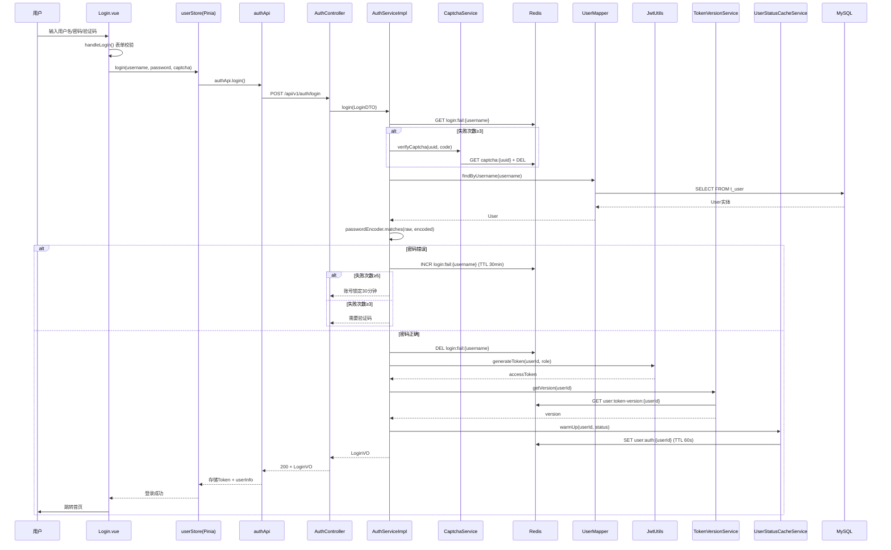
```mermaid
sequenceDiagram
    participant U as 用户
    participant V as Login.vue
    participant Store as userStore(Pinia)
    participant API as authApi
    participant Ctrl as AuthController
    participant Svc as AuthServiceImpl
    participant Captcha as CaptchaService
    participant Redis as Redis
    participant Mapper as UserMapper
    participant JWT as JwtUtils
    participant TV as TokenVersionService
    participant USC as UserStatusCacheService
    participant DB as MySQL

    U->>V: 输入用户名/密码/验证码
    V->>V: handleLogin() 表单校验
    V->>Store: login(username, password, captcha)
    Store->>API: authApi.login()
    API->>Ctrl: POST /api/v1/auth/login

    Ctrl->>Svc: login(LoginDTO)
    Svc->>Redis: GET login:fail:{username}
    alt 失败次数≥3
        Svc->>Captcha: verifyCaptcha(uuid, code)
        Captcha->>Redis: GET captcha:{uuid} + DEL
    end
    Svc->>Mapper: findByUsername(username)
    Mapper->>DB: SELECT FROM t_user
    DB-->>Mapper: User实体
    Mapper-->>Svc: User

    Svc->>Svc: passwordEncoder.matches(raw, encoded)
    alt 密码错误
        Svc->>Redis: INCR login:fail:{username} (TTL 30min)
        alt 失败次数≥5
            Svc-->>Ctrl: 账号锁定30分钟
        else 失败次数≥3
            Svc-->>Ctrl: 需要验证码
        end
    else 密码正确
        Svc->>Redis: DEL login:fail:{username}
        Svc->>JWT: generateToken(userId, role)
        JWT-->>Svc: accessToken
        Svc->>TV: getVersion(userId)
        TV->>Redis: GET user:token-version:{userId}
        TV-->>Svc: version
        Svc->>USC: warmUp(userId, status)
        USC->>Redis: SET user:auth:{userId} (TTL 60s)
        Svc-->>Ctrl: LoginVO
        Ctrl-->>API: 200 + LoginVO
        API-->>Store: 存储Token + userInfo
        Store-->>V: 登录成功
        V->>U: 跳转首页
    end
```

---

### 3.2 用户注册

#### 3.2.1 前端执行流程

| 步骤 | 组件/方法 | 说明 |
|------|-----------|------|
| 1 | `Register.vue` | 用户输入用户名、密码、手机号、验证码 |
| 2 | `handleRegister()` | 表单校验 |
| 3 | `register()` | 调用注册API |
| 4 | `POST /api/v1/auth/register` | 发送注册请求 |
| 5 | 注册成功 | 自动调用login流程，跳转首页 |

#### 3.2.2 后端执行流程

| 步骤 | 方法 | 说明 |
|------|------|------|
| 1 | `AuthController.register()` | 接收RegisterDTO |
| 2 | `AuthServiceImpl.register()` | @Transactional事务 |
| 3 | `CaptchaService.verifyCaptcha()` | 图形验证码校验 |
| 4 | `UserMapper.findByUsername()` | 用户名唯一性校验 |
| 5 | `UserMapper.findByPhone()` | 手机号唯一性校验 |
| 6 | `passwordEncoder.encode()` | BCrypt加密密码 |
| 7 | `UserMapper.insert()` | 插入用户记录 |

#### 3.2.3 中间件与数据存储交互

| 中间件 | Key/操作 | 说明 |
|--------|----------|------|
| Redis | `captcha:{uuid}` | 图形验证码，校验后删除 |
| MySQL | `t_user` SELECT×2 | 用户名+手机号唯一性校验 |
| MySQL | `t_user` INSERT | 插入新用户 |

#### 3.2.4 数据流转机制

- **请求流**: RegisterDTO(username, password, phone, captchaUuid, captchaCode) → Controller → Service
- **校验流**: 验证码校验 → 用户名唯一 → 手机号唯一 → 密码加密
- **响应流**: 注册成功后前端自动触发login流程

#### 3.2.5 Mermaid时序图

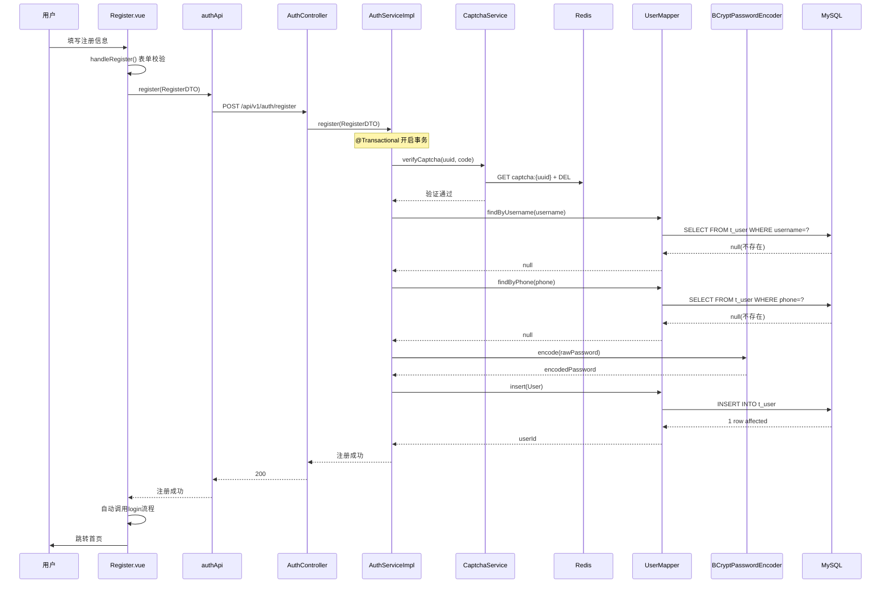
```mermaid
sequenceDiagram
    participant U as 用户
    participant V as Register.vue
    participant API as authApi
    participant Ctrl as AuthController
    participant Svc as AuthServiceImpl
    participant Captcha as CaptchaService
    participant Redis as Redis
    participant Mapper as UserMapper
    participant Encoder as BCryptPasswordEncoder
    participant DB as MySQL

    U->>V: 填写注册信息
    V->>V: handleRegister() 表单校验
    V->>API: register(RegisterDTO)
    API->>Ctrl: POST /api/v1/auth/register

    Ctrl->>Svc: register(RegisterDTO)
    Note over Svc: @Transactional 开启事务

    Svc->>Captcha: verifyCaptcha(uuid, code)
    Captcha->>Redis: GET captcha:{uuid} + DEL
    Captcha-->>Svc: 验证通过

    Svc->>Mapper: findByUsername(username)
    Mapper->>DB: SELECT FROM t_user WHERE username=?
    DB-->>Mapper: null(不存在)
    Mapper-->>Svc: null

    Svc->>Mapper: findByPhone(phone)
    Mapper->>DB: SELECT FROM t_user WHERE phone=?
    DB-->>Mapper: null(不存在)
    Mapper-->>Svc: null

    Svc->>Encoder: encode(rawPassword)
    Encoder-->>Svc: encodedPassword

    Svc->>Mapper: insert(User)
    Mapper->>DB: INSERT INTO t_user
    DB-->>Mapper: 1 row affected
    Mapper-->>Svc: userId

    Svc-->>Ctrl: 注册成功
    Ctrl-->>API: 200
    API-->>V: 注册成功
    V->>V: 自动调用login流程
    V->>U: 跳转首页
```

---

### 3.3 密码修改

#### 3.3.1 前端执行流程

| 步骤 | 组件/方法 | 说明 |
|------|-----------|------|
| 1 | `UserProfile.vue` | 用户输入旧密码、新密码、确认密码 |
| 2 | `handleChangePassword()` | 表单校验（新旧密码不同、确认一致） |
| 3 | `changePassword()` | 调用密码修改API |
| 4 | `PUT /api/v1/auth/password` | 发送修改请求（需JWT认证） |
| 5 | 修改成功 | 退出登录，跳转/login |

#### 3.3.2 后端执行流程

| 步骤 | 方法 | 说明 |
|------|------|------|
| 1 | `AuthController.changePassword()` | 接收ChangePasswordDTO |
| 2 | `AuthServiceImpl.changePassword()` | @Transactional事务 |
| 3 | `passwordEncoder.matches()` | 旧密码校验 |
| 4 | `passwordEncoder.encode()` | 新密码加密 |
| 5 | `UserMapper.updateById()` | 更新密码 |
| 6 | `TokenVersionService.incrementVersion()` | 版本号递增，踢所有设备 |
| 7 | `UserStatusCacheService.invalidateUserAuth()` | 删除用户状态缓存 |

#### 3.3.3 中间件与数据存储交互

| 中间件 | Key/操作 | 说明 |
|--------|----------|------|
| Redis | `user:token-version:{userId}` | INCR递增，使所有旧Token失效 |
| Redis | `user:auth:{userId}` | DEL删除，下次请求重新从DB加载 |
| MySQL | `t_user` UPDATE | 更新password字段 |

#### 3.3.4 数据流转机制

- **请求流**: ChangePasswordDTO(oldPassword, newPassword) → Controller → Service
- **安全流**: 旧密码BCrypt校验 → 新密码加密 → 版本号递增（踢所有设备） → 缓存失效
- **响应流**: 成功后前端主动logout，清除本地Token，跳转登录页

#### 3.3.5 Mermaid时序图

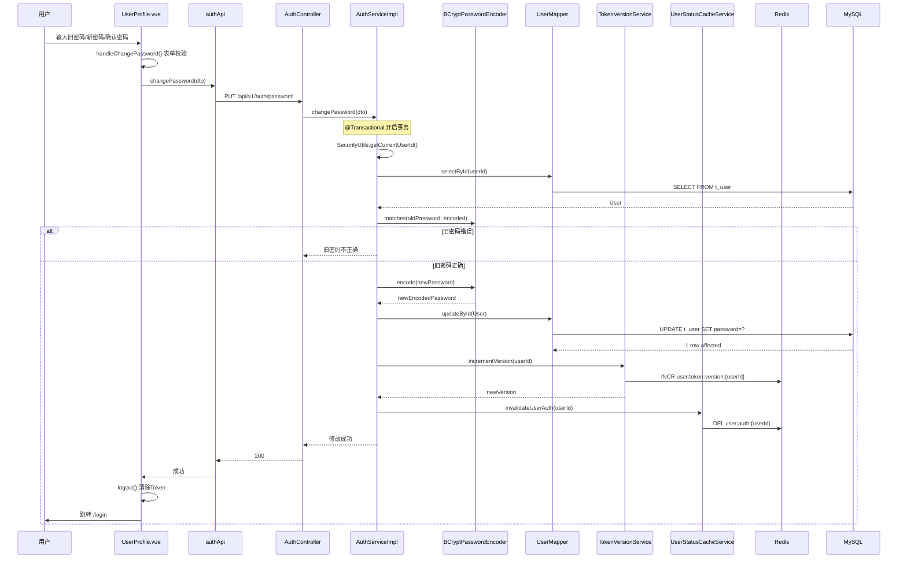
```mermaid
sequenceDiagram
    participant U as 用户
    participant V as UserProfile.vue
    participant API as authApi
    participant Ctrl as AuthController
    participant Svc as AuthServiceImpl
    participant Encoder as BCryptPasswordEncoder
    participant Mapper as UserMapper
    participant TV as TokenVersionService
    participant USC as UserStatusCacheService
    participant Redis as Redis
    participant DB as MySQL

    U->>V: 输入旧密码/新密码/确认密码
    V->>V: handleChangePassword() 表单校验
    V->>API: changePassword(dto)
    API->>Ctrl: PUT /api/v1/auth/password

    Ctrl->>Svc: changePassword(dto)
    Note over Svc: @Transactional 开启事务

    Svc->>Svc: SecurityUtils.getCurrentUserId()
    Svc->>Mapper: selectById(userId)
    Mapper->>DB: SELECT FROM t_user
    DB-->>Svc: User

    Svc->>Encoder: matches(oldPassword, encoded)
    alt 旧密码错误
        Svc-->>Ctrl: 旧密码不正确
    else 旧密码正确
        Svc->>Encoder: encode(newPassword)
        Encoder-->>Svc: newEncodedPassword
        Svc->>Mapper: updateById(User)
        Mapper->>DB: UPDATE t_user SET password=?
        DB-->>Mapper: 1 row affected

        Svc->>TV: incrementVersion(userId)
        TV->>Redis: INCR user:token-version:{userId}
        TV-->>Svc: newVersion

        Svc->>USC: invalidateUserAuth(userId)
        USC->>Redis: DEL user:auth:{userId}

        Svc-->>Ctrl: 修改成功
        Ctrl-->>API: 200
        API-->>V: 成功
        V->>V: logout() 清除Token
        V->>U: 跳转 /login
    end
```

---

### 3.4 找回密码

#### 3.4.1 前端执行流程

| 步骤 | 组件/方法 | 说明 |
|------|-----------|------|
| 1 | `ForgotPassword.vue` | 两步流程：发送验证码 → 重置密码 |
| 2 | `sendForgotPasswordCode()` | `POST /api/v1/auth/forgot-password/send-code` |
| 3 | `resetPassword()` | `POST /api/v1/auth/forgot-password/reset` |
| 4 | 重置成功 | 跳转/login |

#### 3.4.2 后端执行流程

| 步骤 | 方法 | 说明 |
|------|------|------|
| 1 | `AuthServiceImpl.sendForgotPasswordCode()` | 查找用户 → 发送短信/邮件验证码 |
| 2 | `findUserByAccount()` | 根据账号查找用户 |
| 3 | `VerificationCodeServiceImpl.sendSmsCode/sendEmailCode()` | 发送验证码 |
| 4 | Redis标记Key | `forgot-password:{type}:{account}` 防止重复发送 |
| 5 | `AuthServiceImpl.resetPassword()` | @Transactional事务 |
| 6 | 标记Key校验 | 验证是否经过发送验证码步骤 |
| 7 | `verifyCode()` | 验证码校验 |
| 8 | `passwordEncoder.encode()` | 新密码加密 |
| 9 | `updateById()` | 更新密码 |
| 10 | `incrementVersion()` | 踢所有设备 |

#### 3.4.3 中间件与数据存储交互

| 中间件 | Key/操作 | 说明 |
|--------|----------|------|
| Redis | `verify_code:{account}` | 验证码，5min TTL |
| Redis | `verify_code:rate:{account}` | 发送频率限制，60s TTL |
| Redis | `forgot-password:{type}:{account}` | 标记Key，5min TTL，防止未验证直接重置 |
| Redis | `user:token-version:{userId}` | INCR递增 |
| MySQL | `t_user` SELECT + UPDATE | 查找用户 + 更新密码 |

#### 3.4.4 数据流转机制

- **第一步流**: account → findUserByAccount → sendCode → Redis存储验证码+标记Key
- **第二步流**: account+code+newPassword → 标记Key校验 → 验证码校验 → 密码加密 → 更新DB → 版本号递增
- **安全机制**: 标记Key确保必须先发送验证码才能重置，频率限制防刷

#### 3.4.5 Mermaid时序图

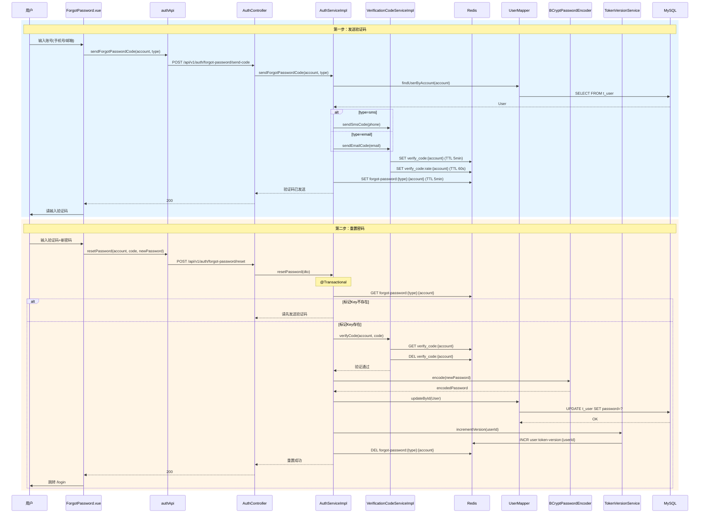
```mermaid
sequenceDiagram
    participant U as 用户
    participant V as ForgotPassword.vue
    participant API as authApi
    participant Ctrl as AuthController
    participant Svc as AuthServiceImpl
    participant VerifySvc as VerificationCodeServiceImpl
    participant Redis as Redis
    participant Mapper as UserMapper
    participant Encoder as BCryptPasswordEncoder
    participant TV as TokenVersionService
    participant DB as MySQL

    rect rgb(230, 245, 255)
        Note over U,DB: 第一步：发送验证码
        U->>V: 输入账号(手机号/邮箱)
        V->>API: sendForgotPasswordCode(account, type)
        API->>Ctrl: POST /api/v1/auth/forgot-password/send-code
        Ctrl->>Svc: sendForgotPasswordCode(account, type)

        Svc->>Mapper: findUserByAccount(account)
        Mapper->>DB: SELECT FROM t_user
        DB-->>Svc: User

        alt type=sms
            Svc->>VerifySvc: sendSmsCode(phone)
        else type=email
            Svc->>VerifySvc: sendEmailCode(email)
        end
        VerifySvc->>Redis: SET verify_code:{account} (TTL 5min)
        VerifySvc->>Redis: SET verify_code:rate:{account} (TTL 60s)
        Svc->>Redis: SET forgot-password:{type}:{account} (TTL 5min)
        Svc-->>Ctrl: 验证码已发送
        Ctrl-->>V: 200
        V->>U: 请输入验证码
    end

    rect rgb(255, 245, 230)
        Note over U,DB: 第二步：重置密码
        U->>V: 输入验证码+新密码
        V->>API: resetPassword(account, code, newPassword)
        API->>Ctrl: POST /api/v1/auth/forgot-password/reset
        Ctrl->>Svc: resetPassword(dto)
        Note over Svc: @Transactional

        Svc->>Redis: GET forgot-password:{type}:{account}
        alt 标记Key不存在
            Svc-->>Ctrl: 请先发送验证码
        else 标记Key存在
            Svc->>VerifySvc: verifyCode(account, code)
            VerifySvc->>Redis: GET verify_code:{account}
            VerifySvc->>Redis: DEL verify_code:{account}
            VerifySvc-->>Svc: 验证通过

            Svc->>Encoder: encode(newPassword)
            Encoder-->>Svc: encodedPassword
            Svc->>Mapper: updateById(User)
            Mapper->>DB: UPDATE t_user SET password=?
            DB-->>Mapper: OK

            Svc->>TV: incrementVersion(userId)
            TV->>Redis: INCR user:token-version:{userId}

            Svc->>Redis: DEL forgot-password:{type}:{account}
            Svc-->>Ctrl: 重置成功
            Ctrl-->>V: 200
            V->>U: 跳转 /login
        end
    end
```

---

### 3.5 个人信息加载

#### 3.5.1 前端执行流程

| 步骤 | 组件/方法 | 说明 |
|------|-----------|------|
| 1 | `UserProfile.vue` onMounted | 页面挂载时触发 |
| 2 | `fetchUserInfo()` | 获取用户信息 |
| 3 | `userStore.fetchUserInfo()` | Pinia Store action |
| 4 | `authApi.getMe()` | API封装 |
| 5 | `GET /api/v1/auth/me` | 发送请求（需JWT） |

#### 3.5.2 后端执行流程

| 步骤 | 方法 | 说明 |
|------|------|------|
| 1 | `JwtAuthenticationFilter` | 安全链路：Token解析 → RS256验签 → 黑名单检查 → 版本号比对 → 状态校验 |
| 2 | `TokenBlacklistService.isBlacklisted()` | 检查JWT是否在黑名单 |
| 3 | `TokenVersionService` | 比对Token中的版本号与Redis中版本号 |
| 4 | `UserStatusCacheService` | 优先从Redis缓存读取用户状态（60s TTL） |
| 5 | 状态ACTIVE校验 | 非ACTIVE则拒绝 |
| 6 | `AuthController.me()` | 获取当前用户信息 |
| 7 | `AuthServiceImpl.getMe()` | 业务逻辑 |
| 8 | `SecurityUtils.getCurrentUserId()` | 从SecurityContext获取userId |
| 9 | `UserMapper.selectById()` | 查询用户 |
| 10 | `toUserVO()` | 转换为VO返回 |

#### 3.5.3 中间件与数据存储交互

| 中间件 | Key/操作 | 说明 |
|--------|----------|------|
| Redis | `token:blacklist:{jwtId}` | 黑名单检查 |
| Redis | `user:token-version:{userId}` | 版本号比对 |
| Redis | `user:auth:{userId}` | 用户状态缓存，60s TTL，优先读取 |
| MySQL | `t_user` SELECT | 缓存未命中时查库 |

#### 3.5.4 数据流转机制

- **安全链路**: JWT → RS256验签 → 黑名单检查 → 版本号比对 → 状态缓存/查库 → ACTIVE校验
- **缓存策略**: 优先读Redis缓存(60s TTL)，未命中则查MySQL并回填缓存
- **响应流**: UserVO(id, username, phone, email, avatarUrl, balance, role, status)

#### 3.5.5 Mermaid时序图

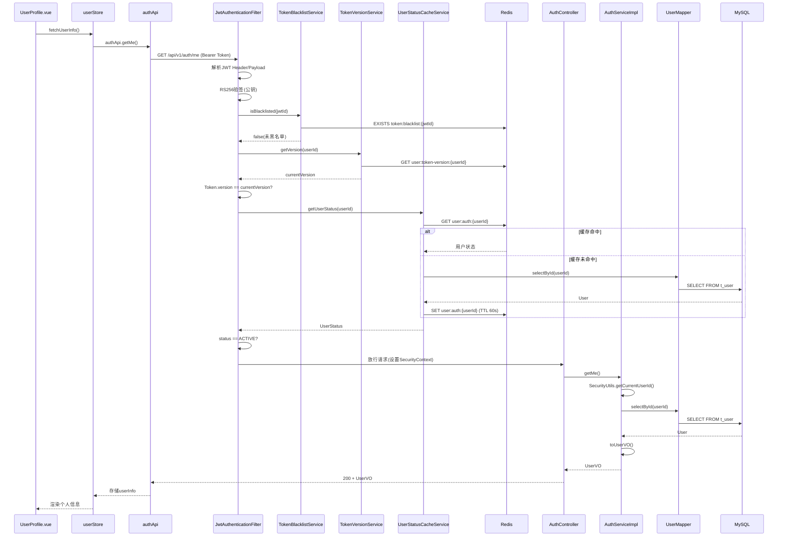
```mermaid
sequenceDiagram
    participant V as UserProfile.vue
    participant Store as userStore
    participant API as authApi
    participant Filter as JwtAuthenticationFilter
    participant BL as TokenBlacklistService
    participant TV as TokenVersionService
    participant USC as UserStatusCacheService
    participant Redis as Redis
    participant Ctrl as AuthController
    participant Svc as AuthServiceImpl
    participant Mapper as UserMapper
    participant DB as MySQL

    V->>Store: fetchUserInfo()
    Store->>API: authApi.getMe()
    API->>Filter: GET /api/v1/auth/me (Bearer Token)

    Filter->>Filter: 解析JWT Header/Payload
    Filter->>Filter: RS256验签(公钥)
    Filter->>BL: isBlacklisted(jwtId)
    BL->>Redis: EXISTS token:blacklist:{jwtId}
    BL-->>Filter: false(未黑名单)

    Filter->>TV: getVersion(userId)
    TV->>Redis: GET user:token-version:{userId}
    TV-->>Filter: currentVersion
    Filter->>Filter: Token.version == currentVersion?

    Filter->>USC: getUserStatus(userId)
    USC->>Redis: GET user:auth:{userId}
    alt 缓存命中
        Redis-->>USC: 用户状态
    else 缓存未命中
        USC->>Mapper: selectById(userId)
        Mapper->>DB: SELECT FROM t_user
        DB-->>USC: User
        USC->>Redis: SET user:auth:{userId} (TTL 60s)
    end
    USC-->>Filter: UserStatus

    Filter->>Filter: status == ACTIVE?
    Filter->>Ctrl: 放行请求(设置SecurityContext)

    Ctrl->>Svc: getMe()
    Svc->>Svc: SecurityUtils.getCurrentUserId()
    Svc->>Mapper: selectById(userId)
    Mapper->>DB: SELECT FROM t_user
    DB-->>Svc: User
    Svc->>Svc: toUserVO()
    Svc-->>Ctrl: UserVO
    Ctrl-->>API: 200 + UserVO
    API-->>Store: 存储userInfo
    Store-->>V: 渲染个人信息
```

---

### 3.6 头像上传

#### 3.6.1 前端执行流程

| 步骤 | 组件/方法 | 说明 |
|------|-----------|------|
| 1 | `ImageUploader.vue` | 选择图片文件 |
| 2 | `uploadImage(file, 'avatar')` | 调用上传API |
| 3 | `POST /api/v1/upload/image` 或 `POST /api/v1/auth/avatar` | 上传文件 |
| 4 | `formatImageUrl()` | 拼接完整URL显示 |

#### 3.6.2 后端执行流程

| 步骤 | 方法 | 说明 |
|------|------|------|
| 1 | `AuthController.uploadAvatar()` | 接收MultipartFile |
| 2 | `AuthServiceImpl.uploadAvatar()` | @Transactional事务 |
| 3 | 文件大小校验 | ≤2MB |
| 4 | `UploadService.uploadImage()` | 通用上传逻辑 |
| 5 | `LocalStorageService.store()` | 写入磁盘 |
| 6 | `UserMapper.updateById()` | 更新avatarUrl字段 |

#### 3.6.3 中间件与数据存储交互

| 中间件 | 操作 | 说明 |
|--------|------|------|
| 文件系统 | `{baseDir}/avatar/{yyyy/MM/dd}/{uuid}.{ext}` | 图片存储路径 |
| MySQL | `t_user` UPDATE | 更新avatarUrl |

#### 3.6.4 数据流转机制

- **上传流**: MultipartFile → 大小校验 → UUID命名+日期目录 → ImageIO读宽高 → 写磁盘 → 返回URL
- **更新流**: avatarUrl → updateById → 数据库持久化

#### 3.6.5 Mermaid时序图

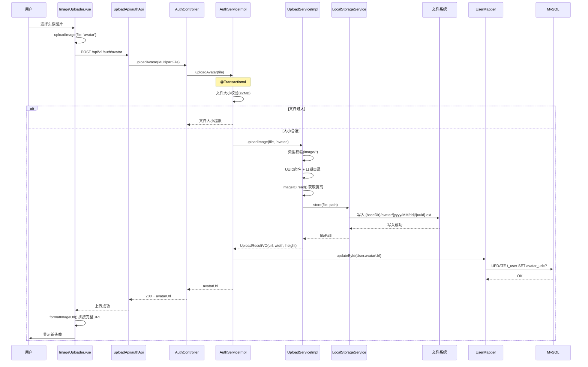
```mermaid
sequenceDiagram
    participant U as 用户
    participant V as ImageUploader.vue
    participant API as uploadApi/authApi
    participant Ctrl as AuthController
    participant Svc as AuthServiceImpl
    participant UploadSvc as UploadServiceImpl
    participant Local as LocalStorageService
    participant FS as 文件系统
    participant Mapper as UserMapper
    participant DB as MySQL

    U->>V: 选择头像图片
    V->>V: uploadImage(file, 'avatar')
    V->>API: POST /api/v1/auth/avatar
    API->>Ctrl: uploadAvatar(MultipartFile)

    Ctrl->>Svc: uploadAvatar(file)
    Note over Svc: @Transactional

    Svc->>Svc: 文件大小校验(≤2MB)
    alt 文件过大
        Svc-->>Ctrl: 文件大小超限
    else 大小合法
        Svc->>UploadSvc: uploadImage(file, 'avatar')
        UploadSvc->>UploadSvc: 类型校验(image/*)
        UploadSvc->>UploadSvc: UUID命名 + 日期目录
        UploadSvc->>UploadSvc: ImageIO.read() 获取宽高
        UploadSvc->>Local: store(file, path)
        Local->>FS: 写入 {baseDir}/avatar/{yyyy/MM/dd}/{uuid}.ext
        FS-->>Local: 写入成功
        Local-->>UploadSvc: filePath
        UploadSvc-->>Svc: UploadResultVO(url, width, height)

        Svc->>Mapper: updateById(User.avatarUrl)
        Mapper->>DB: UPDATE t_user SET avatar_url=?
        DB-->>Mapper: OK

        Svc-->>Ctrl: avatarUrl
        Ctrl-->>API: 200 + avatarUrl
        API-->>V: 上传成功
        V->>V: formatImageUrl() 拼接完整URL
        V->>U: 显示新头像
    end
```

---

### 3.7 地址管理

#### 3.7.1 前端执行流程

| 步骤 | 组件/方法 | 说明 |
|------|-----------|------|
| 1 | `UserProfile.vue` address Tab | 切换到地址管理标签 |
| 2 | `getAddressList()` | `GET /api/v1/user-address` 加载地址列表 |
| 3 | `createAddress()` | `POST /api/v1/user-address` 新增地址 |
| 4 | `updateAddress()` | `PUT /api/v1/user-address/{id}` 修改地址 |
| 5 | `deleteAddress()` | `DELETE /api/v1/user-address/{id}` 删除地址 |
| 6 | `setDefaultAddress()` | `PUT /api/v1/user-address/{id}/default` 设为默认 |

#### 3.7.2 后端执行流程

| 步骤 | 方法 | 说明 |
|------|------|------|
| 1 | `UserAddressController` | CRUD端点 |
| 2 | `UserAddressServiceImpl` | 业务逻辑 |
| 3 | `getOwnedAddress()` | 归属校验（确保地址属于当前用户） |
| 4 | 首地址自动默认 | 用户第一个地址自动设为默认 |
| 5 | `clearDefaultForUser()` | 设新默认前批量取消旧默认 |
| 6 | 逻辑删除 | is_deleted字段标记 |

#### 3.7.3 中间件与数据存储交互

| 中间件 | 操作 | 说明 |
|--------|------|------|
| MySQL | `t_user_address` SELECT | 查询用户地址列表 |
| MySQL | `t_user_address` INSERT | 新增地址 |
| MySQL | `t_user_address` UPDATE | 修改地址/设默认 |
| MySQL | `t_user_address` DELETE(逻辑) | is_deleted=1 |

#### 3.7.4 数据流转机制

- **归属校验**: 所有操作前先验证address.userId == currentUserId
- **默认地址逻辑**: 新增时若无地址则自动默认；设默认时先clearDefaultForUser批量取消旧默认
- **逻辑删除**: 不物理删除，使用is_deleted字段

#### 3.7.5 Mermaid时序图

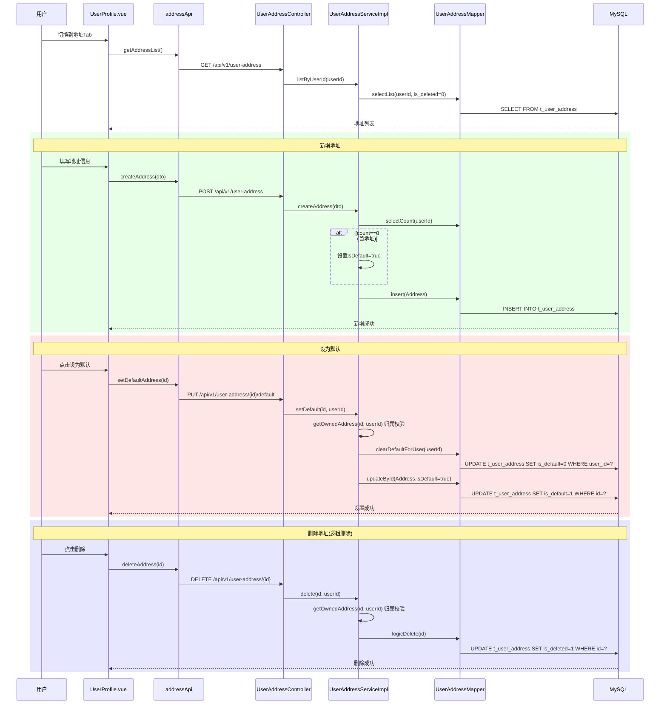
```mermaid
sequenceDiagram
    participant U as 用户
    participant V as UserProfile.vue
    participant API as addressApi
    participant Ctrl as UserAddressController
    participant Svc as UserAddressServiceImpl
    participant Mapper as UserAddressMapper
    participant DB as MySQL

    U->>V: 切换到地址Tab
    V->>API: getAddressList()
    API->>Ctrl: GET /api/v1/user-address
    Ctrl->>Svc: listByUserId(userId)
    Svc->>Mapper: selectList(userId, is_deleted=0)
    Mapper->>DB: SELECT FROM t_user_address
    DB-->>V: 地址列表

    rect rgb(230, 255, 230)
        Note over U,DB: 新增地址
        U->>V: 填写地址信息
        V->>API: createAddress(dto)
        API->>Ctrl: POST /api/v1/user-address
        Ctrl->>Svc: createAddress(dto)
        Svc->>Mapper: selectCount(userId)
        alt count==0 (首地址)
            Svc->>Svc: 设置isDefault=true
        end
        Svc->>Mapper: insert(Address)
        Mapper->>DB: INSERT INTO t_user_address
        DB-->>V: 新增成功
    end

    rect rgb(255, 230, 230)
        Note over U,DB: 设为默认
        U->>V: 点击设为默认
        V->>API: setDefaultAddress(id)
        API->>Ctrl: PUT /api/v1/user-address/{id}/default
        Ctrl->>Svc: setDefault(id, userId)
        Svc->>Svc: getOwnedAddress(id, userId) 归属校验
        Svc->>Mapper: clearDefaultForUser(userId)
        Mapper->>DB: UPDATE t_user_address SET is_default=0 WHERE user_id=?
        Svc->>Mapper: updateById(Address.isDefault=true)
        Mapper->>DB: UPDATE t_user_address SET is_default=1 WHERE id=?
        DB-->>V: 设置成功
    end

    rect rgb(230, 230, 255)
        Note over U,DB: 删除地址(逻辑删除)
        U->>V: 点击删除
        V->>API: deleteAddress(id)
        API->>Ctrl: DELETE /api/v1/user-address/{id}
        Ctrl->>Svc: delete(id, userId)
        Svc->>Svc: getOwnedAddress(id, userId) 归属校验
        Svc->>Mapper: logicDelete(id)
        Mapper->>DB: UPDATE t_user_address SET is_deleted=1 WHERE id=?
        DB-->>V: 删除成功
    end
```

---

### 3.8 商品搜索

#### 3.8.1 前端执行流程

| 步骤 | 组件/方法 | 说明 |
|------|-----------|------|
| 1 | `ProductList.vue` | 搜索栏输入关键词，选择分类/排序 |
| 2 | `fetchProducts()` | 触发搜索 |
| 3 | `getProductList(params)` | API封装 |
| 4 | `GET /api/v1/products` | 发送请求（含keyword, categoryId, page, size, sortBy, sortOrder） |

#### 3.8.2 后端执行流程

| 步骤 | 方法 | 说明 |
|------|------|------|
| 1 | `ProductController.list()` | 接收查询参数 |
| 2 | `ProductServiceImpl.listProducts()` | 核心搜索逻辑 |
| 3 | `sanitizeSortBy()` | 排序字段白名单过滤（防SQL注入） |
| 4 | 分类展开 | 一级分类ID → 展开为所有二级子分类IDs |
| 5 | `ProductMapper.selectProductPage()` | MyBatis动态SQL分页查询 |
| 6 | `buildCategoryNameMap()` | 批量查分类名称 |
| 7 | `toProductVO()` | 转换为VO |

#### 3.8.3 中间件与数据存储交互

| 中间件 | 操作 | 说明 |
|--------|------|------|
| MySQL | `t_product` SELECT | 动态SQL分页查询 |
| MySQL | `t_category` SELECT×3 | 批量查分类名（一级+二级+三级） |

#### 3.8.4 数据流转机制

- **查询流**: keyword + categoryId + sortBy → 排序白名单过滤 → 分类展开 → 动态SQL → 分页结果
- **分类展开**: 一级分类ID → 查所有二级子分类IDs → IN查询
- **VO封装**: Product + categoryNameMap → ProductVO

#### 3.8.5 Mermaid时序图

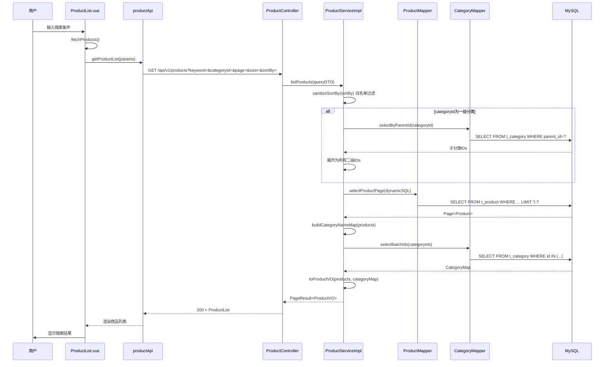
```mermaid
sequenceDiagram
    participant U as 用户
    participant V as ProductList.vue
    participant API as productApi
    participant Ctrl as ProductController
    participant Svc as ProductServiceImpl
    participant Mapper as ProductMapper
    participant CatMapper as CategoryMapper
    participant DB as MySQL

    U->>V: 输入搜索条件
    V->>V: fetchProducts()
    V->>API: getProductList(params)
    API->>Ctrl: GET /api/v1/products?keyword=&categoryId=&page=&size=&sortBy=

    Ctrl->>Svc: listProducts(queryDTO)
    Svc->>Svc: sanitizeSortBy(sortBy) 白名单过滤

    alt categoryId为一级分类
        Svc->>CatMapper: selectByParentId(categoryId)
        CatMapper->>DB: SELECT FROM t_category WHERE parent_id=?
        DB-->>Svc: 子分类IDs
        Svc->>Svc: 展开为所有二级IDs
    end

    Svc->>Mapper: selectProductPage(dynamicSQL)
    Mapper->>DB: SELECT FROM t_product WHERE ... LIMIT ?,?
    DB-->>Svc: Page<Product>

    Svc->>Svc: buildCategoryNameMap(products)
    Svc->>CatMapper: selectBatchIds(categoryIds)
    CatMapper->>DB: SELECT FROM t_category WHERE id IN (...)
    DB-->>Svc: CategoryMap

    Svc->>Svc: toProductVO(products, categoryMap)
    Svc-->>Ctrl: PageResult<ProductVO>
    Ctrl-->>API: 200 + ProductList
    API-->>V: 渲染商品列表
    V->>U: 显示搜索结果
```

---

### 3.9 分类加载

#### 3.9.1 前端执行流程

| 步骤 | 组件/方法 | 说明 |
|------|-----------|------|
| 1 | `Home.vue` / `ProductList.vue` | 页面加载时触发 |
| 2 | `getCategoryTree()` | API封装 |
| 3 | `GET /api/v1/categories` | 获取分类树 |

#### 3.9.2 后端执行流程

| 步骤 | 方法 | 说明 |
|------|------|------|
| 1 | `CategoryController.tree()` | 获取分类树 |
| 2 | `CategoryServiceImpl.getCategoryTree()` | 核心逻辑 |
| 3 | Redis缓存优先 | `seckill:category:tree` |
| 4 | `categoryMapper.selectList()` | 缓存未命中时全表查询 |
| 5 | `buildDirectProductCountMap()` | t_product按category_id分组计数 |
| 6 | 递归构建树 + 后递归回填productCount | 子节点productCount汇总到父节点 |
| 7 | 写Redis | 60min TTL |

#### 3.9.3 中间件与数据存储交互

| 中间件 | Key/操作 | 说明 |
|--------|----------|------|
| Redis | `seckill:category:tree` | String JSON，60min TTL |
| MySQL | `t_category` SELECT | 全表查询 |
| MySQL | `t_product` SELECT | 按category_id分组计数 |

#### 3.9.4 数据流转机制

- **缓存策略**: Redis优先 → 未命中则查库 → 构建树 → 写缓存
- **productCount回填**: 先统计直接商品数 → 递归构建树 → 后递归将子节点count累加到父节点

#### 3.9.5 Mermaid时序图

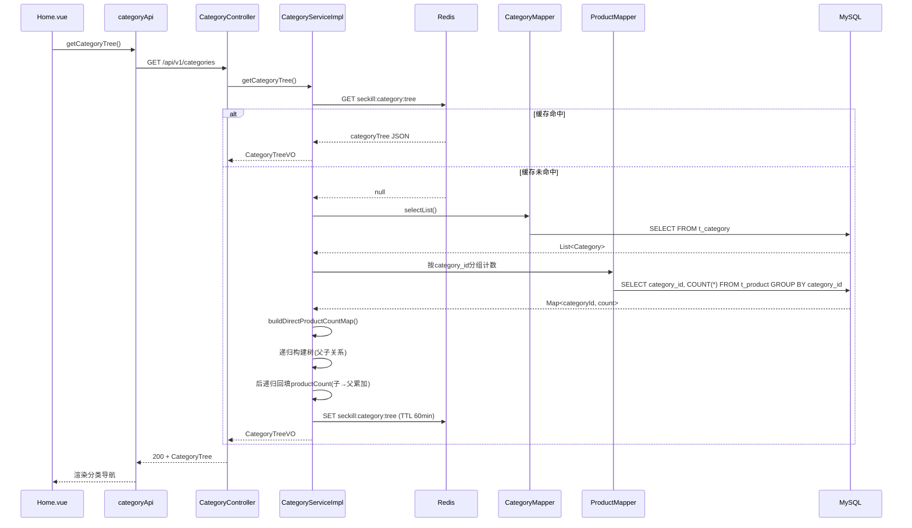
```mermaid
sequenceDiagram
    participant V as Home.vue
    participant API as categoryApi
    participant Ctrl as CategoryController
    participant Svc as CategoryServiceImpl
    participant Redis as Redis
    participant CatMapper as CategoryMapper
    participant ProdMapper as ProductMapper
    participant DB as MySQL

    V->>API: getCategoryTree()
    API->>Ctrl: GET /api/v1/categories
    Ctrl->>Svc: getCategoryTree()

    Svc->>Redis: GET seckill:category:tree
    alt 缓存命中
        Redis-->>Svc: categoryTree JSON
        Svc-->>Ctrl: CategoryTreeVO
    else 缓存未命中
        Redis-->>Svc: null
        Svc->>CatMapper: selectList()
        CatMapper->>DB: SELECT FROM t_category
        DB-->>Svc: List<Category>

        Svc->>ProdMapper: 按category_id分组计数
        ProdMapper->>DB: SELECT category_id, COUNT(*) FROM t_product GROUP BY category_id
        DB-->>Svc: Map<categoryId, count>

        Svc->>Svc: buildDirectProductCountMap()
        Svc->>Svc: 递归构建树(父子关系)
        Svc->>Svc: 后递归回填productCount(子→父累加)

        Svc->>Redis: SET seckill:category:tree (TTL 60min)
        Svc-->>Ctrl: CategoryTreeVO
    end

    Ctrl-->>API: 200 + CategoryTree
    API-->>V: 渲染分类导航
```

---

### 3.10 商品加载（详情页）

#### 3.10.1 前端执行流程

| 步骤 | 组件/方法 | 说明 |
|------|-----------|------|
| 1 | `ProductDetail.vue` | 路由参数productId |
| 2 | `fetchDetail()` | onMounted触发 |
| 3 | `getProductDetail(id)` | API封装 |
| 4 | `GET /api/v1/products/{id}` | 获取商品详情 |

#### 3.10.2 后端执行流程

| 步骤 | 方法 | 说明 |
|------|------|------|
| 1 | `ProductController.detail()` | 接收productId |
| 2 | `ProductServiceImpl.getProductDetail()` | 三级缓存防护 |
| 3 | ①查Redis | `seckill:goods:{id}` → 命中则直接返回 |
| 4 | 空值标记 | NULL值缓存2min防穿透 |
| 5 | ②Redisson互斥锁 | `lock:goods:{id}` 防击穿 + DoubleCheck |
| 6 | ③随机TTL | 31~35min随机防雪崩 |
| 7 | `productMapper.selectById()` | 查库 |
| 8 | `toProductVO()` | 转换VO |
| 9 | 写缓存 | 随机TTL |

#### 3.10.3 中间件与数据存储交互

| 中间件 | Key/操作 | 说明 |
|--------|----------|------|
| Redis | `seckill:goods:{id}` | String JSON，31~35min随机TTL |
| Redis | `seckill:goods:{id}:null` | 空值标记，2min TTL防穿透 |
| Redisson | `lock:goods:{id}` | RLock互斥锁，10s租约防击穿 |
| MySQL | `t_product` SELECT | 根据id查询 |
| MySQL | `t_category` SELECT | 批量查分类名 |

#### 3.10.4 数据流转机制

- **缓存穿透防护**: 查不到商品时缓存空值(NULL, 2min)，避免反复查库
- **缓存击穿防护**: Redisson互斥锁 + DoubleCheck，只允许一个线程查库
- **缓存雪崩防护**: 随机TTL(31~35min)，避免大量Key同时过期
- **完整流程**: Redis → 空值检查 → 加锁 → DoubleCheck → 查库 → 写缓存(随机TTL) → 释放锁

#### 3.10.5 Mermaid时序图

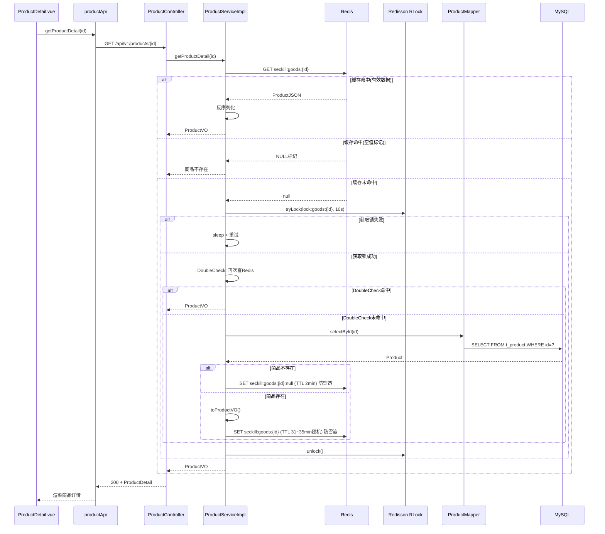
```mermaid
sequenceDiagram
    participant V as ProductDetail.vue
    participant API as productApi
    participant Ctrl as ProductController
    participant Svc as ProductServiceImpl
    participant Redis as Redis
    participant Lock as Redisson RLock
    participant Mapper as ProductMapper
    participant DB as MySQL

    V->>API: getProductDetail(id)
    API->>Ctrl: GET /api/v1/products/{id}
    Ctrl->>Svc: getProductDetail(id)

    Svc->>Redis: GET seckill:goods:{id}
    alt 缓存命中(有效数据)
        Redis-->>Svc: ProductJSON
        Svc->>Svc: 反序列化
        Svc-->>Ctrl: ProductVO
    else 缓存命中(空值标记)
        Redis-->>Svc: NULL标记
        Svc-->>Ctrl: 商品不存在
    else 缓存未命中
        Redis-->>Svc: null

        Svc->>Lock: tryLock(lock:goods:{id}, 10s)
        alt 获取锁失败
            Svc->>Svc: sleep + 重试
        else 获取锁成功
            Svc->>Svc: DoubleCheck: 再次查Redis
            alt DoubleCheck命中
                Svc-->>Ctrl: ProductVO
            else DoubleCheck未命中
                Svc->>Mapper: selectById(id)
                Mapper->>DB: SELECT FROM t_product WHERE id=?
                DB-->>Svc: Product

                alt 商品不存在
                    Svc->>Redis: SET seckill:goods:{id}:null (TTL 2min) 防穿透
                else 商品存在
                    Svc->>Svc: toProductVO()
                    Svc->>Redis: SET seckill:goods:{id} (TTL 31~35min随机) 防雪崩
                end
            end
            Svc->>Lock: unlock()
        end
        Svc-->>Ctrl: ProductVO
    end

    Ctrl-->>API: 200 + ProductDetail
    API-->>V: 渲染商品详情
```

---

### 3.11 图片加载

#### 3.11.1 前端执行流程

| 步骤 | 组件/方法 | 说明 |
|------|-----------|------|
| 1 | `uploadImage(file, bizType)` | 通用上传方法 |
| 2 | `POST /api/v1/upload/image` | 上传文件 |
| 3 | `formatImageUrl()` | 拼接完整URL（baseUrl + 相对路径） |

#### 3.11.2 后端执行流程

| 步骤 | 方法 | 说明 |
|------|------|------|
| 1 | `UploadController.uploadImage()` | 接收MultipartFile |
| 2 | `UploadServiceImpl.uploadImage()` | 核心上传逻辑 |
| 3 | 类型校验 | image/* |
| 4 | 大小校验 | 配置限制 |
| 5 | UUID命名 + 日期目录 | 防文件名冲突 |
| 6 | `ImageIO.read()` | 读取图片宽高 |
| 7 | `LocalStorageService.store()` | 写入磁盘 |
| 8 | `UploadResultVO` | 返回URL+宽高 |

#### 3.11.3 中间件与数据存储交互

| 中间件 | 操作 | 说明 |
|--------|------|------|
| 文件系统 | `{baseDir}/{bizType}/{yyyy/MM/dd}/{uuid}.{ext}` | 图片存储路径 |

#### 3.11.4 数据流转机制

- **上传流**: MultipartFile → 类型/大小校验 → UUID重命名 → 日期目录 → ImageIO读宽高 → 写磁盘
- **URL拼接**: 前端formatImageUrl(baseUrl + relativePath) → 完整访问URL

#### 3.11.5 Mermaid时序图

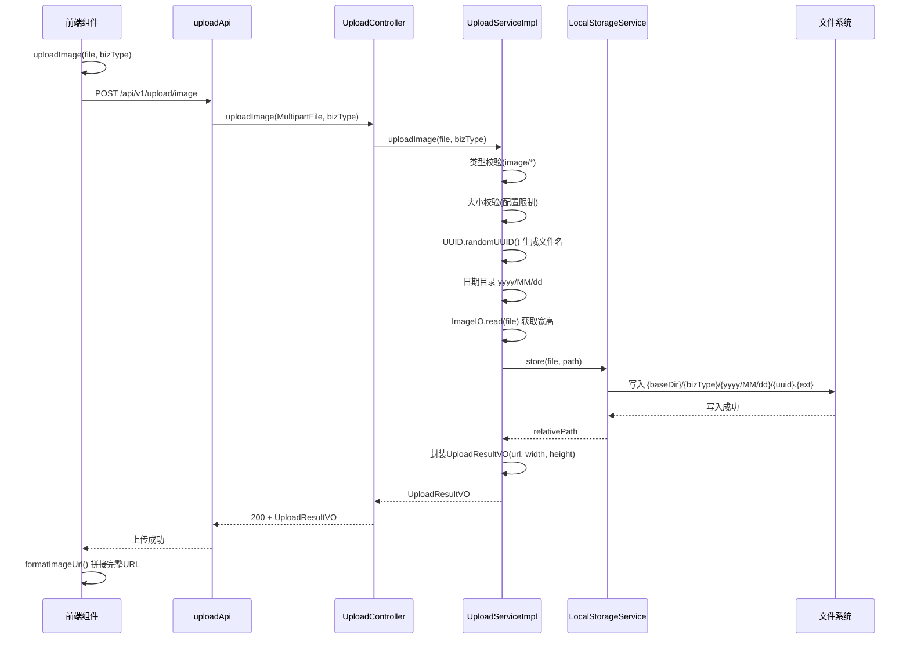
```mermaid
sequenceDiagram
    participant V as 前端组件
    participant API as uploadApi
    participant Ctrl as UploadController
    participant Svc as UploadServiceImpl
    participant Local as LocalStorageService
    participant FS as 文件系统

    V->>V: uploadImage(file, bizType)
    V->>API: POST /api/v1/upload/image
    API->>Ctrl: uploadImage(MultipartFile, bizType)

    Ctrl->>Svc: uploadImage(file, bizType)
    Svc->>Svc: 类型校验(image/*)
    Svc->>Svc: 大小校验(配置限制)
    Svc->>Svc: UUID.randomUUID() 生成文件名
    Svc->>Svc: 日期目录 yyyy/MM/dd
    Svc->>Svc: ImageIO.read(file) 获取宽高

    Svc->>Local: store(file, path)
    Local->>FS: 写入 {baseDir}/{bizType}/{yyyy/MM/dd}/{uuid}.{ext}
    FS-->>Local: 写入成功
    Local-->>Svc: relativePath

    Svc->>Svc: 封装UploadResultVO(url, width, height)
    Svc-->>Ctrl: UploadResultVO
    Ctrl-->>API: 200 + UploadResultVO
    API-->>V: 上传成功
    V->>V: formatImageUrl() 拼接完整URL
```

---

### 3.12 首页轮播图

#### 3.12.1 前端执行流程

| 步骤 | 组件/方法 | 说明 |
|------|-----------|------|
| 1 | `Home.vue` | 首页加载时触发 |
| 2 | `getActiveBanners()` | API封装 |
| 3 | `GET /api/v1/banners/active` | 获取活跃轮播图 |

#### 3.12.2 后端执行流程

| 步骤 | 方法 | 说明 |
|------|------|------|
| 1 | `BannerPublicController.active()` | 公开端点 |
| 2 | `BannerServiceImpl.listActive()` | 查询活跃轮播图 |
| 3 | 条件: status=1 | 只查启用的 |
| 4 | 排序: sort_order升序 | 按排序字段排列 |
| 5 | `bannerMapper.selectList()` | MyBatis-Plus查询 |

#### 3.12.3 中间件与数据存储交互

| 中间件 | 操作 | 说明 |
|--------|------|------|
| MySQL | `t_banner` SELECT | WHERE status=1 ORDER BY sort_order ASC |

#### 3.12.4 数据流转机制

- **查询流**: status=1 + sort_order ASC → selectList → BannerVO列表
- **无缓存**: 轮播图数据量小且变更少，直接查库

#### 3.12.5 Mermaid时序图

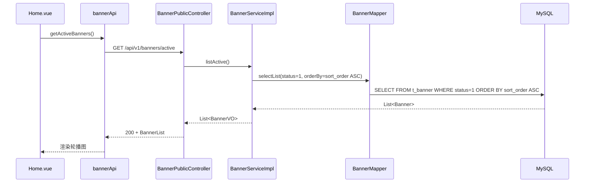
```mermaid
sequenceDiagram
    participant V as Home.vue
    participant API as bannerApi
    participant Ctrl as BannerPublicController
    participant Svc as BannerServiceImpl
    participant Mapper as BannerMapper
    participant DB as MySQL

    V->>API: getActiveBanners()
    API->>Ctrl: GET /api/v1/banners/active
    Ctrl->>Svc: listActive()

    Svc->>Mapper: selectList(status=1, orderBy=sort_order ASC)
    Mapper->>DB: SELECT FROM t_banner WHERE status=1 ORDER BY sort_order ASC
    DB-->>Svc: List<Banner>

    Svc-->>Ctrl: List<BannerVO>
    Ctrl-->>API: 200 + BannerList
    API-->>V: 渲染轮播图
```

---

### 3.13 立即抢购（秒杀）

#### 3.13.1 前端执行流程

| 步骤 | 组件/方法 | 说明 |
|------|-----------|------|
| 1 | `SeckillDetail.vue` | 秒杀商品详情页 |
| 2 | 预取令牌 | `GET /api/v1/seckill/token/{id}` 获取抢购资格令牌 |
| 3 | `handleSeckill()` | 点击"立即抢购" |
| 4 | `POST /api/v1/seckill/do` | 发送秒杀请求（含令牌+商品ID） |
| 5 | 轮询结果 | `GET /api/v1/seckill/result/{id}` 轮询秒杀结果 |

#### 3.13.2 后端执行流程

| 步骤 | 方法 | 说明 |
|------|------|------|
| 1 | `SeckillController.doSeckill()` | 接收秒杀请求 |
| 2 | `SeckillServiceImpl.doSeckill()` | 核心秒杀逻辑 |
| 3 | 令牌校验 | 验证预取令牌有效性 |
| 4 | 布隆过滤器 | 判断用户是否已购买 |
| 5 | Redis Hash活动信息 | 获取秒杀活动配置 |
| 6 | Lua原子预减 | `seckill_deduct.lua` 原子扣减库存+标记已购 |
| 7 | `SeckillOrderProducer` | 发送MQ消息 |
| 8 | `SeckillOrderConsumer` | 消费MQ消息 |
| 9 | `OrderServiceImpl.createSeckillOrder()` | 创建秒杀订单 |
| 10 | 写结果Redis | 秒杀结果写入Redis |
| 11 | 发延迟消息 | 15min超时未支付自动取消 |
| 12 | 广播 | WebSocket广播秒杀成功 |

#### 3.13.3 中间件与数据存储交互

| 中间件 | Key/操作 | 说明 |
|--------|----------|------|
| Redis | `seckill:token:{userId}:{goodsId}` | 秒杀令牌，一次性使用 |
| Redis | `seckill:bought:{goodsId}` | Redis Set，已购用户ID集合（布隆过滤器替代） |
| Redis | `seckill:stock:{goodsId}` | 剩余库存，Lua原子DECR |
| Redis | `seckill:activity:{goodsId}` | Hash，秒杀活动信息 |
| Redis | `seckill:result:{userId}:{goodsId}` | 秒杀结果，供轮询 |
| Redis | Lua脚本 `seckill_deduct.lua` | 原子操作：扣库存+标记已购+校验 |
| RabbitMQ | `seckill.order.queue` | 秒杀下单消息队列 |
| RabbitMQ | `order.delay.queue` | 延迟队列(TTL=15min) → DLX → `order.cancel.queue` |
| MySQL | `t_seckill_order` INSERT | 创建秒杀订单 |

#### 3.13.4 数据流转机制

- **令牌机制**: 预取令牌 → 一次性消费 → 防重复提交
- **Lua原子操作**: 库存校验 + 扣减 + 已购标记 → 三步合一，原子执行
- **异步下单**: MQ异步消费 → 降低数据库压力 → 结果写入Redis供轮询
- **超时取消**: 延迟队列(15min) → DLX死信交换 → 取消消费者 → Redis库存回补

#### 3.13.5 Mermaid时序图

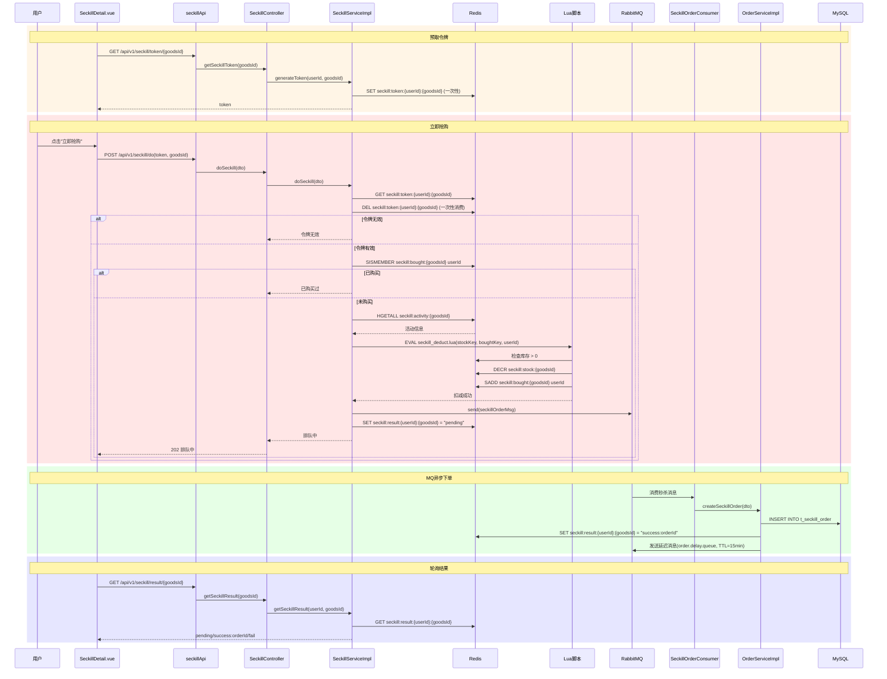
```mermaid
sequenceDiagram
    participant U as 用户
    participant V as SeckillDetail.vue
    participant API as seckillApi
    participant Ctrl as SeckillController
    participant Svc as SeckillServiceImpl
    participant Redis as Redis
    participant Lua as Lua脚本
    participant MQ as RabbitMQ
    participant Consumer as SeckillOrderConsumer
    participant OrderSvc as OrderServiceImpl
    participant DB as MySQL

    rect rgb(255, 245, 230)
        Note over U,DB: 预取令牌
        V->>API: GET /api/v1/seckill/token/{goodsId}
        API->>Ctrl: getSeckillToken(goodsId)
        Ctrl->>Svc: generateToken(userId, goodsId)
        Svc->>Redis: SET seckill:token:{userId}:{goodsId} (一次性)
        Svc-->>V: token
    end

    rect rgb(255, 230, 230)
        Note over U,DB: 立即抢购
        U->>V: 点击"立即抢购"
        V->>API: POST /api/v1/seckill/do(token, goodsId)
        API->>Ctrl: doSeckill(dto)
        Ctrl->>Svc: doSeckill(dto)

        Svc->>Redis: GET seckill:token:{userId}:{goodsId}
        Svc->>Redis: DEL seckill:token:{userId}:{goodsId} (一次性消费)
        alt 令牌无效
            Svc-->>Ctrl: 令牌无效
        else 令牌有效
            Svc->>Redis: SISMEMBER seckill:bought:{goodsId} userId
            alt 已购买
                Svc-->>Ctrl: 已购买过
            else 未购买
                Svc->>Redis: HGETALL seckill:activity:{goodsId}
                Redis-->>Svc: 活动信息

                Svc->>Lua: EVAL seckill_deduct.lua(stockKey, boughtKey, userId)
                Lua->>Redis: 检查库存 > 0
                Lua->>Redis: DECR seckill:stock:{goodsId}
                Lua->>Redis: SADD seckill:bought:{goodsId} userId
                Lua-->>Svc: 扣减成功

                Svc->>MQ: send(seckillOrderMsg)
                Svc->>Redis: SET seckill:result:{userId}:{goodsId} = "pending"

                Svc-->>Ctrl: 排队中
                Ctrl-->>V: 202 排队中
            end
        end
    end

    rect rgb(230, 255, 230)
        Note over U,DB: MQ异步下单
        MQ->>Consumer: 消费秒杀消息
        Consumer->>OrderSvc: createSeckillOrder(dto)
        OrderSvc->>DB: INSERT INTO t_seckill_order
        OrderSvc->>Redis: SET seckill:result:{userId}:{goodsId} = "success:orderId"
        OrderSvc->>MQ: 发送延迟消息(order.delay.queue, TTL=15min)
    end

    rect rgb(230, 230, 255)
        Note over U,DB: 轮询结果
        V->>API: GET /api/v1/seckill/result/{goodsId}
        API->>Ctrl: getSeckillResult(goodsId)
        Ctrl->>Svc: getSeckillResult(userId, goodsId)
        Svc->>Redis: GET seckill:result:{userId}:{goodsId}
        Svc-->>V: pending/success:orderId/fail
    end
```

---

### 3.14 订单支付

#### 3.14.1 前端执行流程

| 步骤 | 组件/方法 | 说明 |
|------|-----------|------|
| 1 | `OrderDetail.vue` | 订单详情页 |
| 2 | `handlePay()` | 点击"立即支付" |
| 3 | 秒杀订单: `payOrder(id, 'ALIPAY')` | `POST /api/v1/orders/{id}/pay` |
| 4 | 普通订单: `payNormalOrder(id, 'ALIPAY')` | `POST /api/v1/orders/{id}/pay-normal` |

#### 3.14.2 后端执行流程

| 步骤 | 方法 | 说明 |
|------|------|------|
| 1 | `OrderController.pay()` / `payNormal()` | 接收支付请求 |
| 2 | `OrderServiceImpl.payOrder()` / `payNormalOrder()` | @Transactional事务 |
| 3 | 状态机5层校验 | 订单存在 → 归属当前用户 → 状态为UNPAID → 未超时 → 金额合法 |
| 4 | 钱包分支 | `UserMapper.deductBalance()` WHERE balance>=amount 原子扣减 |
| 5 | 状态置PAID | 更新订单状态 |
| 6 | 异步邮件 | 支付成功发送邮件通知 |

#### 3.14.3 中间件与数据存储交互

| 中间件 | 操作 | 说明 |
|--------|------|------|
| MySQL | `t_seckill_order` / `t_normal_order` SELECT + UPDATE | 查询订单 + 更新状态 |
| MySQL | `t_user` UPDATE + SELECT | 原子扣减余额 + 查询邮箱 |

#### 3.14.4 数据流转机制

- **状态机校验**: 存在性 → 归属校验 → UNPAID状态 → 未超时 → 金额合法（5层校验）
- **原子扣减**: `UPDATE t_user SET balance = balance - #{amount} WHERE id = #{userId} AND balance >= #{amount}` → 影响行数=1则成功
- **异步邮件**: 支付成功后异步发送邮件通知

#### 3.14.5 Mermaid时序图

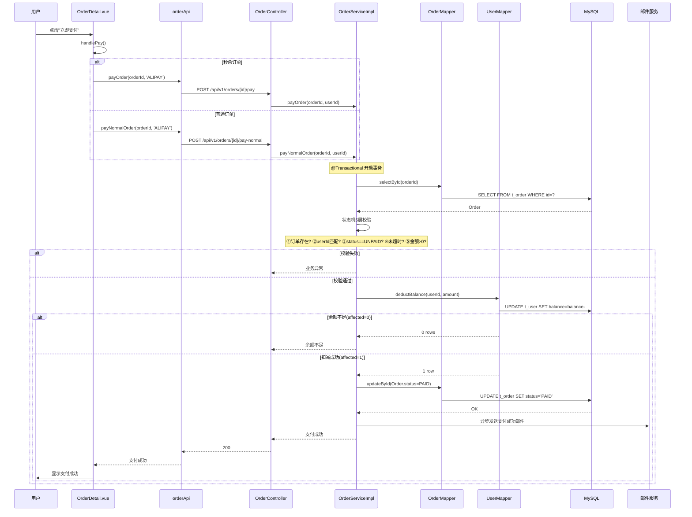
```mermaid
sequenceDiagram
    participant U as 用户
    participant V as OrderDetail.vue
    participant API as orderApi
    participant Ctrl as OrderController
    participant Svc as OrderServiceImpl
    participant Mapper as OrderMapper
    participant UserMapper as UserMapper
    participant DB as MySQL
    participant Email as 邮件服务

    U->>V: 点击"立即支付"
    V->>V: handlePay()

    alt 秒杀订单
        V->>API: payOrder(orderId, 'ALIPAY')
        API->>Ctrl: POST /api/v1/orders/{id}/pay
        Ctrl->>Svc: payOrder(orderId, userId)
    else 普通订单
        V->>API: payNormalOrder(orderId, 'ALIPAY')
        API->>Ctrl: POST /api/v1/orders/{id}/pay-normal
        Ctrl->>Svc: payNormalOrder(orderId, userId)
    end

    Note over Svc: @Transactional 开启事务

    Svc->>Mapper: selectById(orderId)
    Mapper->>DB: SELECT FROM t_order WHERE id=?
    DB-->>Svc: Order

    Svc->>Svc: 状态机5层校验
    Note over Svc: ①订单存在? ②userId匹配? ③status==UNPAID? ④未超时? ⑤金额>0?

    alt 校验失败
        Svc-->>Ctrl: 业务异常
    else 校验通过
        Svc->>UserMapper: deductBalance(userId, amount)
        UserMapper->>DB: UPDATE t_user SET balance=balance-#{amount} WHERE id=#{userId} AND balance>=#{amount}
        alt 余额不足(affected=0)
            UserMapper-->>Svc: 0 rows
            Svc-->>Ctrl: 余额不足
        else 扣减成功(affected=1)
            UserMapper-->>Svc: 1 row
            Svc->>Mapper: updateById(Order.status=PAID)
            Mapper->>DB: UPDATE t_order SET status='PAID'
            DB-->>Svc: OK

            Svc->>Email: 异步发送支付成功邮件
            Svc-->>Ctrl: 支付成功
            Ctrl-->>API: 200
            API-->>V: 支付成功
            V->>U: 显示支付成功
        end
    end
```

---

### 3.15 订单信息界面加载

#### 3.15.1 前端执行流程

| 步骤 | 组件/方法 | 说明 |
|------|-----------|------|
| 1 | `UserOrders.vue` | 订单列表页 |
| 2 | `getUnifiedOrderList()` | `GET /api/v1/orders/unified` 获取统一订单列表 |
| 3 | `OrderDetail.vue` | 订单详情页 |
| 4 | 按orderType分支 | 秒杀: `GET /api/v1/orders/{id}` / 普通: `GET /api/v1/orders/{id}/normal-detail` |
| 5 | `UnifiedOrderDetail` | 前端统一适配两种订单类型 |

#### 3.15.2 后端执行流程

| 步骤 | 方法 | 说明 |
|------|------|------|
| 1 | `OrderServiceImpl.getUnifiedOrderList()` | 两表合并查询 |
| 2 | 查询seckill_order + normal_order | 两表分别查询 |
| 3 | 批量查product / normal_order_item | 补充商品信息和订单项 |
| 4 | `convertSeckillOrder` / `convertNormalOrder` | 分别转换VO |
| 5 | 合并排序 | 按创建时间倒序 |
| 6 | 内存分页 | 合并后内存分页 |
| 7 | 详情按类型分支 | 秒杀返回SeckillOrder / 普通返回NormalOrderDetailVO{order, items} |

#### 3.15.3 中间件与数据存储交互

| 中间件 | 操作 | 说明 |
|--------|------|------|
| MySQL | `t_seckill_order` SELECT | 秒杀订单列表 |
| MySQL | `t_normal_order` SELECT | 普通订单列表 |
| MySQL | `t_product` SELECT批量 | 商品信息 |
| MySQL | `t_normal_order_item` SELECT批量 | 普通订单项 |

#### 3.15.4 数据流转机制

- **双表合并**: seckill_order + normal_order → 分别转换 → 合并 → 排序 → 内存分页
- **详情分支**: orderType区分 → 秒杀直接返回Order / 普通返回Order+Items
- **前端适配**: UnifiedOrderDetail组件统一渲染两种订单类型

#### 3.15.5 Mermaid时序图

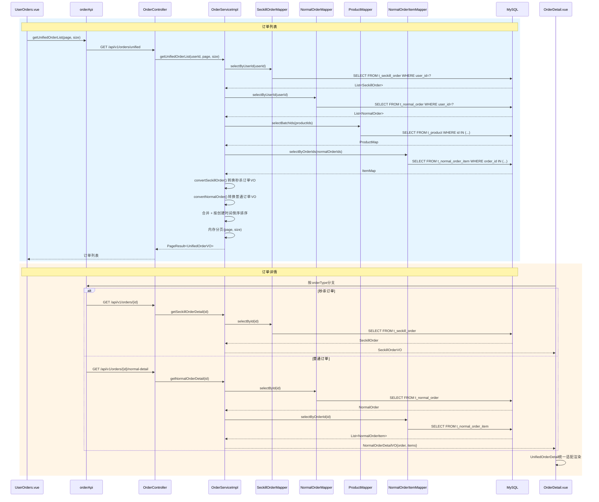
```mermaid
sequenceDiagram
    participant V as UserOrders.vue
    participant API as orderApi
    participant Ctrl as OrderController
    participant Svc as OrderServiceImpl
    participant SeckillMapper as SeckillOrderMapper
    participant NormalMapper as NormalOrderMapper
    participant ProdMapper as ProductMapper
    participant ItemMapper as NormalOrderItemMapper
    participant DB as MySQL

    rect rgb(230, 245, 255)
        Note over V,DB: 订单列表
        V->>API: getUnifiedOrderList(page, size)
        API->>Ctrl: GET /api/v1/orders/unified
        Ctrl->>Svc: getUnifiedOrderList(userId, page, size)

        Svc->>SeckillMapper: selectByUserId(userId)
        SeckillMapper->>DB: SELECT FROM t_seckill_order WHERE user_id=?
        DB-->>Svc: List<SeckillOrder>

        Svc->>NormalMapper: selectByUserId(userId)
        NormalMapper->>DB: SELECT FROM t_normal_order WHERE user_id=?
        DB-->>Svc: List<NormalOrder>

        Svc->>ProdMapper: selectBatchIds(productIds)
        ProdMapper->>DB: SELECT FROM t_product WHERE id IN (...)
        DB-->>Svc: ProductMap

        Svc->>ItemMapper: selectByOrderIds(normalOrderIds)
        ItemMapper->>DB: SELECT FROM t_normal_order_item WHERE order_id IN (...)
        DB-->>Svc: ItemMap

        Svc->>Svc: convertSeckillOrder() 转换秒杀订单VO
        Svc->>Svc: convertNormalOrder() 转换普通订单VO
        Svc->>Svc: 合并 + 按创建时间倒序排序
        Svc->>Svc: 内存分页(page, size)

        Svc-->>Ctrl: PageResult<UnifiedOrderVO>
        Ctrl-->>V: 订单列表
    end

    rect rgb(255, 245, 230)
        Note over V,DB: 订单详情
        participant Detail as OrderDetail.vue

        Detail->>API: 按orderType分支
        alt 秒杀订单
            API->>Ctrl: GET /api/v1/orders/{id}
            Ctrl->>Svc: getSeckillOrderDetail(id)
            Svc->>SeckillMapper: selectById(id)
            SeckillMapper->>DB: SELECT FROM t_seckill_order
            DB-->>Svc: SeckillOrder
            Svc-->>Detail: SeckillOrderVO
        else 普通订单
            API->>Ctrl: GET /api/v1/orders/{id}/normal-detail
            Ctrl->>Svc: getNormalOrderDetail(id)
            Svc->>NormalMapper: selectById(id)
            NormalMapper->>DB: SELECT FROM t_normal_order
            DB-->>Svc: NormalOrder
            Svc->>ItemMapper: selectByOrderId(id)
            ItemMapper->>DB: SELECT FROM t_normal_order_item
            DB-->>Svc: List<NormalOrderItem>
            Svc-->>Detail: NormalOrderDetailVO{order, items}
        end
        Detail->>Detail: UnifiedOrderDetail统一适配渲染
    end
```

---

### 3.16 余额充值

#### 3.16.1 前端执行流程

| 步骤 | 组件/方法 | 说明 |
|------|-----------|------|
| 1 | 充值页面 | 输入充值卡号+卡密 |
| 2 | `rechargeWallet({cardNo, cardPassword})` | API封装 |
| 3 | `POST /api/v1/wallet/recharge` | 发送充值请求 |

#### 3.16.2 后端执行流程

| 步骤 | 方法 | 说明 |
|------|------|------|
| 1 | `WalletController.recharge()` | 接收充值请求 |
| 2 | `RechargeCardServiceImpl.recharge()` | @Transactional事务 |
| 3 | `selectOne(cardNo)` | 查询充值卡 |
| 4 | 状态校验 | USED/DISABLED则拒绝 |
| 5 | `BCrypt.matches()` | 卡密校验 |
| 6 | `LambdaUpdateWrapper` | 原子更新(id + status=UNUSED) |
| 7 | `balance = balance + faceValue` | SQL累加余额 |
| 8 | `selectById()` | 查最新余额 |

#### 3.16.3 中间件与数据存储交互

| 中间件 | 操作 | 说明 |
|--------|------|------|
| MySQL | `t_recharge_card` SELECT + UPDATE | 查卡 + 原子更新状态 |
| MySQL | `t_user` UPDATE + SELECT | 累加余额 + 查最新余额 |

#### 3.16.4 数据流转机制

- **原子操作**: `UPDATE t_recharge_card SET status='USED' WHERE id=#{id} AND status='UNUSED'` → affected=1则成功
- **余额累加**: `UPDATE t_user SET balance = balance + #{faceValue} WHERE id = #{userId}` → SQL级别原子累加
- **并发安全**: 卡状态原子更新(UNUSED→USED)防重复充值

#### 3.16.5 Mermaid时序图

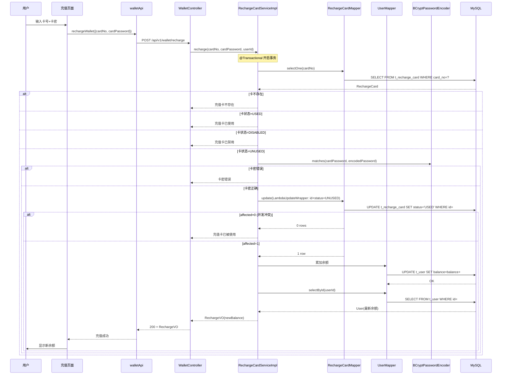
```mermaid
sequenceDiagram
    participant U as 用户
    participant V as 充值页面
    participant API as walletApi
    participant Ctrl as WalletController
    participant Svc as RechargeCardServiceImpl
    participant CardMapper as RechargeCardMapper
    participant UserMapper as UserMapper
    participant Encoder as BCryptPasswordEncoder
    participant DB as MySQL

    U->>V: 输入卡号+卡密
    V->>API: rechargeWallet({cardNo, cardPassword})
    API->>Ctrl: POST /api/v1/wallet/recharge
    Ctrl->>Svc: recharge(cardNo, cardPassword, userId)

    Note over Svc: @Transactional 开启事务

    Svc->>CardMapper: selectOne(cardNo)
    CardMapper->>DB: SELECT FROM t_recharge_card WHERE card_no=?
    DB-->>Svc: RechargeCard

    alt 卡不存在
        Svc-->>Ctrl: 充值卡不存在
    else 卡状态=USED
        Svc-->>Ctrl: 充值卡已使用
    else 卡状态=DISABLED
        Svc-->>Ctrl: 充值卡已禁用
    else 卡状态=UNUSED
        Svc->>Encoder: matches(cardPassword, encodedPassword)
        alt 卡密错误
            Svc-->>Ctrl: 卡密错误
        else 卡密正确
            Svc->>CardMapper: update(LambdaUpdateWrapper: id+status=UNUSED)
            CardMapper->>DB: UPDATE t_recharge_card SET status='USED' WHERE id=#{id} AND status='UNUSED'
            alt affected=0 (并发冲突)
                CardMapper-->>Svc: 0 rows
                Svc-->>Ctrl: 充值卡已被使用
            else affected=1
                CardMapper-->>Svc: 1 row

                Svc->>UserMapper: 累加余额
                UserMapper->>DB: UPDATE t_user SET balance=balance+#{faceValue} WHERE id=#{userId}
                DB-->>UserMapper: OK

                Svc->>UserMapper: selectById(userId)
                UserMapper->>DB: SELECT FROM t_user WHERE id=#{userId}
                DB-->>Svc: User(最新余额)

                Svc-->>Ctrl: RechargeVO(newBalance)
                Ctrl-->>API: 200 + RechargeVO
                API-->>V: 充值成功
                V->>U: 显示新余额
            end
        end
    end
```

---

### 3.17 秒杀取消Redis回补

#### 3.17.1 前端执行流程

| 步骤 | 组件/方法 | 说明 |
|------|-----------|------|
| 1 | `OrderDetail.vue` | 用户主动取消 或 系统超时取消 |
| 2 | `cancelOrder()` | `POST /api/v1/orders/{id}/cancel` 主动取消 |

#### 3.17.2 后端执行流程

| 步骤 | 方法 | 说明 |
|------|------|------|
| 1 | `OrderServiceImpl.cancelOrder()` | 主动取消 |
| 2 | `OrderServiceImpl.timeoutCancel()` | 超时自动取消 |
| 3 | 状态校验 | 只有UNPAID状态可取消 |
| 4 | `registerAfterCommit()` | 事务提交后回调 |
| 5 | Redis库存回补 | `INCR seckill:stock:{id}` |
| 6 | Redis已购标记移除 | `SREM seckill:bought:{id} userId` |

#### 3.17.3 延迟队列机制

| 步骤 | 组件 | 说明 |
|------|------|------|
| 1 | `order.delay.queue` | 延迟队列，TTL=15min |
| 2 | DLX(死信交换机) | 消息过期后进入死信 |
| 3 | `order.cancel.queue` | 死信路由到取消队列 |
| 4 | `OrderCancelConsumer` | 消费取消消息 |
| 5 | `timeoutCancel()` | 执行超时取消逻辑 |

#### 3.17.4 中间件与数据存储交互

| 中间件 | Key/操作 | 说明 |
|--------|----------|------|
| Redis | `seckill:stock:{goodsId}` | INCR库存回补 |
| Redis | `seckill:bought:{goodsId}` | SREM移除已购标记 |
| RabbitMQ | `order.delay.queue` | 延迟队列(TTL=15min) |
| RabbitMQ | DLX → `order.cancel.queue` | 死信路由 |
| MySQL | `t_seckill_order` UPDATE | 状态置CANCELLED |

#### 3.17.5 数据流转机制

- **主动取消**: 用户操作 → 状态校验 → 更新DB → 事务提交后Redis回补
- **超时取消**: 延迟队列(15min) → DLX → 取消消费者 → timeoutCancel() → Redis回补
- **事务后回调**: `registerAfterCommit()` 确保DB事务提交成功后才回补Redis，避免数据不一致

#### 3.17.6 Mermaid时序图

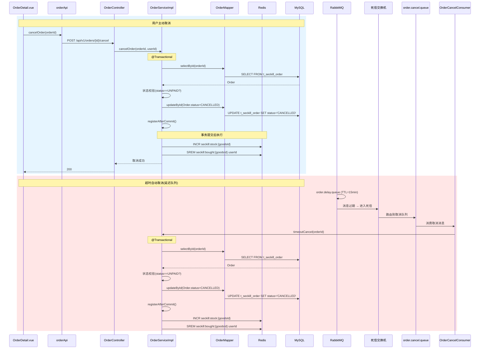
```mermaid
sequenceDiagram
    participant V as OrderDetail.vue
    participant API as orderApi
    participant Ctrl as OrderController
    participant Svc as OrderServiceImpl
    participant Mapper as OrderMapper
    participant Redis as Redis
    participant DB as MySQL

    rect rgb(230, 245, 255)
        Note over V,DB: 用户主动取消
        V->>API: cancelOrder(orderId)
        API->>Ctrl: POST /api/v1/orders/{id}/cancel
        Ctrl->>Svc: cancelOrder(orderId, userId)

        Note over Svc: @Transactional
        Svc->>Mapper: selectById(orderId)
        Mapper->>DB: SELECT FROM t_seckill_order
        DB-->>Svc: Order

        Svc->>Svc: 状态校验(status==UNPAID?)
        Svc->>Mapper: updateById(Order.status=CANCELLED)
        Mapper->>DB: UPDATE t_seckill_order SET status='CANCELLED'

        Svc->>Svc: registerAfterCommit()
        Note over Svc,Redis: 事务提交后执行
        Svc->>Redis: INCR seckill:stock:{goodsId}
        Svc->>Redis: SREM seckill:bought:{goodsId} userId

        Svc-->>Ctrl: 取消成功
        Ctrl-->>V: 200
    end

    rect rgb(255, 230, 230)
        Note over V,DB: 超时自动取消(延迟队列)
        participant MQ as RabbitMQ
        participant DLX as 死信交换机
        participant CancelQ as order.cancel.queue
        participant Consumer as OrderCancelConsumer

        MQ->>MQ: order.delay.queue (TTL=15min)
        MQ->>DLX: 消息过期 → 进入死信
        DLX->>CancelQ: 路由到取消队列
        CancelQ->>Consumer: 消费取消消息
        Consumer->>Svc: timeoutCancel(orderId)

        Note over Svc: @Transactional
        Svc->>Mapper: selectById(orderId)
        Mapper->>DB: SELECT FROM t_seckill_order
        DB-->>Svc: Order

        Svc->>Svc: 状态校验(status==UNPAID?)
        Svc->>Mapper: updateById(Order.status=CANCELLED)
        Mapper->>DB: UPDATE t_seckill_order SET status='CANCELLED'

        Svc->>Svc: registerAfterCommit()
        Svc->>Redis: INCR seckill:stock:{goodsId}
        Svc->>Redis: SREM seckill:bought:{goodsId} userId
    end
```

---

## 四、全局中间件交互汇总表

| 业务场景 | Redis | MySQL | RabbitMQ | Redisson | 文件系统 |
|----------|-------|-------|----------|----------|----------|
| 用户登录 | ✅ 失败计数/验证码/Token版本/状态缓存 | ✅ t_user SELECT / t_login_log INSERT | - | - | - |
| 用户注册 | ✅ 验证码 | ✅ t_user SELECT×2 + INSERT | - | - | - |
| 密码修改 | ✅ Token版本递增/状态缓存删除 | ✅ t_user UPDATE | - | - | - |
| 找回密码 | ✅ 验证码/频率限制/标记Key/Token版本 | ✅ t_user SELECT + UPDATE | - | - | - |
| 个人信息加载 | ✅ 黑名单/版本号/状态缓存 | ✅ t_user SELECT | - | - | - |
| 头像上传 | - | ✅ t_user UPDATE | - | - | ✅ 图片写入 |
| 地址管理 | - | ✅ t_user_address CRUD | - | - | - |
| 商品搜索 | - | ✅ t_product SELECT / t_category SELECT×3 | - | - | - |
| 分类加载 | ✅ 分类树缓存 | ✅ t_category SELECT / t_product SELECT | - | - | - |
| 商品加载 | ✅ 商品缓存/空值标记 | ✅ t_product SELECT / t_category SELECT | - | ✅ 互斥锁 | - |
| 图片加载 | - | - | - | - | ✅ 图片写入 |
| 首页轮播图 | - | ✅ t_banner SELECT | - | - | - |
| 立即抢购 | ✅ 令牌/已购标记/库存/活动信息/结果/Lua | ✅ t_seckill_order INSERT | ✅ 秒杀下单/延迟取消 | - | - |
| 订单支付 | - | ✅ t_order SELECT+UPDATE / t_user UPDATE+SELECT | ✅ 异步邮件 | - | - |
| 订单信息加载 | - | ✅ t_seckill_order+t_normal_order+t_product+t_normal_order_item SELECT | - | - | - |
| 余额充值 | - | ✅ t_recharge_card SELECT+UPDATE / t_user UPDATE+SELECT | - | - | - |
| 秒杀取消回补 | ✅ 库存INCR/已购标记SREM | ✅ t_seckill_order UPDATE | ✅ 延迟队列/DLX | - | - |

---

## 五、全局Redis Key一览表

| Redis Key | 类型 | TTL | 业务场景 | 说明 |
|-----------|------|-----|----------|------|
| `login:fail:{username}` | String | 30min | 用户登录 | 登录失败计数，≥5次锁定，登录成功删除 |
| `captcha:{uuid}` | String | 5min | 登录/注册 | 图形验证码，验证后删除 |
| `user:token-version:{userId}` | String | 30天 | 登录/密码修改/找回密码 | Token版本号，INCR使旧Token失效 |
| `user:auth:{userId}` | String | 60s | 登录/个人信息加载 | 用户状态缓存，优先读取 |
| `token:blacklist:{jwtId}` | String | - | 个人信息加载 | Token黑名单检查 |
| `verify_code:{account}` | String | 5min | 找回密码 | 短信/邮件验证码 |
| `verify_code:rate:{account}` | String | 60s | 找回密码 | 验证码发送频率限制 |
| `forgot-password:{type}:{account}` | String | 5min | 找回密码 | 标记Key，防止未验证直接重置 |
| `seckill:category:tree` | String(JSON) | 60min | 分类加载 | 分类树缓存 |
| `seckill:goods:{id}` | String(JSON) | 31~35min(随机) | 商品加载 | 商品详情缓存，随机TTL防雪崩 |
| `seckill:goods:{id}:null` | String | 2min | 商品加载 | 空值标记防穿透 |
| `lock:goods:{id}` | Redisson RLock | 10s租约 | 商品加载 | 互斥锁防击穿 |
| `seckill:token:{userId}:{goodsId}` | String | 短期 | 秒杀抢购 | 一次性令牌，使用后删除 |
| `seckill:bought:{goodsId}` | Set | - | 秒杀抢购/取消 | 已购用户ID集合 |
| `seckill:stock:{goodsId}` | String(int) | - | 秒杀抢购/取消 | 剩余库存，Lua原子DECR/INCR |
| `seckill:activity:{goodsId}` | Hash | - | 秒杀抢购 | 秒杀活动信息 |
| `seckill:result:{userId}:{goodsId}` | String | - | 秒杀抢购 | 秒杀结果(pending/success:orderId/fail) |

---

## 附录：Mermaid图表渲染说明

本文档中所有Mermaid图表支持以下渲染方式：

1. **VS Code**: 安装 "Markdown Preview Mermaid Support" 插件
2. **GitHub/GitLab**: 原生支持Mermaid语法
3. **Typora**: 原生支持Mermaid语法
4. **在线渲染**: [Mermaid Live Editor](https://mermaid.live/)

---

> **文档结束** — 本文档覆盖秒杀商城系统全部17个业务场景的前后端全链路分析，深入到方法调用级别，包含完整的Mermaid时序图、中间件交互汇总和Redis Key一览表。