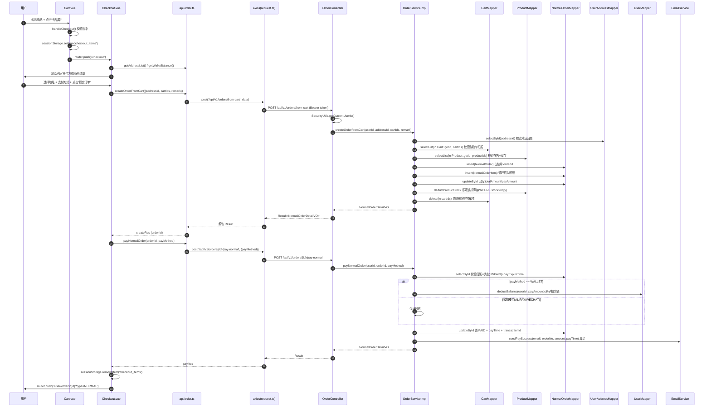
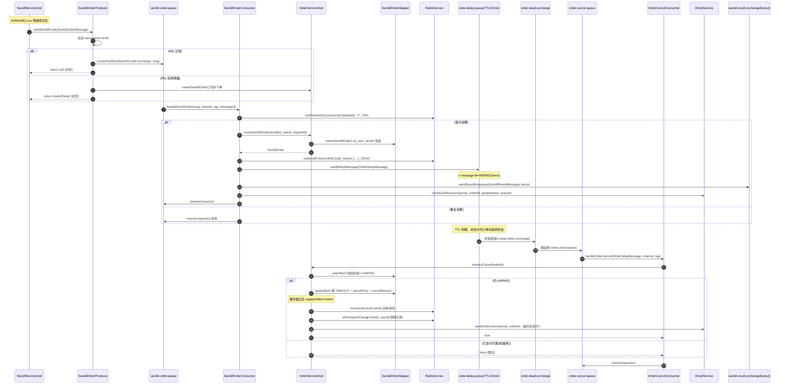
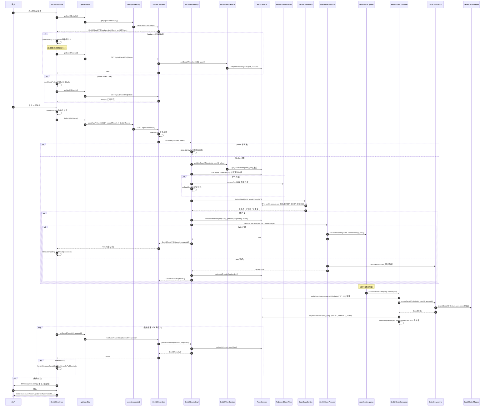

# 秒杀商场系统 — 项目内部结构与全链路技术文档

> **文档定位**：本文档为「Spring Boot + Vue + RabbitMQ + Redis + MySQL 前后端分离秒杀商场系统」的内部研发手册，基于源码逐行走查生成，可直接作为团队二次开发、架构评审与新人 onboarding 的参考依据。
>
> **技术栈概要**：后端 Spring Boot 3.2.5 + Java 17 + MyBatis-Plus 3.5.5 + Redisson 3.27.2 + Spring Security/JWT + Spring AMQP(RabbitMQ) + Knife4j 4.5.0；前端 Vue 3.5 + TypeScript + Vite 5 + Pinia + Element Plus；中间件 MySQL 8.0 + Redis 7 + RabbitMQ 3.13。
>
> **文档生成日期**：2026-08-04

---

## 目录

- 一、系统整体架构与目录结构解读
- 二、数据模型与缓存设计深度分析
- 三、核心业务流程与前后端链路拆解
- 四、中间件机制与系统可靠性设计
- 五、核心功能节点与接口清单

---

## 一、系统整体架构与目录结构解读

### 1.1 整体技术栈概览

「秒杀商场系统」采用前后端分离架构：后端基于 **Spring Boot 3.2.5 + Java 17** 构建高并发秒杀电商服务，前端基于 **Vue 3.5 + TypeScript + Vite 5 + Pinia + Element Plus** 构建 SPA，通过根目录 `docker-compose.yml` 编排 MySQL/Redis/RabbitMQ 三大中间件，前端经 Vite 代理 `/api` 转发到后端 `8080` 端口。

#### 1.1.1 后端关键依赖与中间件（来源：`seckill-mall/pom.xml` + `docker-compose.yml`）

| 类别 | 组件 / 依赖 | 版本 | 在商场项目中的职责 |
|------|------------|------|-------------------|
| **框架基座** | spring-boot-starter-parent | 3.2.5 | 统一管理 Spring 全家桶版本，Java 17 编译 |
| Web | spring-boot-starter-web | 3.2.5 | RESTful 控制器层，内嵌 Tomcat（`server.tomcat.max-threads=200`, `accept-count=100`） |
| 安全 | spring-boot-starter-security | 3.2.5 | JWT 鉴权、`@PreAuthorize` 角色控制、防重放 |
| 缓存 | spring-boot-starter-data-redis + redisson-spring-boot-starter | 3.27.2 | Lettuce 池 + Redisson 分布式锁；秒杀库存预扣、布隆过滤器、限流计数、Token 黑名单 |
| 校验 | spring-boot-starter-validation | 3.2.5 | Jakarta Validation（`@Valid`/`@NotBlank` 等），DTO 入参校验 |
| 消息队列 | spring-boot-starter-amqp | 3.2.5 | RabbitMQ：秒杀订单异步落库、订单超时取消延迟队列 |
| 邮件 | spring-boot-starter-mail | 3.2.5 | 找回密码验证码发送（dev 配置 `smtp.qq.com:465`） |
| 模板 | spring-boot-starter-thymeleaf | 3.2.5 | 邮件模板渲染 |
| 监控 | spring-boot-starter-actuator + micrometer-registry-prometheus | 3.2.5 | 暴露 `/actuator/prometheus` 指标，配合 Grafana 监控 |
| 重试 | spring-retry + aspectjweaver | — | `@Retryable` 失败重试（订单支付、库存回滚等） |
| ORM | mybatis-plus-spring-boot3-starter | 3.5.5 | 实体 CRUD、分页、逻辑删除（`logic-delete-field: isDeleted`）、`ASSIGN_ID` 雪花 ID |
| API 文档 | knife4j-openapi3-jakarta-spring-boot-starter | 4.5.0 | Swagger UI 增强，`/swagger-ui.html`、`/v3/api-docs` |
| 数据库 | mysql-connector-j | runtime | MySQL 8.0 JDBC 驱动 |
| 工具 | lombok / mapstruct | 1.18.30 / 1.5.5.Final | 样板代码消除、DTO↔Entity 高性能映射 |
| 安全工具 | jsoup | 1.17.2 | 富文本 XSS 清洗（`common.XssCleanUtil`） |
| 对象存储 | minio | 8.5.7 | 预留：`storage.type=minio` 时启用，默认 `local` 本地存储 |
| Excel | poi-ooxml | 5.2.3 | 操作日志导出 Excel（`SystemController.exportLogs`） |
| 鉴权 | jjwt-api/impl/jackson | 0.12.3 | JWT HS256 签发与解析（`JwtUtils`） |
| 测试 | spring-boot-starter-test / h2 / testcontainers | — | 单元测试 + H2 内存库 + Testcontainers 编排 MySQL/Redis/RabbitMQ 集成测试 |
| 覆盖率 | jacoco-maven-plugin | 0.8.11 | `prepare-agent` + `report` 双执行，测试阶段注入探针 |
| **中间件** | MySQL | 8.0 | 业务主库：用户/商品/订单/秒杀/优惠券等 17 张 `t_*` 表，utf8mb4 |
| **中间件** | Redis | 7-alpine | 缓存 + 秒杀预扣 + 限流 + 布隆过滤器 + Token 黑名单 + 验证码 |
| **中间件** | RabbitMQ | 3.13-management | 异步消息：秒杀订单落库、订单超时取消（管理台 15672） |

#### 1.1.2 后端核心配置 Key 路径（来源：`application.yml` / `application-dev.yml` / `application-prod.yml`）

| 配置 Key | 取值（dev / prod） | 用途 |
|---------|-------------------|------|
| `server.port` | 8080 | 后端监听端口 |
| `spring.datasource.hikari.maximum-pool-size` | 20 / 50 | 数据库连接池上限 |
| `spring.data.redis.lettuce.pool.max-active` | 8 / 32 | Redis 连接池上限 |
| `spring.rabbitmq.listener.simple.concurrency` | 3 / 5 | MQ 消费者并发数 |
| `spring.rabbitmq.listener.simple.acknowledge-mode` | manual | 手动 ACK，配合幂等表 |
| `mybatis-plus.global-config.db-config.id-type` | ASSIGN_ID | 雪花算法主键 |
| `mybatis-plus.global-config.db-config.logic-delete-field` | isDeleted | 逻辑删除字段 |
| `jwt.secret` | MySecretKey...（dev） | HS256 签名密钥 |
| `jwt.access-token-expiration` | 7200000 (2h) | Access Token 有效期 |
| `jwt.refresh-token-expiration` | 604800000 (7d) | Refresh Token 有效期 |
| `seckill.pay-timeout-minutes` | 15 | 秒杀订单支付超时（MQ 延迟队列） |
| `seckill.rate-limit-per-user` / `seckill.rate-limit-per-ip` | 1 / 30 | 秒杀限流阈值 |
| `seckill.security.sign-secret` | wnj-seckill...（dev）/ prod-...（prod） | HMAC-SHA256 防重放签名密钥 |
| `seckill.security.replay-window-seconds` | 60 | 防重放时间窗口 |
| `upload.base-dir` / `upload.base-url` | `${user.dir}/images` / `/images` | 本地图片存储目录与访问前缀 |
| `upload.allowed-types` | image/jpeg,png,gif,webp | 允许上传的 MIME 类型 |
| `storage.type` | local（可切 minio） | 文件存储策略 |
| `management.endpoints.web.exposure.include` | health,info,metrics,prometheus | Actuator 暴露端点 |
| `logging.level.com.seckill.mall` | DEBUG（dev）/ WARN（prod） | 业务日志级别 |

#### 1.1.3 前端关键依赖（来源：`frontend/package.json`）

| 类别 | 依赖 | 版本 | 职责 |
|------|------|------|------|
| **核心框架** | vue | 3.5.12 | 响应式视图层 |
| 路由 | vue-router | 4.4.5 | SPA 路由（17 个页面 + 路由守卫） |
| 状态 | pinia | 2.2.4 | 全局状态管理（4 个 store：user/cart/seckill/app） |
| UI 库 | element-plus + @element-plus/icons-vue | 2.8.4 / 2.3.1 | 组件库 + 图标（中文 locale `zh-cn`） |
| HTTP | axios | 1.7.7 | 请求库，封装于 `api/request.ts`，统一拦截 + 时间偏移同步 |
| 时间 | dayjs | 1.11.13 | 秒杀倒计时（`zh-cn` locale） |
| 图表 | echarts | 5.5.1 | 数据看台仪表盘（按需 chunk） |
| 富文本 | @wangeditor/editor + editor-for-vue | 5.1.23 / 5.1.12 | 后台商品详情编辑（按需 chunk） |
| Excel | xlsx | 0.18.5 | 后台订单/操作日志导出 |
| 安全 | dompurify | 3.4.13 | 前端 XSS 过滤 |
| 构建 | vite + @vitejs/plugin-vue | 5.4.9 / 5.1.4 | 构建工具 |
| 类型 | typescript + vue-tsc | 5.6.3 / 2.1.6 | 类型检查（`vue-tsc --noEmit`） |
| 自动导入 | unplugin-auto-import + unplugin-vue-components | 0.18.3 / 0.27.4 | Element Plus 按需自动注册 + Vue/Router/Pinia API 自动导入 |
| 死代码 | knip | 6.31.0 | 前端死代码扫描 |

#### 1.1.4 前端 Vite 构建策略（来源：`frontend/vite.config.ts`）

| 配置项 | 取值 | 作用 |
|--------|------|------|
| `resolve.alias.@` | `src` | 路径别名 |
| `server.port` | 5173 | 开发服务器端口 |
| `server.proxy./api` | `http://localhost:8080` | 前后端联调代理（`changeOrigin: true`） |
| `build.rollupOptions.output.manualChunks` | `vue-vendor` / `element-plus` / `echarts` / `wangeditor` | 第三方大库独立 chunk，提升缓存命中率 |
| `build.cssCodeSplit` | true | 异步 chunk CSS 单独提取 |
| `AutoImport.imports` | `['vue','vue-router','pinia']` | 自动导入 Composition API |

---

### 1.2 前后端目录结构映射

#### 1.2.1 后端（Spring Boot）包结构

后端 Java 包根：`com.seckill.mall`，启动类 `SeckillMallApplication.java`，下分 14 个子包，整体遵循「Controller → Service → Mapper → Entity」分层 + 横切关注点（aspect/annotation/security/cache/mq）。

| 子包 | 职责定位 | 关键类 / 文件 |
|------|---------|---------------|
| **annotation** | 自定义注解，供 AOP 切面扫描 | `@OperationLog`（操作日志，含 module/action/targetIdSpEL/targetType）、`@RateLimit`（限流） |
| **aspect** | AOP 切面，横切 Controller 方法 | `OperationLogAspect`（拦截 `@OperationLog` 写入 `t_operation_log`）、`OperationLogRecorder`（异步记录器）、`RateLimitAspect`（拦截 `@RateLimit`，Redis 计数限流） |
| **cache** | Redis 缓存抽象与秒杀专用缓存组件 | `RedisKeyConstants`（统一 Key 前缀常量与工厂方法）、`RedisService`（字符串/对象读写封装）、`CacheDegradeService`（缓存降级）、`SeckillLuaService`（Lua 脚本原子预扣库存）、`SeckillBloomInitializer`（布隆过滤器初始化，过滤不存在的秒杀商品 ID） |
| **common** | 通用基础类 | `Result<T>`（统一响应体）、`PageResult<T>`（分页结果）、`ErrorCode`（错误码枚举）、`BusinessException`（业务异常）、`GlobalExceptionHandler`（全局异常处理）、`XssCleanUtil`（Jsoup XSS 清洗） |
| **config** | Spring 配置类 | `SecurityConfig`（Spring Security 链 + JWT 过滤器）、`MybatisPlusConfig`（分页插件 + 拦截器）、`MetaObjectHandler`（自动填充 createTime/updateTime）、`RabbitMQConfig`（队列/交换机/延迟队列绑定）、`AsyncConfig`（`@EnableAsync` 线程池）、`RetryConfig`（`@EnableRetry`）、`JacksonConfig`（ObjectMapper）、`Knife4jConfig`（Swagger 文档）、`WebMvcConfig`（静态资源 `/images/**` 映射 + 跨域）、`UploadProperties`（`upload.*` 配置绑定） |
| **controller** | RESTful 控制器，23 个 Controller | 详见章节五。前缀统一 `/api/v1/`，前台 Controller 与 Admin Controller 分离（如 `BannerPublicController` / `BannerController`） |
| **dto** | 请求 DTO，28 个 | 命名以 `*Request` 结尾：`LoginRequest`、`RegisterRequest`、`ProductCreateRequest`、`SeckillCreateRequest`、`CouponCreateRequest`、`WalletRechargeRequest`、`CartCheckoutRequest`、`BuyNowRequest`、`ForgotPasswordSendRequest` 等，配合 `@Valid` 校验 |
| **entity** | MyBatis-Plus 实体，18 个 + 9 个枚举 | `User`、`Product`、`Category`、`SeckillGoods`、`SeckillOrder`、`NormalOrder`、`NormalOrderItem`、`Cart`、`UserFavorite`、`UserAddress`、`UserCoupon`、`Coupon`、`RechargeCard`、`Banner`、`ProductReview`、`OperationLog`、`LoginLog`；枚举子包 `entity/enums`：`UserRole`、`UserStatus`、`OrderStatus`、`SeckillStatus`、`ProductStatus`、`CouponType`、`UserCouponStatus`、`RechargeCardStatus`、`LoginResult` |
| **exception** | 异常扩展（预留包） | 仅 `package-info.java`，当前异常类位于 `common` 包 |
| **mapper** | MyBatis-Plus Mapper 接口，18 个 | `UserMapper`、`ProductMapper`、`CategoryMapper`、`SeckillGoodsMapper`、`SeckillOrderMapper`、`NormalOrderMapper`、`NormalOrderItemMapper`、`CartMapper`、`UserFavoriteMapper`、`UserAddressMapper`、`UserCouponMapper`、`CouponMapper`、`RechargeCardMapper`、`BannerMapper`、`ProductReviewMapper`、`OperationLogMapper`、`LoginLogMapper`；XML 位于 `resources/mapper/*.xml` |
| **mq** | RabbitMQ 消息组件，分三个子包 | `mq/message`：`SeckillOrderMessage`、`SeckillResultMessage`、`OrderDelayMessage`；`mq/producer`：`SeckillOrderProducer`（发送秒杀订单消息）；`mq/consumer`：`SeckillOrderConsumer`（异步落库）、`OrderCancelConsumer`（延迟队列消费超时取消） |
| **security** | JWT 鉴权与安全工具，10 个类 | `JwtAuthenticationFilter`（请求头解析 JWT）、`JwtUtils`（签发/解析/验证）、`JwtAuthenticationEntryPoint`（401 未认证）、`JwtAccessDeniedHandler`（403 无权限）、`ReplayProtectionFilter`（HMAC 防重放）、`SecurityUserDetails`/`SecurityUserDetailsService`（Spring Security 用户适配）、`SecurityUtils`（获取当前登录用户）、`TokenBlacklistService`（Redis Token 黑名单，登出踢人） |
| **service** | 业务服务层，25 个接口 + 23 个实现 | 接口：`AuthService`、`ProductService`、`CategoryService`、`SeckillService`、`SeckillGoodsService`、`SeckillTokenService`、`SeckillDbStrategy`、`OrderService`、`AdminOrderService`、`AdminUserService`、`CartService`、`CouponService`、`RechargeCardService`、`BannerService`、`ProductReviewService`、`UserAddressService`、`UserFavoriteService`、`StatsService`、`SystemService`、`UploadService`、`StorageService`、`EmailService`、`VerificationCodeService`、`CaptchaService`；实现位于 `service/impl`，存储策略含 `LocalStorageService` / `MinioStorageService` 双实现 |
| **vo** | 视图对象，33 个 | 命名以 `VO` 结尾：`UserVO`、`ProductVO`、`CategoryVO`、`SeckillGoodsVO`、`SeckillResultVO`、`SeckillRankingVO`、`OrderListItemVO`、`NormalOrderDetailVO`、`AdminOrderVO`、`CartItemVO`、`CouponVO`、`UserCouponVO`、`RechargeCardVO`、`BannerVO`、`ProductReviewVO`、`DashboardVO`、`StatsOverviewVO`、`SystemHealthVO`、`TokenVO`、`LoginVO`、`UploadResultVO` 等，仅返回前端所需字段 |

#### 1.2.2 前端（Vue 3）目录结构

前端 src 根：`frontend/src`，入口 `main.ts`（注册 Pinia + Router + Element Plus 中文 locale + dayjs zh-cn）。

| 目录 / 文件 | 职责定位 | 关键内容 |
|------------|---------|----------|
| **`main.ts`** | 应用入口 | `createApp(App).use(createPinia()).use(router).use(ElementPlus,{locale:zhCn})`；全局注册 Element Plus 图标 |
| **`App.vue`** | 根组件 | 仅 `<router-view />`，所有布局由路由层控制 |
| **`router/index.ts`** | 路由配置 + 守卫 | 17 个页面路由，分 3 个布局组：`FrontLayout`（前台）、`BlankLayout`（登录/注册/找回密码）、`AdminLayout`（后台，`roles:['ADMIN','SELLER']`）；`beforeEach` 守卫：标题设置 → 登录态校验 → 用户信息拉取 → Token 过期刷新 → 角色权限校验（`normalizeRole` 兼容 `ROLE_` 前缀）；空闲预取高频路由 chunk |
| **`layouts/`** | 3 个布局壳 | `FrontLayout.vue`（前台顶部导航 + 购物车徽标）、`AdminLayout.vue`（后台侧边栏 + 顶栏，受 `appStore.sidebarCollapsed` 控制）、`BlankLayout.vue`（裸壳，用于登录/注册） |
| **`views/front/`** | 前台页面，15 个 | `Home.vue`（秒杀大厅首页）、`ProductList.vue`、`ProductDetail.vue`、`SeckillZone.vue`、`SeckillDetail.vue`、`Cart.vue`、`Checkout.vue`、`UserOrders.vue`、`OrderDetail.vue`、`UserProfile.vue`（含地址/钱包/优惠券 Tab）、`MyCoupons.vue`、`Favorites.vue`、`Login.vue`、`Register.vue`、`ForgotPassword.vue` |
| **`views/admin/`** | 后台页面，13 个 | `Dashboard.vue`（仪表盘，ECharts）、`ProductManage.vue` + `ProductEdit.vue`、`CategoryManage.vue`、`SeckillManage.vue`、`OrderManage.vue`、`UserManage.vue`、`BannerManage.vue`、`ReviewManage.vue`、`CouponManage.vue`、`RechargeCardManage.vue`、`OperationLog.vue`、`SystemHealth.vue` |
| **`views/Forbidden.vue` / `NotFound.vue`** | 错误页 | 403 无权限 / 404 页面不存在 |
| **`components/`** | 通用组件，6 个 | `ImageUploader.vue`（图片上传，对接 `/api/v1/upload/image`）、`OrderStatusTag.vue`（订单状态标签）、`PaginationWrapper.vue`（分页封装）、`ProductCard.vue`（商品卡片）、`SeckillButton.vue`（秒杀按钮，含防抖 + 倒计时禁用）、`SeckillCountdown.vue`（秒杀倒计时，使用 `seckillStore.startCountdown`） |
| **`api/`** | API 请求层，19 个文件 | `request.ts`（axios 封装：`http/get/post/put/del` + 拦截器 + `syncServerTime`/`getTimeOffset` 时间偏移）、其余 18 个按业务模块拆分：`auth`、`admin`、`address`、`banner`、`cart`、`category`、`coupon`、`favorite`、`order`、`product`、`rechargeCard`、`review`、`seckill`、`stats`、`system`、`upload`、`verification`、`wallet` |
| **`stores/`** | Pinia 状态管理，4 个 | 见下表 |
| **`types/index.ts`** | TypeScript 类型定义 | 全部 VO/DTO/枚举的 TS 镜像类型，与后端 `vo`/`dto`/`entity/enums` 一一对应 |
| **`utils/image.ts`** | 工具函数 | 图片处理工具 |
| **`styles/`** | 全局样式 | `global.css`（全局重置 + 通用类）、`variables.css`（CSS 变量：主题色、间距） |
| **`auto-imports.d.ts` / `components.d.ts`** | 自动生成 | unplugin 自动导入类型声明 |

##### Pinia Stores 详解

| Store | 文件 | State | Getters | Actions | 职责 |
|-------|------|-------|---------|---------|------|
| **userStore** | `stores/user.ts` | `accessToken`、`refreshToken`（localStorage 持久化）、`userInfo: UserVO` | `isLoggedIn`、`isAdmin`、`isSeller`、`isBuyer`、`userRole` | `login`、`logout`、`fetchUserInfo`、`refreshTokenAction`、`isTokenExpired`（提前 5 分钟缓冲）、`restoreFromStorage`、`hasRole` | 用户鉴权状态、Token 管理、角色判断 |
| **cartStore** | `stores/cart.ts` | `count: number` | — | `fetchCount`（拉取 `/api/v1/cart/count`）、`reset`、`increment`、`decrement` | 购物车数量徽标实时更新（增量更新避免重复请求） |
| **seckillStore** | `stores/seckill.ts` | `activeList`、`pendingList`、`endedList`、`cancelledList`（按状态分组）、`countdownMap`、`pollingMap`、`timeOffset`、`total`/`pageNum`/`pageSize` | — | `fetchSeckillList`（拉取并按状态分组）、`startCountdown`/`stopCountdown`/`stopAllCountdowns`（基于 `timeOffset` 校时倒计时）、`pollResult`（轮询秒杀结果，最多 10 次每次 1s）、`reset` | 秒杀列表分组、倒计时管理、异步结果轮询 |
| **appStore** | `stores/app.ts` | `sidebarCollapsed`、`theme: 'light'|'dark'`、`globalLoading` | — | `toggleSidebar`、`setSidebarCollapsed`、`setLoading`、`setTheme` | 后台侧边栏折叠、主题、全局加载态 |

---

## 二、数据模型与缓存设计深度分析

本章基于 `seckill-mall/src/main/resources/sql/` 下 8 个 SQL 脚本与 `entity/` 下 17 个实体类，对「秒杀商场系统」的 MySQL 数据模型与 Redis 缓存体系进行深度剖析。所有引用均来自实际代码，按业务模块归类，并给出可渲染的 Mermaid ER 图与 Redis Key 一览表。

### 2.1 MySQL 数据库设计

#### 2.1.1 数据库总体规范

| 维度 | 规范 | 出处 |
|------|------|------|
| 数据库版本 | MySQL 8.0 + InnoDB + `utf8mb4_general_ci` | 所有 SQL 脚本头部 |
| 主键策略 | MyBatis-Plus 雪花算法 `IdType.ASSIGN_ID`，统一 `BIGINT` | 实体类 `@TableId(type = IdType.ASSIGN_ID)` |
| 逻辑删除 | `is_deleted TINYINT NOT NULL DEFAULT 0`（0-正常/1-已删除），由 `@TableLogic` 自动追加 `is_deleted=0` 条件 | `User.java`、`Product.java` 等 |
| 时间字段 | `create_time` / `update_time`，由 `@TableField(fill = FieldFill.INSERT)` / `FieldFill.INSERT_UPDATE` 自动填充；DDL 中 `DEFAULT CURRENT_TIMESTAMP ON UPDATE CURRENT_TIMESTAMP` 兜底 | 全部业务表 |
| 金额字段 | `DECIMAL(10,2)`，支持最大 99999999.99，避免浮点精度问题 | `t_product.original_price`、`t_seckill_goods.seckill_price`、`t_user.balance` 等 |
| 状态字段 | MySQL `ENUM` 类型，可读性强；Java 端用枚举类（`UserRole`、`UserStatus`、`ProductStatus`、`OrderStatus`、`SeckillStatus`、`CouponType`、`UserCouponStatus`、`RechargeCardStatus`、`LoginResult`）映射 | `t_user.role`、`t_product.status` 等 |
| 索引规范 | 唯一约束以 `uk_` 前缀，普通索引以 `idx_` 前缀，复合索引按"高选择性 → 等值 → 范围"顺序 | 全部 DDL |
| SQL 脚本演进 | `schema.sql`（基础 8 表）→ `migration_v2.sql`（Banner+评论）→ `migration_v3.sql`（购物车+收藏+商品冗余计数）→ `migration_v4.sql`（钱包+优惠券+充值卡）→ `normal_order_tables.sql`（普通订单）→ `seckill_goods_add_columns.sql`（秒杀活动扩展字段）→ `migration_v5_category.sql`（分类种子数据）→ `data.sql`（用户/商品/秒杀活动种子） | `resources/sql/` 目录 |

#### 2.1.2 核心数据表按业务模块归类

系统共 **17 张核心表**，按业务域归类如下：

| 业务模块 | 表名 | 实体类 | 表注释 | 来源脚本 |
|---------|------|--------|--------|---------|
| **A. 用户/权限** | `t_user` | `User` | 用户表（买家/卖家/管理员） | schema.sql |
| | `t_user_address` | `UserAddress` | 收货地址表 | schema.sql |
| **B. 商品/分类** | `t_category` | `Category` | 商品分类表（自关联多级） | schema.sql |
| | `t_product` | `Product` | 商品表 | schema.sql |
| | `t_product_review` | `ProductReview` | 商品评论表 | migration_v2.sql |
| | `t_user_favorite` | `UserFavorite` | 用户收藏夹表 | migration_v3.sql |
| **C. 营销 Banner** | `t_banner` | `Banner` | 轮播图表 | migration_v2.sql |
| **D. 购物车** | `t_cart` | `Cart` | 购物车表 | migration_v3.sql |
| **E. 订单/支付** | `t_normal_order` | `NormalOrder` | 普通订单表（立即购买/购物车结算） | normal_order_tables.sql |
| | `t_normal_order_item` | `NormalOrderItem` | 普通订单明细表 | normal_order_tables.sql |
| | `t_seckill_order` | `SeckillOrder` | 秒杀订单表 | schema.sql |
| **F. 秒杀活动** | `t_seckill_goods` | `SeckillGoods` | 秒杀活动表 | schema.sql + seckill_goods_add_columns.sql |
| **G. 优惠券** | `t_coupon` | `Coupon` | 优惠券表 | migration_v4.sql |
| | `t_user_coupon` | `UserCoupon` | 用户优惠券表 | migration_v4.sql |
| **H. 充值卡** | `t_recharge_card` | `RechargeCard` | 充值卡表 | migration_v4.sql |
| **I. 日志/审计** | `t_login_log` | `LoginLog` | 登录日志表（append-only） | schema.sql |
| | `t_operation_log` | `OperationLog` | 操作日志表（后台审计） | schema.sql |

#### 2.1.3 核心表字段、类型与关键约束

##### A. 用户/权限模块

**`t_user`（用户表）** —— 平台所有用户（买家/卖家/管理员）

| 字段名 | 类型 | 约束 | 说明 |
|--------|------|------|------|
| `id` | BIGINT | PK | 主键（雪花算法） |
| `username` | VARCHAR(50) | NOT NULL, UNIQUE `uk_username` | 用户名 |
| `password` | VARCHAR(100) | NOT NULL | 密码（BCrypt 加密，Java 端 `@JsonIgnore` 防止序列化泄露） |
| `phone` | VARCHAR(20) | UNIQUE `uk_phone` | 手机号 |
| `email` | VARCHAR(100) | — | 邮箱 |
| `nickname` | VARCHAR(50) | — | 昵称 |
| `avatar_url` | VARCHAR(255) | — | 头像 URL |
| `balance` | DECIMAL(10,2) | NOT NULL DEFAULT 0.00 | 钱包余额（migration_v4 新增） |
| `role` | ENUM('BUYER','SELLER','ADMIN') | NOT NULL DEFAULT 'BUYER' | 角色 |
| `status` | ENUM('ACTIVE','DISABLED') | NOT NULL DEFAULT 'ACTIVE' | 状态 |
| `is_deleted` | TINYINT | NOT NULL DEFAULT 0 | 逻辑删除 |
| `create_time` / `update_time` | DATETIME | NOT NULL DEFAULT CURRENT_TIMESTAMP | 创建/更新时间 |

**`t_user_address`（收货地址表）**

| 字段名 | 类型 | 约束 | 说明 |
|--------|------|------|------|
| `id` | BIGINT | PK | 主键 |
| `user_id` | BIGINT | NOT NULL, `idx_user_id` | 所属用户 ID |
| `receiver_name` | VARCHAR(50) | NOT NULL | 收货人姓名 |
| `receiver_phone` | VARCHAR(20) | NOT NULL | 收货人手机号 |
| `province` / `city` / `district` | VARCHAR(30) | NOT NULL | 省/市/区 |
| `detail_address` | VARCHAR(200) | NOT NULL | 详细地址 |
| `is_default` | TINYINT | NOT NULL DEFAULT 0 | 是否默认地址（`idx_user_default` 复合索引） |
| `is_deleted` / `create_time` / `update_time` | — | — | 通用字段 |

##### B. 商品/分类模块

**`t_category`（商品分类表）** —— 自关联多级分类

| 字段名 | 类型 | 约束 | 说明 |
|--------|------|------|------|
| `id` | BIGINT | PK | 主键 |
| `name` | VARCHAR(50) | NOT NULL | 分类名称 |
| `parent_id` | BIGINT | NULL=一级分类, `idx_parent_id` | 父分类 ID |
| `sort_order` | INT | NOT NULL DEFAULT 0 | 排序权重（值小靠前） |
| `icon_url` | VARCHAR(255) | — | 分类图标 |
| `status` | TINYINT | NOT NULL DEFAULT 1 | 1-启用/0-禁用 |

**`t_product`（商品表）**

| 字段名 | 类型 | 约束 | 说明 |
|--------|------|------|------|
| `id` | BIGINT | PK | 主键 |
| `name` | VARCHAR(200) | NOT NULL | 商品名称 |
| `description` | TEXT | — | 商品简介 |
| `original_price` | DECIMAL(10,2) | NOT NULL | 原价 |
| `stock` | INT | NOT NULL DEFAULT 0 | 普通库存 |
| `sales_count` | INT | NOT NULL DEFAULT 0 | 累计销量 |
| `cart_count` | INT | NOT NULL DEFAULT 0 | 加购数量（migration_v3 冗余计数） |
| `favorite_count` | INT | NOT NULL DEFAULT 0 | 收藏数量（migration_v3 冗余计数） |
| `category_id` | BIGINT | NOT NULL, `idx_category_status` | 所属分类 ID |
| `images` | JSON | — | 商品图片 URL 数组 |
| `main_image` | VARCHAR(255) | — | 主图 URL |
| `detail_html` | TEXT | — | 商品详情（富文本 HTML） |
| `status` | ENUM('ON_SALE','OFF_SHELF') | NOT NULL DEFAULT 'ON_SALE' | 在售/下架 |

**`t_product_review`（商品评论表）** —— `migration_v2.sql` 新增

| 字段名 | 类型 | 约束 | 说明 |
|--------|------|------|------|
| `id` | BIGINT | PK | 主键 |
| `product_id` | BIGINT | NOT NULL, `idx_product_id` | 商品 ID |
| `user_id` | BIGINT | NOT NULL, `idx_user_id` | 评论用户 ID |
| `order_id` | BIGINT | NULL | 关联订单 ID（可选） |
| `content` | TEXT | NOT NULL | 评论内容 |
| `rating` | TINYINT | NOT NULL DEFAULT 5 | 评分 1-5 星 |
| `images` | JSON | — | 评论图片 URL 数组 |
| `status` | TINYINT | NOT NULL DEFAULT 1 | 1-显示/0-隐藏 |
| `reply_content` | TEXT | — | 商家回复内容 |
| `reply_time` | DATETIME | — | 回复时间 |

**`t_user_favorite`（用户收藏夹表）** —— `migration_v3.sql` 新增

| 字段名 | 类型 | 约束 | 说明 |
|--------|------|------|------|
| `id` | BIGINT | PK | 主键 |
| `user_id` | BIGINT | NOT NULL | 用户 ID |
| `product_id` | BIGINT | NOT NULL | 商品 ID |
| — | — | UNIQUE `uk_user_product(user_id, product_id)` | 每用户每商品唯一 |

##### C. 营销 Banner 模块

**`t_banner`（轮播图表）** —— `migration_v2.sql` 新增

| 字段名 | 类型 | 约束 | 说明 |
|--------|------|------|------|
| `id` | BIGINT | PK | 主键 |
| `title` | VARCHAR(100) | — | 轮播图标题 |
| `image_url` | VARCHAR(500) | NOT NULL | 图片 URL |
| `link_url` | VARCHAR(500) | — | 点击跳转链接 |
| `sort_order` | INT | NOT NULL DEFAULT 0 | 排序权重 |
| `status` | TINYINT | NOT NULL DEFAULT 1 | 1-启用/0-禁用，`idx_status_sort(status, sort_order)` |

##### D. 购物车模块

**`t_cart`（购物车表）** —— `migration_v3.sql` 新增

| 字段名 | 类型 | 约束 | 说明 |
|--------|------|------|------|
| `id` | BIGINT | PK | 主键 |
| `user_id` | BIGINT | NOT NULL | 用户 ID |
| `product_id` | BIGINT | NOT NULL | 商品 ID |
| `quantity` | INT | NOT NULL DEFAULT 1 | 加购数量 |
| `selected` | TINYINT | NOT NULL DEFAULT 1 | 是否选中（结算勾选） |
| — | — | UNIQUE `uk_user_product(user_id, product_id)` | 每用户每商品唯一 |

##### E. 订单/支付模块

**`t_normal_order`（普通订单主表）** —— `normal_order_tables.sql` 新增，与 `t_seckill_order` 互相独立

| 字段名 | 类型 | 约束 | 说明 |
|--------|------|------|------|
| `id` | BIGINT | PK | 主键 |
| `order_no` | VARCHAR(32) | NOT NULL, UNIQUE `uk_order_no` | 订单号（时间戳+随机串） |
| `user_id` | BIGINT | NOT NULL | 下单用户 ID |
| `address_id` | BIGINT | NOT NULL | 收货地址 ID |
| `total_amount` | DECIMAL(10,2) | NOT NULL | 商品总金额（明细小计之和） |
| `freight_amount` | DECIMAL(10,2) | NOT NULL DEFAULT 0.00 | 运费 |
| `pay_amount` | DECIMAL(10,2) | NOT NULL | 实付金额 = total_amount + freight_amount |
| `status` | ENUM('UNPAID','PAID','CANCELLED','TIMEOUT','COMPLETED') | NOT NULL DEFAULT 'UNPAID' | 订单状态 |
| `pay_method` | VARCHAR(20) | — | 支付方式（WALLET/ALIPAY/WECHAT） |
| `transaction_id` | VARCHAR(64) | — | 支付流水号 |
| `pay_time` / `pay_expire_time` / `cancel_time` | DATETIME | — | 支付/截止/取消时间 |
| `cancel_reason` | VARCHAR(255) | — | 取消原因 |
| `remark` | VARCHAR(255) | — | 用户下单备注 |

**`t_normal_order_item`（普通订单明细表）** —— 一个订单对应多个明细行，冗余商品名称/主图/单价保留下单时刻快照

| 字段名 | 类型 | 约束 | 说明 |
|--------|------|------|------|
| `id` | BIGINT | PK | 主键 |
| `order_id` | BIGINT | NOT NULL, `idx_order_id` | 所属普通订单 ID |
| `product_id` | BIGINT | NOT NULL, `idx_product_id` | 商品 ID |
| `product_name` | VARCHAR(200) | NOT NULL | 商品名称（下单时快照） |
| `product_image` | VARCHAR(255) | — | 商品主图 URL（下单时快照） |
| `unit_price` | DECIMAL(10,2) | NOT NULL | 商品单价（下单时快照） |
| `quantity` | INT | NOT NULL DEFAULT 1 | 购买数量 |
| `subtotal` | DECIMAL(10,2) | NOT NULL | 小计 = unit_price × quantity |

**`t_seckill_order`（秒杀订单表）** —— 核心交易表，含一人一单唯一约束

| 字段名 | 类型 | 约束 | 说明 |
|--------|------|------|------|
| `id` | BIGINT | PK | 主键 |
| `order_no` | VARCHAR(32) | NOT NULL, UNIQUE `uk_order_no` | 订单号 |
| `user_id` | BIGINT | NOT NULL | 下单用户 ID |
| `seckill_id` | BIGINT | NOT NULL | 秒杀活动 ID |
| `product_id` | BIGINT | NOT NULL | 商品 ID（冗余，减少 JOIN） |
| `seckill_price` | DECIMAL(10,2) | NOT NULL | 下单时秒杀价（价格快照） |
| `quantity` | INT | NOT NULL DEFAULT 1 | 购买数量 |
| `total_amount` | DECIMAL(10,2) | NOT NULL | 订单总金额 |
| `status` | ENUM('UNPAID','PAID','CANCELLED','TIMEOUT','COMPLETED') | NOT NULL DEFAULT 'UNPAID' | 订单状态 |
| `pay_time` / `pay_expire_time` / `cancel_time` | DATETIME | — | 关键时间点 |
| `transaction_id` / `pay_method` / `cancel_reason` | — | — | 支付/取消信息 |
| — | — | UNIQUE `uk_user_seckill(user_id, seckill_id)` | **一人一单约束（核心）** |
| — | — | `idx_user_status` / `idx_seckill_status` | 复合索引 |

##### F. 秒杀活动模块

**`t_seckill_goods`（秒杀活动表）** —— `schema.sql` 基础 + `seckill_goods_add_columns.sql` 扩展

| 字段名 | 类型 | 约束 | 说明 |
|--------|------|------|------|
| `id` | BIGINT | PK | 主键 |
| `product_id` | BIGINT | NOT NULL, `idx_product_id` | 关联商品 ID |
| `seckill_price` | DECIMAL(10,2) | NOT NULL | 秒杀价格 |
| `stock_count` | INT | NOT NULL | 秒杀总库存 |
| `available_count` | INT | NOT NULL | 可用库存（实时扣减） |
| `start_time` / `end_time` | DATETIME | NOT NULL | 秒杀时间窗口，`idx_status_start` / `idx_start_time` |
| `status` | ENUM('PENDING','ACTIVE','ENDED','CANCELLED') | NOT NULL DEFAULT 'PENDING' | 活动状态 |
| `creator_id` | BIGINT | NOT NULL | 创建人 ID（管理员） |
| `seckill_name` | VARCHAR(255) | — | 秒杀活动名称（扩展字段） |
| `per_limit` | INT | NOT NULL DEFAULT 1 | 每人限购数量（扩展字段，兼容一人一单） |
| `images` | TEXT | — | 活动图片（JSON 数组，扩展字段） |
| `description` | TEXT | — | 活动描述（扩展字段） |

##### G. 优惠券模块

**`t_coupon`（优惠券表）** —— `migration_v4.sql` 新增

| 字段名 | 类型 | 约束 | 说明 |
|--------|------|------|------|
| `id` | BIGINT | PK | 主键 |
| `name` | VARCHAR(100) | NOT NULL | 优惠券名称 |
| `type` | ENUM('AMOUNT','DISCOUNT') | NOT NULL | AMOUNT-满减 / DISCOUNT-折扣 |
| `amount` | DECIMAL(10,2) | NOT NULL | 满减金额或折扣值（如 0.85 表示 85 折） |
| `min_amount` | DECIMAL(10,2) | NOT NULL DEFAULT 0.00 | 最低消费金额 |
| `total_count` / `received_count` / `used_count` | INT | NOT NULL | 发放总数/已领取/已使用 |
| `start_time` / `end_time` | DATETIME | NOT NULL | 有效期 |
| `status` | TINYINT | NOT NULL DEFAULT 1 | 1-启用/0-停用 |

**`t_user_coupon`（用户优惠券表）**

| 字段名 | 类型 | 约束 | 说明 |
|--------|------|------|------|
| `id` | BIGINT | PK | 主键 |
| `user_id` | BIGINT | NOT NULL, `idx_user_id` | 用户 ID |
| `coupon_id` | BIGINT | NOT NULL, `idx_coupon_id` | 优惠券 ID |
| `status` | ENUM('UNUSED','USED','EXPIRED') | NOT NULL DEFAULT 'UNUSED' | 状态 |
| `receive_time` | DATETIME | NOT NULL DEFAULT CURRENT_TIMESTAMP | 领取时间 |
| `use_time` | DATETIME | — | 使用时间 |
| `order_id` | BIGINT | — | 使用的订单 ID |

##### H. 充值卡模块

**`t_recharge_card`（充值卡表）** —— `migration_v4.sql` 新增

| 字段名 | 类型 | 约束 | 说明 |
|--------|------|------|------|
| `id` | BIGINT | PK | 主键 |
| `card_no` | VARCHAR(32) | NOT NULL, UNIQUE `uk_card_no` | 卡号 |
| `card_password` | VARCHAR(64) | NOT NULL | 卡密（BCrypt 加密存储） |
| `face_value` | DECIMAL(10,2) | NOT NULL | 面额 |
| `status` | ENUM('UNUSED','USED','DISABLED') | NOT NULL DEFAULT 'UNUSED' | 状态 |
| `used_by` | BIGINT | — | 使用者用户 ID |
| `used_time` | DATETIME | — | 使用时间 |
| `batch_no` | VARCHAR(32) | NOT NULL, `idx_batch_no` | 批次号 |

##### I. 日志/审计模块

**`t_login_log`（登录日志表）** —— append-only，无 `update_time` / `is_deleted`

| 字段名 | 类型 | 约束 | 说明 |
|--------|------|------|------|
| `id` | BIGINT | PK | 主键 |
| `user_id` | BIGINT | NOT NULL | 用户 ID |
| `login_ip` | VARCHAR(50) | NOT NULL | 登录 IP |
| `login_location` | VARCHAR(100) | — | 登录地点（IP 解析城市） |
| `user_agent` | VARCHAR(500) | — | 浏览器 UA |
| `login_result` | ENUM('SUCCESS','FAILED') | NOT NULL | 登录结果 |
| `fail_reason` | VARCHAR(255) | — | 失败原因 |
| `create_time` | DATETIME | NOT NULL DEFAULT CURRENT_TIMESTAMP, `idx_user_time` | 登录时间 |

**`t_operation_log`（操作日志表）** —— 后台管理员审计，append-only

| 字段名 | 类型 | 约束 | 说明 |
|--------|------|------|------|
| `id` | BIGINT | PK | 主键 |
| `operator_id` | BIGINT | NOT NULL | 操作人 ID |
| `module` | VARCHAR(50) | NOT NULL, `idx_module` | 操作模块 |
| `action` | VARCHAR(50) | NOT NULL | 操作类型（CREATE/UPDATE/DELETE/EXPORT） |
| `target_id` | VARCHAR(64) | — | 操作目标 ID |
| `target_type` | VARCHAR(50) | — | 目标类型（PRODUCT/SECKILL/USER） |
| `detail` | TEXT | — | 操作详情（JSON 变更快照） |
| `ip_address` | VARCHAR(50) | — | 操作 IP |
| `create_time` | DATETIME | NOT NULL, `idx_operator_time` | 操作时间 |

#### 2.1.4 核心表关联关系

系统采用 **"逻辑外键 + 应用层维护"** 策略，DDL 中未声明物理 `FOREIGN KEY`，便于分库分表演进。核心关联如下：

1. **用户 → 地址**：`t_user_address.user_id` → `t_user.id`（1:N）
2. **用户 → 收藏**：`t_user_favorite.user_id` → `t_user.id`，`t_user_favorite.product_id` → `t_product.id`（N:M，通过 `uk_user_product` 唯一）
3. **用户 → 购物车**：`t_cart.user_id` → `t_user.id`，`t_cart.product_id` → `t_product.id`（N:M，通过 `uk_user_product` 唯一）
4. **分类自关联**：`t_category.parent_id` → `t_category.id`（多级树形结构）
5. **商品 → 分类**：`t_product.category_id` → `t_category.id`（N:1）
6. **商品 → 评论**：`t_product_review.product_id` → `t_product.id`，`t_product_review.user_id` → `t_user.id`，`t_product_review.order_id` → `t_normal_order.id` 或 `t_seckill_order.id`（1:N）
7. **秒杀活动 → 商品**：`t_seckill_goods.product_id` → `t_product.id`（1:1，一个商品可挂多个秒杀活动）
8. **秒杀活动 → 创建人**：`t_seckill_goods.creator_id` → `t_user.id`（N:1，管理员）
9. **秒杀订单 → 用户/活动/商品**：`t_seckill_order.user_id` → `t_user.id`，`t_seckill_order.seckill_id` → `t_seckill_goods.id`，`t_seckill_order.product_id` → `t_product.id`（冗余 `product_id` 减少 JOIN，`uk_user_seckill` 保证一人一单）
10. **普通订单 → 用户/地址**：`t_normal_order.user_id` → `t_user.id`，`t_normal_order.address_id` → `t_user_address.id`（1:N）
11. **普通订单 → 明细**：`t_normal_order_item.order_id` → `t_normal_order.id`（1:N），明细冗余 `product_name` / `product_image` / `unit_price` 保留下单时刻快照
12. **用户优惠券 → 用户/优惠券/订单**：`t_user_coupon.user_id` → `t_user.id`，`t_user_coupon.coupon_id` → `t_coupon.id`，`t_user_coupon.order_id` → `t_normal_order.id` 或 `t_seckill_order.id`（N:1）
13. **充值卡 → 使用者**：`t_recharge_card.used_by` → `t_user.id`（1:1）
14. **登录日志 → 用户**：`t_login_log.user_id` → `t_user.id`（1:N）
15. **操作日志 → 操作人**：`t_operation_log.operator_id` → `t_user.id`（1:N）

#### 2.1.5 Mermaid ER 图

> 以下 ER 图使用 Mermaid `erDiagram` 语法，覆盖 17 张核心表与主要关联关系，可直接在支持 Mermaid 的 Markdown 渲染器中查看。

```mermaid
erDiagram
    t_user ||--o{ t_user_address : "拥有"
    t_user ||--o{ t_user_favorite : "收藏"
    t_user ||--o{ t_cart : "加购"
    t_user ||--o{ t_normal_order : "下单"
    t_user ||--o{ t_seckill_order : "秒杀下单"
    t_user ||--o{ t_user_coupon : "领取优惠券"
    t_user ||--o{ t_login_log : "登录日志"
    t_user ||--o{ t_operation_log : "操作日志"
    t_user ||--o{ t_seckill_goods : "创建秒杀活动(creator_id)"
    t_user ||--o| t_recharge_card : "使用充值卡(used_by)"

    t_category ||--o{ t_category : "parent_id 自关联"
    t_category ||--o{ t_product : "归属分类"

    t_product ||--o{ t_product_review : "被评论"
    t_product ||--o{ t_user_favorite : "被收藏"
    t_product ||--o{ t_cart : "被加购"
    t_product ||--o{ t_seckill_goods : "参与秒杀"
    t_product ||--o{ t_normal_order_item : "订单明细"

    t_seckill_goods ||--o{ t_seckill_order : "产生订单"

    t_normal_order ||--|{ t_normal_order_item : "包含明细"
    t_normal_order }o--|| t_user_address : "收货地址"

    t_coupon ||--o{ t_user_coupon : "发放实例"
    t_user_coupon }o--o| t_normal_order : "使用于普通订单"
    t_user_coupon }o--o| t_seckill_order : "使用于秒杀订单"

    t_product_review }o--o| t_normal_order : "评论来源订单"
    t_product_review }o--o| t_seckill_order : "评论来源订单"

    t_user {
        BIGINT id PK "雪花算法"
        VARCHAR username UK "用户名"
        VARCHAR password "BCrypt加密"
        VARCHAR phone UK "手机号"
        VARCHAR email "邮箱"
        VARCHAR nickname "昵称"
        VARCHAR avatar_url "头像URL"
        DECIMAL balance "钱包余额"
        ENUM role "BUYER/SELLER/ADMIN"
        ENUM status "ACTIVE/DISABLED"
        TINYINT is_deleted "逻辑删除"
        DATETIME create_time
        DATETIME update_time
    }

    t_user_address {
        BIGINT id PK
        BIGINT user_id FK
        VARCHAR receiver_name
        VARCHAR receiver_phone
        VARCHAR province
        VARCHAR city
        VARCHAR district
        VARCHAR detail_address
        TINYINT is_default "是否默认"
    }

    t_category {
        BIGINT id PK
        VARCHAR name
        BIGINT parent_id FK "NULL=一级"
        INT sort_order
        VARCHAR icon_url
        TINYINT status
    }

    t_product {
        BIGINT id PK
        VARCHAR name
        TEXT description
        DECIMAL original_price
        INT stock "普通库存"
        INT sales_count "累计销量"
        INT cart_count "加购冗余计数"
        INT favorite_count "收藏冗余计数"
        BIGINT category_id FK
        JSON images
        VARCHAR main_image
        TEXT detail_html
        ENUM status "ON_SALE/OFF_SHELF"
    }

    t_product_review {
        BIGINT id PK
        BIGINT product_id FK
        BIGINT user_id FK
        BIGINT order_id FK "可选"
        TEXT content
        TINYINT rating "1-5星"
        JSON images
        TINYINT status
        TEXT reply_content
        DATETIME reply_time
    }

    t_user_favorite {
        BIGINT id PK
        BIGINT user_id FK
        BIGINT product_id FK
    }

    t_banner {
        BIGINT id PK
        VARCHAR title
        VARCHAR image_url
        VARCHAR link_url
        INT sort_order
        TINYINT status
    }

    t_cart {
        BIGINT id PK
        BIGINT user_id FK
        BIGINT product_id FK
        INT quantity
        TINYINT selected "是否选中"
    }

    t_normal_order {
        BIGINT id PK
        VARCHAR order_no UK
        BIGINT user_id FK
        BIGINT address_id FK
        DECIMAL total_amount
        DECIMAL freight_amount
        DECIMAL pay_amount
        ENUM status "UNPAID/PAID/CANCELLED/TIMEOUT/COMPLETED"
        VARCHAR pay_method
        VARCHAR transaction_id
        DATETIME pay_time
        DATETIME pay_expire_time
        VARCHAR remark
    }

    t_normal_order_item {
        BIGINT id PK
        BIGINT order_id FK
        BIGINT product_id FK
        VARCHAR product_name "下单快照"
        VARCHAR product_image "下单快照"
        DECIMAL unit_price "下单快照"
        INT quantity
        DECIMAL subtotal
    }

    t_seckill_goods {
        BIGINT id PK
        BIGINT product_id FK
        DECIMAL seckill_price
        INT stock_count "总库存"
        INT available_count "可用库存"
        DATETIME start_time
        DATETIME end_time
        ENUM status "PENDING/ACTIVE/ENDED/CANCELLED"
        BIGINT creator_id FK
        VARCHAR seckill_name "扩展字段"
        INT per_limit "每人限购"
        TEXT images
        TEXT description
    }

    t_seckill_order {
        BIGINT id PK
        VARCHAR order_no UK
        BIGINT user_id FK
        BIGINT seckill_id FK
        BIGINT product_id FK "冗余"
        DECIMAL seckill_price "价格快照"
        INT quantity
        DECIMAL total_amount
        ENUM status "UNPAID/PAID/CANCELLED/TIMEOUT/COMPLETED"
        DATETIME pay_time
        DATETIME pay_expire_time
        VARCHAR transaction_id
        VARCHAR pay_method
    }

    t_coupon {
        BIGINT id PK
        VARCHAR name
        ENUM type "AMOUNT/DISCOUNT"
        DECIMAL amount "满减额或折扣值"
        DECIMAL min_amount
        INT total_count
        INT received_count
        INT used_count
        DATETIME start_time
        DATETIME end_time
        TINYINT status
    }

    t_user_coupon {
        BIGINT id PK
        BIGINT user_id FK
        BIGINT coupon_id FK
        ENUM status "UNUSED/USED/EXPIRED"
        DATETIME receive_time
        DATETIME use_time
        BIGINT order_id FK "使用的订单"
    }

    t_recharge_card {
        BIGINT id PK
        VARCHAR card_no UK
        VARCHAR card_password "BCrypt加密"
        DECIMAL face_value
        ENUM status "UNUSED/USED/DISABLED"
        BIGINT used_by FK
        DATETIME used_time
        VARCHAR batch_no
    }

    t_login_log {
        BIGINT id PK
        BIGINT user_id FK
        VARCHAR login_ip
        VARCHAR login_location
        VARCHAR user_agent
        ENUM login_result "SUCCESS/FAILED"
        VARCHAR fail_reason
        DATETIME create_time
    }

    t_operation_log {
        BIGINT id PK
        BIGINT operator_id FK
        VARCHAR module
        VARCHAR action
        VARCHAR target_id
        VARCHAR target_type
        TEXT detail "JSON变更快照"
        VARCHAR ip_address
        DATETIME create_time
    }
```



> **设计要点**：
> - **订单双轨制**：`t_normal_order` + `t_normal_order_item`（普通订单，主表+明细，支持多商品）与 `t_seckill_order`（秒杀订单，单商品单行）是两套独立模型，互不干扰，分别服务"立即购买/购物车结算"与"秒杀下单"两种入口。
> - **冗余字段**：`t_seckill_order.product_id` / `seckill_price`、`t_normal_order_item.product_name` / `product_image` / `unit_price` 均为下单时刻快照，避免商品后续修改影响历史订单展示。
> - **核心唯一约束**：`t_seckill_order.uk_user_seckill(user_id, seckill_id)` 是一人一单的最终物理保障；`t_cart.uk_user_product` 与 `t_user_favorite.uk_user_product` 保证每用户每商品唯一加购/收藏。
> - **append-only 表**：`t_login_log`、`t_operation_log` 无 `update_time` / `is_deleted`，仅追加，符合审计日志语义。

---

### 2.2 Redis 缓存与数据结构

#### 2.2.1 Redis 总体架构

系统采用 **Spring Data Redis（`StringRedisTemplate`） + Redisson（`RedissonClient`）** 双客户端架构：

| 组件 | 类 | 职责 |
|------|----|------|
| **统一封装** | `cache/RedisService` | 封装 `StringRedisTemplate`，提供 `get/set/setIfAbsent/del/incr/decr/sRem/sIsMember/hSet/hGet/hGetAll/expire/hasKey/scanKeys` 等统一 API；`scanKeys` 使用 SCAN 游标避免 KEYS 阻塞 |
| **Lua 脚本执行** | `cache/SeckillLuaService` | 加载 `lua/seckill_deduct.lua`，提供 `deductStock()` 原子预减库存与 `rollbackDeduct()` 回补；`@PostConstruct` 初始化 `DefaultRedisScript` |
| **限流 Lua** | `aspect/RateLimitAspect` | 加载 `lua/rate_limit.lua`，对 `@RateLimit` 注解方法执行令牌桶限流 |
| **布隆过滤器** | `cache/SeckillBloomInitializer` | 实现 `ApplicationRunner`，启动时分页加载 `t_seckill_goods` 全表 ID 至 Redisson `RBloomFilter`（期望 10000 元素，误判率 0.01） |
| **健康探测与降级** | `cache/CacheDegradeService` | 探测 Redis / RabbitMQ 可用性，10s 缓存窗口避免高频 ping；Redis 不可用时秒杀降级为数据库直降模式 |
| **Key 常量** | `cache/RedisKeyConstants` | 统一管理所有 Key 前缀与拼接方法 |

#### 2.2.2 Redis 应用场景梳理

通过 grep 全后端搜索 `RedisTemplate` / `StringRedisTemplate` / `RedissonClient` / `RLock` / `RBucket` / `RBloomFilter` 共命中 66 处，覆盖以下 **17 类应用场景**：

| # | 应用场景 | 涉及类/方法 | 数据类型 | 关键 Key |
|---|---------|------------|---------|---------|
| 1 | **Token 黑名单（登出/吊销）** | `TokenBlacklistService.addToBlacklist` / `isBlacklisted` | String | `token:blacklist:{tokenId}` |
| 2 | **登录失败计数（5 次锁定/3 次强校验图形验证码）** | `AuthServiceImpl.login` / `recordLoginFailure` / `getFailCount` | String（INCR） | `login:fail:{username}` |
| 3 | **图形验证码（Base64 PNG）** | `CaptchaService.generateCaptcha` / `verifyCaptcha` | String | `captcha:{captchaId}` |
| 4 | **短信/邮箱验证码（6 位数字）** | `VerificationCodeServiceImpl.sendSmsCode` / `sendEmailCode` / `verifyCode` | String | `verify_code:{target}` |
| 5 | **验证码发送频率限制（60s 一次）** | `VerificationCodeServiceImpl.checkRateLimit` / `storeCode` | String | `verify_code:rate:{target}` |
| 6 | **找回密码标记** | `AuthServiceImpl.sendForgotPasswordCode` / `resetPassword` | String | `forgot-password:{type}:{account}` |
| 7 | **商品详情缓存（防穿透/击穿/雪崩）** | `ProductServiceImpl.getProductDetail` | String | `seckill:goods:{id}` |
| 8 | **商品详情分布式锁（防击穿互斥重建）** | `ProductServiceImpl.getProductDetail` 中 `redissonClient.getLock` | Redisson RLock | `lock:goods:{id}` |
| 9 | **分类树缓存** | `CategoryServiceImpl.getCategoryTree` / `evictCategoryCache` | String | `seckill:category:tree` |
| 10 | **秒杀活动信息预热（Hash 多字段）** | `SeckillGoodsServiceImpl.preheatSeckill` | Hash | `seckill:info:{seckillId}` |
| 11 | **秒杀库存预扣（Lua 原子 DECR）** | `SeckillLuaService.deductStock` + `lua/seckill_deduct.lua` | String（DECR） | `seckill:stock:{seckillId}` |
| 12 | **秒杀已购用户集合（Set 判重）** | `SeckillLuaService.deductStock` + `OrderServiceImpl.rollbackStock` | Set（SISMEMBER/SADD/SREM） | `seckill:bought:{seckillId}` |
| 13 | **秒杀结果缓存（排队中/成功/失败）** | `SeckillServiceImpl.doSeckill` / `getSeckillResult`、`SeckillOrderConsumer.writeResult` | String | `seckill:result:{seckillId}:{userId}` |
| 14 | **秒杀令牌（防 URL 篡改）** | `SeckillTokenService.getSeckillToken` / `validateSeckillToken` | String | `seckill:token:{seckillId}:{userId}` |
| 15 | **布隆过滤器（拦截不存在的 seckillId）** | `SeckillBloomInitializer.run`、`SeckillServiceImpl.doSeckill`、`SeckillGoodsServiceImpl.preheatSeckill` | Redisson RBloomFilter | `seckill:bloom:goods` |
| 16 | **接口限流（令牌桶 Lua）** | `RateLimitAspect.around` + `lua/rate_limit.lua` | Hash（HMSET/HGET） | `rate:seckill:{prefix}:{userId}` 或 `rate:ip:{ip}:{prefix}` |
| 17 | **防重放 Nonce（一次性令牌）** | `ReplayProtectionFilter.doFilterInternal` | String（SETNX） | `nonce:{nonce}` |
| 18 | **MQ 消费幂等去重** | `SeckillOrderConsumer.handleSeckillOrder` | String（SETNX） | `mq:consumed:{messageId}` |

> **说明**：`RedisKeyConstants.SECKILL_GOODS = "seckill:goods:"` 与 `RedisKeyConstants.SECKILL_MARK = "seckill:mark:"` 两个常量中，`SECKILL_GOODS` 被 `ProductServiceImpl` 以本地常量 `CACHE_KEY_PREFIX` 形式实际使用（商品详情缓存），`SECKILL_MARK` 当前为预留常量，未在生产代码中引用。

#### 2.2.3 Redis Key 命名规则与数据类型一览

**命名规则**：所有 Key 统一采用 `"业务域:子域:"` 形式作为前缀，拼接具体 ID 后形成完整 Key。布隆过滤器为单一全局对象，不拼接 ID，故不以冒号结尾；其余常量均以冒号结尾以便拼接。Key 拼接方法集中在 `RedisKeyConstants` 的静态方法中（如 `seckillStock(seckillId)`、`seckillResult(seckillId, userId)`）。

| Key 常量名 / 来源 | Key 模板 | 数据类型 | 用途 | 过期策略 | 拼接方法 |
|------------------|---------|---------|------|---------|---------|
| `SECKILL_GOODS` / `ProductServiceImpl.CACHE_KEY_PREFIX` | `seckill:goods:{id}` | String | 商品详情 JSON 缓存（含 `NULL` 空值标记防穿透） | 30min + 随机 1~5min（防雪崩）；空值 2min | 直接字符串拼接 |
| `ProductServiceImpl.LOCK_KEY_PREFIX` | `lock:goods:{id}` | Redisson RLock | 商品详情互斥锁（防击穿，`tryLock(0, 10s)`） | 锁租约 10s，自动释放 | `redissonClient.getLock` |
| `CategoryServiceImpl.CACHE_KEY` | `seckill:category:tree` | String | 分类树 JSON 缓存 | 60min | 单一 Key，无拼接 |
| `SECKILL_INFO` | `seckill:info:{seckillId}` | Hash | 秒杀活动预热信息（字段：`id`/`stock`/`startTime`/`endTime`/`status`/`perLimit`） | max(60s, 活动剩余时间) | `seckillInfo(seckillId)` |
| `SECKILL_STOCK` | `seckill:stock:{seckillId}` | String（DECR/INCR） | 秒杀库存原子预扣（Lua） | max(60s, 活动剩余时间)，Lua 中 EXPIRE 刷新 | `seckillStock(seckillId)` |
| `SECKILL_BOUGHT` | `seckill:bought:{seckillId}` | Set（SISMEMBER/SADD/SREM） | 已购用户集合（一人一单判重） | max(60s, 活动剩余时间)，Lua 中 EXPIRE 刷新 | `seckillBought(seckillId)` |
| `SECKILL_RESULT` | `seckill:result:{seckillId}:{userId}` | String | 秒杀结果（status=0 排队中/1 成功/-1 失败 + orderId/orderNo/totalAmount） | 10min | `seckillResult(seckillId, userId)` |
| `SECKILL_TOKEN` | `seckill:token:{seckillId}:{userId}` | String | 秒杀令牌（UUID，防 URL 篡改） | max(30s, 活动剩余时间) | `seckillToken(seckillId, userId)` |
| `SECKILL_BLOOM_GOODS` | `seckill:bloom:goods` | Redisson RBloomFilter | 秒杀活动 ID 布隆过滤器（期望 10000，误判率 0.01） | 永久（全局对象） | `redissonClient.getBloomFilter` |
| `RATE_SECKILL` | `rate:seckill:{prefix}:{userId}` | Hash（`last_time`/`tokens`） | 用户级令牌桶限流（Lua） | 120s（Lua 中 EXPIRE） | `RateLimitAspect.buildLimitKey` |
| `RATE_IP` | `rate:ip:{ip}:{prefix}` | Hash（`last_time`/`tokens`） | IP 级令牌桶限流（未登录用户退化） | 120s（Lua 中 EXPIRE） | `RateLimitAspect.buildLimitKey` |
| `LOGIN_FAIL` | `login:fail:{username}` | String（INCR） | 登录失败计数（≥5 锁定，≥3 强制图形验证码） | 30min（首次 INCR 时设置） | 直接字符串拼接 |
| `TOKEN_BLACKLIST` | `token:blacklist:{tokenId}` | String | JWT Token 黑名单（登出/refreshToken 轮换） | Token 剩余有效期（毫秒级） | `tokenBlacklist(tokenId)` |
| `CAPTCHA` | `captcha:{captchaId}` | String | 图形验证码（4 位字母数字） | 5min，校验后立即删除（一次性） | `captcha(captchaId)` |
| `VerificationCodeServiceImpl.CODE_KEY_PREFIX` | `verify_code:{target}` | String | 短信/邮箱验证码（6 位数字） | 5min，校验成功后立即删除 | 直接字符串拼接 |
| `VerificationCodeServiceImpl.RATE_KEY_PREFIX` | `verify_code:rate:{target}` | String | 验证码发送频率限制 | 60s | 直接字符串拼接 |
| `AuthServiceImpl.FORGOT_PASSWORD_CODE_KEY_PREFIX` | `forgot-password:{type}:{account}` | String | 找回密码标记 key（区分业务场景） | 5min | 直接字符串拼接 |
| `ReplayProtectionFilter` | `nonce:{nonce}` | String（SETNX） | 防重放 Nonce 原子去重 | 60s | 直接字符串拼接 |
| `MQ_CONSUMED` | `mq:consumed:{messageId}` | String（SETNX） | MQ 消息消费幂等去重 | 24h | `mqConsumed(messageId)` |
| `SECKILL_MARK` | `seckill:mark:{...}` | — | **预留常量，当前未使用** | — | — |

#### 2.2.4 关键 Lua 脚本机制

**`lua/seckill_deduct.lua`（秒杀库存原子预减）**

- **入参**：`KEYS[1]=seckill:stock:{seckillId}`、`KEYS[2]=seckill:bought:{seckillId}`、`ARGV[1]=userId`、`ARGV[2]=boughtSetTtlSeconds`、`ARGV[3]=stockKeyTtlSeconds`
- **逻辑**：① `SISMEMBER` 判重 → 返回 `-2`；② `DECR` 预减库存，`remain < 0` 则 `INCR` 回滚并返回 `-1`；③ `SADD` 记录已购用户，`EXPIRE` 刷新 TTL；④ 返回 `1` 成功
- **保证**：判重 + 扣减 + 记录已购三步原子执行，避免并发超卖与重复下单；`stockKey` 与 `boughtKey` 均设置 TTL，避免活动结束后残留 Key 造成内存泄漏（M34 修复）

**`lua/rate_limit.lua`（令牌桶限流）**

- **入参**：`KEYS[1]=限流 key`、`ARGV[1]=capacity`（桶容量）、`ARGV[2]=rate`（补充速率 tokens/sec）、`ARGV[3]=nowSec`（当前时间戳）、`ARGV[4]=cost`（本次消耗令牌数）
- **逻辑**：① `HGET` 读取 `last_time` / `tokens`，首次初始化为满桶；② 按时间差补充令牌，上限 `capacity`；③ 令牌充足则扣减并返回 `1`，否则返回 `0`；④ `HMSET` 写回，`EXPIRE 120s` 防垃圾数据
- **保证**：限流计数与时间窗口原子更新，避免并发漏判；Hash 结构存储双字段（`last_time` / `tokens`），120s 未访问自动过期

#### 2.2.5 缓存可靠性设计要点

1. **防穿透**：`ProductServiceImpl.getProductDetail` 对数据库不存在的商品写入 `NULL` 空值标记，TTL 2min，避免恶意请求穿透到 DB。
2. **防击穿**：热点 Key 失效时通过 `RedissonClient.getLock("lock:goods:{id}")` 互斥重建，Double Check 拿到锁后再查一次缓存；重试 3 次，每次间隔 50ms。
3. **防雪崩**：商品详情 TTL = 30min + `ThreadLocalRandom` 1~5min 随机偏移，避免大量 Key 同时失效。
4. **缓存与 DB 一致性**：`SeckillGoodsServiceImpl.cancelSeckill` / `evictCache` 通过 `registerAfterCommit` 将 Redis 失效操作注册到事务提交后执行，避免事务回滚后缓存与 DB 不一致（H9/M19 修复）。
5. **MQ 失败库存回补**：`SeckillServiceImpl.doSeckill` 中 MQ 发送异常时调用 `SeckillLuaService.rollbackDeduct` 回补 Lua 预减库存并移除 bought 集合元素，避免库存泄漏（H12 修复）。
6. **布隆过滤器初始化容错**：`SeckillBloomInitializer` 分页加载（`PAGE_SIZE=1000`）且仅查询 ID 字段，避免全表 `selectList` 导致 OOM（H14 修复）；初始化异常时仅记录日志不阻塞应用启动。
7. **Token 黑名单 Fail-Closed**：`TokenBlacklistService.isBlacklisted` 在 Redis 异常时返回 `true`（拒绝请求），避免故障期间已登出 Token 仍可访问（H4 安全修复）。
8. **健康探测降级**：`CacheDegradeService.isRedisAvailable` 10s 缓存窗口避免高频 ping；Redis 不可用时 `SeckillServiceImpl.doSeckillViaDb` 切换为数据库直降模式（乐观锁扣减 + 同步下单）。

---

以上为「秒杀商场系统」**章节二：数据模型与缓存设计深度分析**的全部内容。MySQL 侧覆盖 17 张核心表的字段、约束、关联与 ER 图；Redis 侧覆盖 18 类应用场景、Key 命名规则、数据类型与过期策略，并梳理了 Lua 脚本机制与缓存可靠性设计要点。所有引用均来自实际 SQL 脚本、实体类与缓存代码。

---

## 三、核心业务流程与前后端链路拆解

本章选取系统中最核心的 **3 个业务流程**，从前端 Vue 组件 → axios 请求层 → 后端 Controller → Service → Mapper/Redis/MQ，进行全链路拆解，并标注关键类名、方法名、DTO/VO 与接口 URL，最后为每个流程绘制 Mermaid 时序图。

> **统一约定**
> - 前端 axios 实例封装于 `frontend/src/api/request.ts`，`baseURL` 取自 `VITE_API_BASE_URL`，请求拦截器自动注入 `Authorization: Bearer <token>`，响应拦截器统一解包 `Result<T>`（业务码 `code===200` 视为成功）并对 `401/403/429/5xx` 做全局提示。
> - 后端统一响应体为 `Result<T>`，分页为 `PageResult<T>`，当前用户 ID 通过 `SecurityUtils.getCurrentUserId()` 从 JWT 上下文获取。
> - 普通订单前缀 `NO`、秒杀订单前缀 `SK`；支付超时统一由 `seckill.pay-timeout-minutes`（默认 15 分钟）控制。

---

### 3.1 流程一：普通商品下单 / 购买（购物车结算 → 创建订单 → 支付 → MQ 延迟取消）

#### 3.1.1 全链路追踪

**① 前端：购物车页选择商品 → 写入结算上下文 → 跳转结算页**

| 层级 | 文件 / 函数 | 职责 |
|------|------------|------|
| Vue 组件 | `views/front/Cart.vue` → `handleCheckout()` | 校验 `selectedCount>0`，过滤 `selected && productStatus==='ON_SALE'` 的项，映射为 `{cartId, productId, productName, mainImage, price, quantity, subtotal}` 写入 `sessionStorage['checkout_items']`，随后 `router.push('/checkout')` |
| 路由 | `router/index.ts` | `/checkout` → `Checkout.vue` |

**② 前端：结算确认页 → 创建订单 → 模拟支付 → 跳转订单详情**

| 层级 | 文件 / 函数 | 职责 |
|------|------------|------|
| Vue 组件 | `views/front/Checkout.vue` → `onMounted` | 并行加载收货地址 `getAddressList()`（默认选中 `isDefault===1`）与钱包余额 `getWalletBalance()`（余额充足时默认选 `WALLET` 支付） |
| Vue 组件 | `Checkout.vue` → `handleSubmit()` | 校验 `canSubmit`（有商品 + 已选地址）；`WALLET` 支付时校验余额，不足弹窗引导充值；依次调用 `createOrderFromCart()` → `payNormalOrder()` → `sessionStorage.removeItem` → `router.push('/user/orders/${id}?type=NORMAL')` |
| api 函数 | `api/order.ts` → `createOrderFromCart(data)` | `POST /api/v1/orders/from-cart`，body: `{addressId, cartIds, remark?}`，返回 `Result<NormalOrderDetailVO>` |
| api 函数 | `api/order.ts` → `payNormalOrder(orderId, payMethod)` | `POST /api/v1/orders/{orderId}/pay-normal`，body: `{payMethod}`，返回 `Result<NormalOrderDetailVO>` |
| axios | `api/request.ts` → `post()` | 经请求拦截器注入 Bearer token，响应拦截器解包 `Result` |

**③ 后端：购物车结算创建普通订单**

| 层级 | 类 / 方法 | 职责 |
|------|----------|------|
| Controller | `OrderController.createFromCart()` | `@PostMapping("/from-cart")`，接收 `@Valid CartCheckoutRequest`，取 `userId = SecurityUtils.getCurrentUserId()`，调用 `orderService.createOrderFromCart(userId, addressId, cartIds, remark)`，返回 `Result<NormalOrderDetailVO>` |
| Service | `OrderServiceImpl.createOrderFromCart()` | `@Transactional(rollbackFor=Exception.class)`，完整编排如下：<br>1. `checkAddressOwnership()` → `userAddressMapper.selectById(addressId)` 校验地址归属<br>2. `cartMapper.selectList(in Cart::getId, cartIds)` 查购物车项，逐项校验 `userId` 归属<br>3. `productMapper.selectList(in Product::getId, productIds)` 批量查商品，校验 `status==ON_SALE` 且 `stock>=quantity`<br>4. `buildNormalOrder()` 构造 `NormalOrder`（`orderNo=NO+yyyyMMddHHmmss+6位随机`，`status=UNPAID`，`payExpireTime=now+15min`）→ `normalOrderMapper.insert(order)` 占位拿 `orderId`<br>5. 循环 `buildOrderItem()` 构造 `NormalOrderItem`（保留下单时刻商品快照 `productName/productImage/unitPrice`）→ `normalOrderItemMapper.insert(item)`<br>6. 回写 `totalAmount/freightAmount/payAmount` → `normalOrderMapper.updateById(order)`<br>7. 按商品聚合数量后 `deductProductStock()` 乐观锁扣库存<br>8. `cartMapper.delete(in Cart::getId, cartIds)` 逻辑删除已结算购物车项<br>9. `assembleDetail(order, items)` 返回 `NormalOrderDetailVO` |
| Mapper | `CartMapper` / `ProductMapper` / `NormalOrderMapper` / `NormalOrderItemMapper` / `UserAddressMapper` | MyBatis-Plus 操作对应表 |
| 关键私有 | `OrderServiceImpl.deductProductStock(productId, quantity)` | 乐观锁扣减：`UPDATE product SET stock=stock-?, sales_count=sales_count+? WHERE id=? AND status=ON_SALE AND stock>=?`，返回受影响行数；`0` 表示库存不足抛 `STOCK_EMPTY` 触发事务回滚 |

**④ 后端：普通订单支付（支持钱包 / 模拟支付）**

| 层级 | 类 / 方法 | 职责 |
|------|----------|------|
| Controller | `OrderController.payNormal()` | `@PostMapping("/{orderId}/pay-normal")`，`@OperationLog(module="ORDER", action="PAY")`，接收 `@Valid NormalOrderPayRequest`（`payMethod` 必填），调用 `orderService.payNormalOrder(userId, orderId, payMethod)` |
| Service | `OrderServiceImpl.payNormalOrder()` | `@Transactional`：<br>1. `loadAndCheckNormalOrderOwnership()` 校验订单存在且归属当前用户<br>2. 状态机校验：`PAID`→`ORDER_ALREADY_PAID`；`TIMEOUT/CANCELLED`→`ORDER_TIMEOUT`；非 `UNPAID`→`ORDER_STATUS_ERROR`；`now > payExpireTime`→`ORDER_TIMEOUT`<br>3. `WALLET` 支付：`userMapper.deductBalance(userId, payAmount)` 原子扣余额，`rows==0` 抛 `WALLET_BALANCE_NOT_ENOUGH`；否则模拟支付仅记日志<br>4. 置 `status=PAID`、`payTime=now`、`payMethod`、`transactionId=PAY+...` → `normalOrderMapper.updateById(order)`<br>5. `emailService.sendPaySuccess(email, orderNo, payAmount, payTime)` 异步发邮件，`try-catch` 防止邮件异常冒泡<br>6. 返回 `getNormalOrderDetail(userId, orderId)` 重新组装详情 |

**⑤ MQ 延迟取消链路（当前仅秒杀订单接入，普通订单依赖 `payExpireTime` 软校验）**

> **现状说明**：经代码核查，`OrderServiceImpl.createNormalOrder/createOrderFromCart` 当前**未**发送 `OrderDelayMessage`，普通订单的超时取消依赖支付时对 `payExpireTime` 的校验（`now > payExpireTime` 即拒付）。完整的 MQ 延迟取消链路（TTL + DLX）目前由秒杀订单消费者 `SeckillOrderConsumer.sendDelayMessage()` 触发，详见 **3.2 流程二**。该链路对普通订单的复用为后续增强项（队列/交换机/消费者已就绪，仅需在普通订单创建后投递 `OrderDelayMessage`）。

#### 3.1.2 关键代码节点与 DTO/VO

| 节点 | 类 / 方法 | 请求 DTO | 响应 VO |
|------|----------|---------|---------|
| 购物车结算 | `OrderController.createFromCart` | `CartCheckoutRequest{addressId, cartIds, remark}` | `NormalOrderDetailVO{order: NormalOrder, items: List<NormalOrderItem>}` |
| 立即购买 | `OrderController.createByBuyNow` | `BuyNowRequest{productId, quantity, addressId, remark}` | `NormalOrderDetailVO` |
| 普通订单支付 | `OrderController.payNormal` | `NormalOrderPayRequest{payMethod}` | `NormalOrderDetailVO` |
| 取消普通订单 | `OrderController.cancelNormal` | 无（`@PathVariable orderId`） | `NormalOrderDetailVO` |
| 普通订单详情 | `OrderController.normalDetail` / `normalDetailAlias` | 无 | `NormalOrderDetailVO` |

#### 3.1.3 流程可视化（Mermaid 时序图）



---

### 3.2 流程二：MQ 异步处理 / 支付回调（秒杀异步下单 → 写结果 → 发延迟消息 → 超时取消消费 / 支付回调）

本流程涵盖三条 MQ 链路：**秒杀异步下单削峰**、**订单延迟取消（TTL+DLX）**、**秒杀结果广播（fanout）**，以及秒杀订单的**支付回调**。

#### 3.2.1 全链路追踪

**① MQ 基础设施（`config/RabbitMQConfig.java`）**

| 组件 | 常量 | 类型 | 说明 |
|------|------|------|------|
| 秒杀下单交换机/队列/路由键 | `SECKILL_ORDER_EXCHANGE="seckill.order.exchange"` / `SECKILL_ORDER_QUEUE="seckill.order.queue"` / `SECKILL_ORDER_ROUTING_KEY="seckill.order"` | Direct | 削峰异步下单，持久化 |
| 订单延迟队列 | `ORDER_DELAY_EXCHANGE` / `ORDER_DELAY_QUEUE` / `ORDER_DELAY_ROUTING_KEY` | Direct + `x-message-ttl=900000`(15min) + `x-dead-letter-exchange=ORDER_DEAD_EXCHANGE` + `x-dead-letter-routing-key=order.cancel` | TTL 到期转死信 |
| 订单取消队列 | `ORDER_DEAD_EXCHANGE` / `ORDER_CANCEL_QUEUE="order.cancel.queue"` / `ORDER_CANCEL_ROUTING_KEY="order.cancel"` | Direct | 接收死信，由 `OrderCancelConsumer` 消费 |
| 秒杀结果广播 | `SECKILL_RESULT_EXCHANGE="seckill.result.exchange"` / `SECKILL_RESULT_QUEUE` | Fanout | 广播秒杀成功结果供多实例订阅 |
| 消息转换器 | `messageConverter()` | `Jackson2JsonMessageConverter` | 生产/消费统一 JSON 序列化 |

**② 秒杀异步下单：生产者**

| 层级 | 类 / 方法 | 职责 |
|------|----------|------|
| Producer | `SeckillOrderProducer.sendSeckillOrder(SeckillOrderMessage)` | 生成 `messageId=UUID`，通过 `MessagePostProcessor` 设置 `messageId` 供消费者幂等；`rabbitTemplate.convertAndSend(SECKILL_ORDER_EXCHANGE, SECKILL_ORDER_ROUTING_KEY, message, postProcessor)`；`AmqpException` 时**降级同步下单**调用 `orderService.createSeckillOrder()` 返回非空 `SeckillOrder`，保证 MQ 审机可用性 |
| 消息体 | `SeckillOrderMessage{seckillId, userId, requestId, timestamp}` | `Serializable`，由 `SeckillServiceImpl.doSeckill()` 构造 |

**③ 秒杀异步下单：消费者**

| 层级 | 类 / 方法 | 职责 |
|------|----------|------|
| Consumer | `SeckillOrderConsumer.handleSeckillOrder(message, channel, deliveryTag, messageId)` | `@RabbitListener(queues=SECKILL_ORDER_QUEUE)`，手动 ACK：<br>1. **幂等去重**：`dedupId = messageId ?: seckillId:userId:requestId`，`redisService.setIfAbsent(mq:consumed:{dedupId}, "1", 24h)`，`FALSE` 表示重复消费 → `channel.basicAck` 丢弃<br>2. `orderService.createSeckillOrder(seckillId, userId, requestId)` 同步创建秒杀订单（`uk_user_seckill` 唯一索引兜底）<br>3. `writeSuccessResult()` → Redis `seckill:result:{seckillId}:{userId}` 写 `SeckillResultVO{status=1, orderId, orderNo, totalAmount, payExpireTime}`，TTL 10min<br>4. `sendDelayMessage(order)` → 投递 `OrderDelayMessage{orderId, orderNo, expireTime}` 到 `ORDER_DELAY_EXCHANGE`（进入 15min TTL 倒计时）<br>5. `sendResultBroadcast(order, seckillId)` → 投递 `SeckillResultMessage` 到 `SECKILL_RESULT_EXCHANGE`(fanout) 广播<br>6. `sendSeckillSuccessEmail(order)` → `emailService.sendSeckillSuccess(email, orderNo, goodsName, amount)` 异步邮件<br>7. `channel.basicAck`<br>**异常分流**：`BusinessException`（如重复下单）→ `writeFailureResult(status=-1)` + ACK；非业务异常 → `channel.basicNack(deliveryTag, false, false)` 不重回，避免毒消息阻塞 |
| Service | `OrderServiceImpl.createSeckillOrder(seckillId, userId, requestId)` | `@Transactional`：`seckillGoodsMapper.selectById` + `productMapper.selectById` 校验；构造 `SeckillOrder`（`orderNo=SK+...`，`quantity=1`，`status=UNPAID`，`payExpireTime=now+15min`）；`seckillOrderMapper.insert`，`DuplicateKeyException` → `REPEAT_SECKILL` |

**④ 订单延迟取消：消费者**

| 层级 | 类 / 方法 | 职责 |
|------|----------|------|
| Consumer | `OrderCancelConsumer.handleOrderCancel(message, channel, deliveryTag)` | `@RabbitListener(queues=ORDER_CANCEL_QUEUE)`，接收经 DLX 转投的死信 `OrderDelayMessage`：<br>1. `orderService.timeoutCancel(message.getOrderId())`<br>2. 成功/幂等跳过均 `channel.basicAck`；异常 `channel.basicNack(deliveryTag, false, false)` 不重回，依赖补偿任务兜底 |
| Service | `OrderServiceImpl.timeoutCancel(orderId)` | `@Transactional`：<br>1. `seckillOrderMapper.selectById`，`null` 或状态非 `UNPAID` 返回 `false`（幂等忽略，已支付/已取消等终态跳过）<br>2. 置 `status=TIMEOUT`、`cancelTime=now`、`cancelReason="超时未支付，自动取消"` → `seckillOrderMapper.updateById`<br>3. `registerAfterCommit(() -> rollbackStock(seckillId, userId))` **事务提交后**回补 Redis 库存（避免回滚后缓存与 DB 不一致）<br>4. `rollbackStock()` → `redisService.incr(seckill:stock:{seckillId})` + `redisService.sRem(seckill:bought:{seckillId}, userId)`，异常仅 `log.warn` 不阻断主流程<br>5. `emailService.sendOrderCancel(email, orderNo, "超时未支付，自动取消")` 异步邮件 |

**⑤ 支付回调（秒杀订单模拟支付）**

| 层级 | 类 / 方法 | 职责 |
|------|----------|------|
| 前端 | `OrderDetail.vue` → `handlePay()` | 根据 `orderType==='SECKILL'` 调用 `payOrder(orderId, 'ALIPAY')`，成功后 `fetchOrderDetail()` 刷新 |
| api | `api/order.ts` → `payOrder(orderId, payMethod?)` | `POST /api/v1/orders/{orderId}/pay?payMethod=ALIPAY` |
| Controller | `OrderController.pay()` | `@PostMapping("/{orderId}/pay")`，`@OperationLog(action="PAY")`，调用 `orderService.payOrder(userId, orderId, payMethod)` |
| Service | `OrderServiceImpl.payOrder()` | `@Transactional`：校验归属 + 状态 `UNPAID` + 未过 `payExpireTime`；`WALLET` 走 `userMapper.deductBalance`，否则模拟支付；置 `PAID + payTime + transactionId` → `seckillOrderMapper.updateById`；`emailService.sendPaySuccess` 异步邮件 |

#### 3.2.2 关键代码节点与 DTO/VO

| 节点 | 类 / 方法 | 消息 / DTO | 响应 |
|------|----------|-----------|------|
| 秒杀下单生产 | `SeckillOrderProducer.sendSeckillOrder` | `SeckillOrderMessage{seckillId, userId, requestId, timestamp}` | `SeckillOrder`（降级时非空）/ `null`（投递成功） |
| 秒杀下单消费 | `SeckillOrderConsumer.handleSeckillOrder` | 同上 + `messageId` Header | Redis `SeckillResultVO` + 延迟消息 + 广播 + 邮件 |
| 延迟取消消费 | `OrderCancelConsumer.handleOrderCancel` | `OrderDelayMessage{orderId, orderNo, expireTime}` | `boolean`（`timeoutCancel` 返回） |
| 结果广播 | `SeckillOrderConsumer.sendResultBroadcast` | `SeckillResultMessage{userId, seckillId, status, orderId, orderNo, totalAmount}` | fanout 广播 |
| 秒杀支付回调 | `OrderController.pay` | `payMethod`(RequestParam) | `Result<SeckillOrder>` |

#### 3.2.3 流程可视化（Mermaid 时序图）



---

### 3.3 流程三：秒杀下单（详情页 → 预取令牌 → Lua 预扣库存 → 发 MQ → 异步创建订单 → 轮询结果）

#### 3.3.1 全链路追踪

**① 前端：秒杀详情页状态机**

`SeckillDetail.vue` 维护完整按钮状态机：`IDLE → PENDING_COUNTDOWN → TOKEN_PREFETCH → ACTIVE_READY → CLICK_SECKILL → LOADING → POLLING → SUCCESS/FAIL`

| 阶段 | 文件 / 函数 | 职责 |
|------|------------|------|
| 加载详情 | `SeckillDetail.vue` → `onMounted` → `fetchSeckillDetail()` | 调用 `getSeckillDetail(id)` 获取 `SeckillGoodsVO`，再 `getProductDetail(productId)` 取原价；根据 `status` 初始化：`PENDING` 启动距开始倒计时 `startPendingCountdown()`，`ACTIVE` 启动库存轮询 `startStockPolling()`（每 3s 调 `getSeckillStock`） |
| 预取令牌 | `prefetchToken()` | 距开始 ≤5s 时调用 `getSeckillToken(seckill.id)` → `seckillToken.value`，失败则在抢购时再尝试 |
| 抢购 | `handleSeckill()` | 1. `seckillInProgress` 防重入<br>2. `userStore.isLoggedIn` 登录检查，未登录跳转 `/login?redirect=`<br>3. 确保 `seckillToken` 已获取（缺则现场 `getSeckillToken`）<br>4. `btnState='loading'` → `doSeckill(seckill.id, seckillToken)` → `handleSeckillResult(result)` |
| 结果分发 | `handleSeckillResult(result)` | `status===0` 排队中 → `pollResult(requestId)`；`status===1` → `handleSuccess`；`status===-1` → `handleFailStock`（售罄）；`status===-2` → `handleFailDuplicate`（重复购买） |
| 轮询 | `pollResult(requestId)` | 最多 10 次，每次间隔 1s，调用 `getSeckillResult(seckill.id, requestId)`，`status!==0` 即处理终态；`pollingCancelled` 标志支持组件卸载/重新抢购时取消 |
| 成功 | `handleSuccess(result)` | `ElMessageBox.alert` 提示订单号 + 15min 内支付，确认后 `router.push('/user/orders/${orderId}?type=SECKILL')` |

**② 前端 api 层**

| api 函数 | URL | 说明 |
|---------|-----|------|
| `getSeckillDetail(id)` | `GET /api/v1/seckill/{seckillId}` | 返回 `SeckillGoodsVO` |
| `getSeckillStock(id)` | `GET /api/v1/seckill/{seckillId}/stock` | 返回实时库存 `Integer` |
| `getSeckillToken(id)` | `GET /api/v1/seckill/{seckillId}/token` | 返回 `String` token |
| `doSeckill(id, token)` | `POST /api/v1/seckill/{seckillId}` | 同时通过 `params` 与 `X-Seckill-Token` Header 传 token，返回 `SeckillResultVO` |
| `getSeckillResult(id, requestId)` | `GET /api/v1/seckill/{seckillId}/result?requestId=` | 轮询结果，返回 `SeckillResultVO` |

**③ 后端：执行秒杀核心**

| 层级 | 类 / 方法 | 职责 |
|------|----------|------|
| Controller | `SeckillController.doSeckill()` | `@PostMapping("/{seckillId}")`，`@RateLimit(key="seckill", capacity=1, rate=1)` 限流；取 `userId = SecurityUtils.getCurrentUserId()`，token 优先取 `X-Seckill-Token` Header 否则取 `seckillToken` 参数；调用 `seckillService.doSeckill(seckillId, token)` |
| Service | `SeckillServiceImpl.doSeckill(seckillId, seckillToken)` | 完整编排：<br>1. `userId = SecurityUtils.getCurrentUserId()`<br>2. **容错降级**：`cacheDegradeService.isRedisAvailable()` 为 `false` → `doSeckillViaDb()` 数据库直降模式<br>3. `seckillTokenService.validateSeckillToken(seckillId, userId, token)` 校验令牌（Redis `seckill:token:{skId}:{uid}`）<br>4. `redisService.hGetAll(seckill:info:{skId})` 校验活动状态/时间窗口；空则布隆过滤器 `seckill:bloom:goods` 判存在 + `seckillGoodsService.preheatSeckill()` 兜底预热<br>5. **Lua 原子预减**：`seckillLuaService.deductStock(seckillId, userId, boughtTtlSeconds)` 执行 `lua/seckill_deduct.lua`，返回 `1` 成功 / `-1` 库存不足 / `-2` 重复下单<br>6. 生成 `requestId=UUID`，写 Redis `seckill:result:{skId}:{uid}` = `SeckillResultVO{status=0, requestId}`（排队中），TTL 10min<br>7. 构造 `SeckillOrderMessage` → `seckillOrderProducer.sendSeckillOrder(message)`<br>8. **MQ 异常回补**：发送失败时 `seckillLuaService.rollbackDeduct(seckillId, userId)` 回补 Lua 库存 + `redisService.del` 结果缓存 + 抛 `SYSTEM_ERROR`<br>9. 降级同步下单成功时 `writeSyncSuccessResult()` 回写成功结果 |
| Lua | `SeckillLuaService.deductStock()` → `lua/seckill_deduct.lua` | `KEYS[1]=seckill:stock:{skId}`、`KEYS[2]=seckill:bought:{skId}`、`ARGV[1]=userId`、`ARGV[2]=boughtSetTtl`：<br>① `SISMEMBER bought userId` 判重 → `-2`<br>② `DECR stock`，`<0` 则 `INCR` 回滚 → `-1`<br>③ `SADD bought userId` + `EXPIRE` → `1` |
| 令牌 | `SeckillTokenService.getSeckillToken()` / `validateSeckillToken()` | 生成 `UUID` token 写 Redis `seckill:token:{skId}:{uid}`，TTL 为活动剩余时间；校验时比对缓存 token |

**④ 后端：异步创建订单（MQ 消费者）**

见 **3.2 流程二** 中的 `SeckillOrderConsumer.handleSeckillOrder`：消费 `SeckillOrderMessage` → `OrderServiceImpl.createSeckillOrder()` 写 `seckill_order` 表 → `writeSuccessResult` 回写 Redis 结果（`status=1`）→ 发延迟消息 + 广播 + 邮件。

**⑤ 后端：查询秒杀结果（轮询端点）**

| 层级 | 类 / 方法 | 职责 |
|------|----------|------|
| Controller | `SeckillController.result()` | `@GetMapping("/{seckillId}/result?requestId=")`，取 `userId` 备用（TODO 校验 `result.userId==userId` 防越权），调用 `seckillService.getSeckillResult(seckillId, requestId)` |
| Service | `SeckillServiceImpl.getSeckillResult()` | `userId = SecurityUtils.getCurrentUserId()`；`redisService.get(seckill:result:{skId}:{uid})` 读缓存；`null` 返回 `status=-1`；JSON 反序列化为 `SeckillResultVO`，`requestId` 不匹配返回 `status=-1`，否则返回缓存结果 |

#### 3.3.2 关键代码节点与 DTO/VO

| 节点 | 类 / 方法 | 请求 | 响应 VO |
|------|----------|------|---------|
| 获取令牌 | `SeckillController.token` | `@PathVariable seckillId` | `Result<String>` |
| 执行秒杀 | `SeckillController.doSeckill` | `@PathVariable seckillId` + `X-Seckill-Token` Header / `seckillToken` Param | `Result<SeckillResultVO>` |
| 一键秒杀 | `SeckillController.execute` | `@PathVariable seckillId` | `Result<SeckillResultVO>` |
| 查询结果 | `SeckillController.result` | `@PathVariable seckillId` + `@RequestParam requestId` | `Result<SeckillResultVO>` |
| Lua 预减 | `SeckillLuaService.deductStock` | `seckillId, userId, boughtTtlSeconds` | `Long`：1/-1/-2 |
| 异步下单 | `OrderServiceImpl.createSeckillOrder` | `seckillId, userId, requestId` | `SeckillOrder` |

> **`SeckillResultVO` 状态码**：`status=0` 排队中 / `status=1` 成功（含 `orderId, orderNo, totalAmount, payExpireTime`）/ `status=-1` 失败或售罄 / `status=-2` 重复购买。

#### 3.3.3 流程可视化（Mermaid 时序图）



---

### 3.4 三大流程对比与关键设计要点

| 维度 | 流程一（普通下单） | 流程二（MQ 异步/支付回调） | 流程三（秒杀下单） |
|------|-------------------|--------------------------|-------------------|
| **前端入口** | `Cart.vue` → `Checkout.vue` | `OrderDetail.vue`（支付/取消） | `SeckillDetail.vue` |
| **核心 Controller** | `OrderController.createFromCart` / `payNormal` | `OrderController.pay` + MQ Consumer | `SeckillController.doSeckill` / `result` |
| **核心 Service** | `OrderServiceImpl.createOrderFromCart` / `payNormalOrder` | `OrderServiceImpl.timeoutCancel` + `createSeckillOrder` | `SeckillServiceImpl.doSeckill` / `getSeckillResult` |
| **库存扣减** | MySQL 乐观锁 `WHERE stock>=qty` | 超时回补 Redis `INCR` + `SREM` | Lua 原子 `DECR+SADD`（预扣）+ DB 唯一索引兜底 |
| **幂等机制** | 事务 + 乐观锁 | Redis `setIfAbsent(mq:consumed:{id})` 24h + 状态机终态忽略 | `uk_user_seckill` 唯一索引 + Lua `SISMEMBER` 判重 + requestId |
| **MQ 角色** | 暂未接入延迟取消（依赖 `payExpireTime` 软校验） | 削峰 + 延迟取消(TTL+DLX) + 结果广播(fanout) | 削峰异步下单 + 延迟取消 |
| **降级策略** | 事务回滚 | MQ 宕机 → 同步下单；Redis 不可用 → DB 直降 | Redis 不可用 → `doSeckillViaDb`；MQ 审机 → 同步下单 + Lua 回补 |
| **缓存一致性** | 不涉及 Redis | `registerAfterCommit` 事务提交后回补 Redis | Lua 原子操作 + MQ 失败 `rollbackDeduct` 回补 |
| **响应 VO** | `NormalOrderDetailVO{order, items}` | `SeckillOrder` / `boolean` | `SeckillResultVO{status, requestId, orderId, orderNo, totalAmount, payExpireTime}` |

> **关键设计要点**
> 1. **事务后置 Redis 操作**（`OrderServiceImpl.registerAfterCommit`）：取消/超时回补 Redis 库存统一注册到 `TransactionSynchronization.afterCommit`，避免事务回滚后缓存与 DB 不一致（H10 修复）。
> 2. **MQ 消费幂等**：`SeckillOrderConsumer` 以 `messageId`（缺省退化为业务维度组合）为 `dedupId`，通过 `setIfAbsent(mq:consumed:{dedupId}, 24h)` 保证消息不重复消费。
> 3. **毒消息隔离**：业务异常 `BusinessException` 写失败结果后 ACK；非业务异常 `basicNack(deliveryTag, false, false)` 不重回，避免毒消息阻塞队列，依赖补偿任务兜底。
> 4. **MQ 审机降级**：`SeckillOrderProducer.sendSeckillOrder` 捕获 `AmqpException` 后同步调用 `createSeckillOrder`，保证秒杀可用性；发送失败时 `SeckillServiceImpl` 进一步 `rollbackDeduct` 回补 Lua 库存，避免库存泄漏（H12 修复）。
> 5. **限流 + 令牌双保险**：`SeckillController.doSeckill` 通过 `@RateLimit(capacity=1, rate=1)` 注解限流，叠加 `SeckillTokenService` 的 `seckill:token:{skId}:{uid}` 令牌校验，防止接口被刷。
> 6. **前端轮询取消**：`SeckillDetail.vue.pollResult` 通过 `pollingCancelled` 标志位支持组件卸载/重新抢购时取消进行中的轮询，避免内存泄漏与状态错乱（H21 修复）。

---

## 四、中间件机制与系统可靠性设计

本章节聚焦「秒杀商场系统」中 RabbitMQ 消息中间件的拓扑与可靠性机制，以及保证高并发场景下数据一致性的多层级技术手段（分布式锁、Lua 原子操作、数据库乐观锁、本地事务、Spring Retry）。所有结论均来自源码实际引用，避免泛谈。

### 4.1 RabbitMQ 消息队列机制

#### 4.1.1 Exchange / Queue / Binding / RoutingKey 拓扑总览

RabbitMQ 全部拓扑在 `com.seckill.mall.config.RabbitMQConfig` 中以 `@Bean` 形式集中声明，使用 `Jackson2JsonMessageConverter` 统一序列化。共定义 **3 组业务通道**，覆盖秒杀异步下单、订单超时取消、秒杀结果广播三大场景。

| 业务场景 | Exchange 名称 | Exchange 类型 | Queue 名称 | RoutingKey | 持久化 | 特殊参数 | 绑定 Bean | 业务说明 |
|---|---|---|---|---|---|---|---|---|
| 秒杀异步下单（削峰） | `seckill.order.exchange` | Direct | `seckill.order.queue` | `seckill.order` | Exchange/Queue 均 durable | 无 | `seckillOrderBinding()` | 用户秒杀请求异步投递，消费者串行创建订单，削峰填谷 |
| 订单延迟取消（TTL+DLX） | `order.delay.exchange` | Direct | `order.delay.queue` | `order.delay` | durable | `x-message-ttl=900000`（15 分钟）、`x-dead-letter-exchange=order.dead.exchange`、`x-dead-letter-routing-key=order.cancel` | `orderDelayBinding()` | 订单创建后投递，TTL 到期后转入死信队列，实现超时未支付自动取消 |
| 死信队列（订单取消执行） | `order.dead.exchange` | Direct | `order.cancel.queue` | `order.cancel` | durable | 无 | `orderCancelBinding()` | 接收超时消息，由 `OrderCancelConsumer` 执行取消并回补库存 |
| 秒杀结果广播 | `seckill.result.exchange` | Fanout | `seckill.result.queue` | （fanout 无需 routingKey，投递时传 `""`） | durable | 无 | `seckillResultBinding()` | 秒杀下单成功后广播结果，便于多实例订阅/监控/数据聚合 |

> **常量定义位置**：上述名称均以 `public static final String` 形式定义于 `RabbitMQConfig` 内，例如 `SECKILL_ORDER_EXCHANGE = "seckill.order.exchange"`、`ORDER_TTL_MS = 900000`。`ORDER_TTL_MS` 与 `application-dev.yml` 中 `seckill.pay-timeout-minutes: 15` 保持一致（15×60×1000）。

#### 4.1.2 生产者（Producer）节点

| 生产者类 | 方法 | 投递目标 (Exchange / RoutingKey) | 消息类 | 触发时机 | 关键逻辑 |
|---|---|---|---|---|---|
| `SeckillOrderProducer` | `sendSeckillOrder(SeckillOrderMessage)` | `seckill.order.exchange` / `seckill.order` | `SeckillOrderMessage` | `SeckillServiceImpl.doSeckill()` 通过 Lua 预减库存成功后投递 | 通过 `MessagePostProcessor` 写入唯一 `messageId`（`UUID.randomUUID()` 去横线）供消费者幂等；捕获 `AmqpException`，**MQ 宕机时降级为同步下单**（调用 `orderService.createSeckillOrder`），返回非空 `SeckillOrder` 表示已同步创建 |
| `SeckillOrderConsumer` | `sendDelayMessage(SeckillOrder)` | `order.delay.exchange` / `order.delay` | `OrderDelayMessage` | 秒杀订单异步创建成功后立即投递 | 携带 `orderId`、`orderNo`、`expireTime`（`payExpireTime` 转 epoch 毫秒），进入 15 分钟 TTL 倒计时 |
| `SeckillOrderConsumer` | `sendResultBroadcast(SeckillOrder, Long)` | `seckill.result.exchange` / `""` | `SeckillResultMessage` | 秒杀订单创建成功后广播 | 携带 `userId`、`seckillId`、`status=1`、`orderId`、`orderNo`、`totalAmount`，fanout 广播 |

#### 4.1.3 消费者（Consumer）节点

| 消费者类 | `@RabbitListener` Queue | 入参消息类 | 手动 ACK | 业务逻辑 | 异常处理策略 |
|---|---|---|---|---|---|
| `SeckillOrderConsumer.handleSeckillOrder` | `seckill.order.queue` | `SeckillOrderMessage` | 是（`Channel` + `deliveryTag`） | ① 幂等去重 ② 调用 `orderService.createSeckillOrder` ③ 写成功结果到 Redis ④ 投递延迟消息 ⑤ 广播结果 ⑥ 异步发送秒杀成功邮件 | **业务异常**（`BusinessException`，如重复下单）：写失败结果后 `basicAck`，避免无限重试；**非业务异常**：`basicNack(deliveryTag, false, false)` **不重回**，避免毒消息阻塞队列 |
| `OrderCancelConsumer.handleOrderCancel` | `order.cancel.queue` | `OrderDelayMessage` | 是 | 调用 `orderService.timeoutCancel(orderId)`：若订单仍为 `UNPAID` 则置 `TIMEOUT` 并回补库存；已支付/已取消等终态幂等忽略 | 异常 `basicNack(deliveryTag, false, false)` **不重回**，避免重复扣减风险，依赖补偿任务兜底 |

#### 4.1.4 消息类（Payload）定义

| 消息类 | 字段 | 用途 |
|---|---|---|
| `SeckillOrderMessage` | `seckillId`、`userId`、`requestId`、`timestamp` | 秒杀异步下单请求载体，`requestId` 用于关联客户端轮询结果 |
| `SeckillResultMessage` | `userId`、`seckillId`、`status`（0=排队中/1=成功/-1=失败）、`orderId`、`orderNo`、`totalAmount` | 秒杀结果广播载体 |
| `OrderDelayMessage` | `orderId`、`orderNo`、`expireTime` | 订单延迟取消载体，进入 `order.delay.queue` 等待 TTL |

#### 4.1.5 RabbitMQ 配置（YAML）

| 配置文件 | 关键配置项 | 说明 |
|---|---|---|
| `application-dev.yml` | `spring.rabbitmq.host=localhost`、`port=5672`、`username/password=guest` | 本地开发连接 |
| `application-dev.yml` | `spring.rabbitmq.listener.simple.acknowledge-mode=manual` | **手动 ACK**，配合 `Channel.basicAck/basicNack` 精确控制 |
| `application-dev.yml` | `spring.rabbitmq.listener.simple.prefetch=1` | 每个消费者预取 1 条，配合 `concurrency=3` 实现串行化消费，避免批量预取导致消息堆积与处理不均 |
| `application-dev.yml` | `spring.rabbitmq.listener.simple.concurrency=3` | 每个队列 3 个并发消费者 |
| `application-dev.yml` | `spring.rabbitmq.listener.simple.retry.enabled=false` | **关闭 Spring AMQP 自动重试**，重试逻辑由代码层手动 `basicNack` 控制，避免与手动 ACK 冲突 |
| `application-prod.yml` | `spring.rabbitmq.listener.simple.concurrency=5` | 生产环境并发消费者提升至 5 |

#### 4.1.6 可靠性机制：消息丢失 / 重复消费 / 消费失败

**(1) 消息丢失防护**

| 风险点 | 防护手段 | 实现位置 |
|---|---|---|
| Exchange/Queue/Message 持久化 | 所有 Exchange 构造为 `durable=true`（如 `new DirectExchange(NAME, true, false)`），所有 Queue 通过 `QueueBuilder.durable(...)` 构建 | `RabbitMQConfig` 各 `@Bean` |
| 生产端 MQ 审机丢消息 | `SeckillOrderProducer.sendSeckillOrder` 捕获 `AmqpException`，**降级为同步下单**（`orderService.createSeckillOrder`），保证业务可用性；调用方 `SeckillServiceImpl.doSeckill` 在捕获异常时还会调用 `seckillLuaService.rollbackDeduct` **回补 Lua 预减库存**并删除结果缓存，避免库存泄漏（H12 修复） | `SeckillOrderProducer`、`SeckillServiceImpl` 第 153-163 行 |
| 消息序列化一致性 | 全局 `Jackson2JsonMessageConverter`，生产/消费统一 JSON 序列化 | `RabbitMQConfig.messageConverter()` |
| Redis 不可用降级 | `CacheDegradeService.isRedisAvailable()` 通过 Lettuce `ping` 探测（10s 健康缓存窗口），不可用时 `SeckillServiceImpl.doSeckillViaDb` 切换为 DB 直降模式 | `CacheDegradeService`、`SeckillServiceImpl` |

> **说明**：项目未显式开启 RabbitMQ Publisher Confirms / Returns（`spring.rabbitmq.publisher-confirm-type` / `publisher-returns` 未在 YAML 配置）。生产端可靠性主要依赖 **持久化 + 审机降级同步下单** 的业务级兜底，而非传输层 confirm 回调。

**(2) 重复消费防护（幂等性）**

| 消费者 | 幂等方案 | 实现细节 |
|---|---|---|
| `SeckillOrderConsumer` | **Redis SETNX 去重 + 业务唯一索引兜底** | 优先使用消息 `messageId`，缺省退化为 `seckillId:userId:requestId` 组合作为 `dedupId`；调用 `redisService.setIfAbsent(RedisKeyConstants.mqConsumed(dedupId), "1", 24, HOURS)`，若返回 `FALSE` 直接 `basicAck` 丢弃；24 小时 TTL 防止 Redis 内存泄漏。即使去重失效，`OrderServiceImpl.createSeckillOrder` 捕获 `DuplicateKeyException`（`uk_user_seckill` 唯一索引）抛 `REPEAT_SECKILL`，业务异常 ACK 不重试 |
| `OrderCancelConsumer` | **状态校验幂等** | `OrderServiceImpl.timeoutCancel` 仅当 `order.getStatus() == UNPAID` 才置 `TIMEOUT` 并回补库存；已支付/已取消/已超时等终态直接返回 `false`，消费者 ACK 跳过，天然幂等 |

**(3) 消费失败处理**

| 失败类型 | 处理策略 | 实现位置 |
|---|---|---|
| 业务异常（`BusinessException`） | 写失败结果到 Redis（`SeckillResultVO.status=-1`），`basicAck` 不重试，避免无限循环 | `SeckillOrderConsumer.handleSeckillOrder` 第 84-90 行 |
| 非业务异常（`Exception`） | `basicNack(deliveryTag, false, false)` **不重回队列**，避免毒消息阻塞；依赖补偿任务兜底 | `SeckillOrderConsumer` 第 91-95 行、`OrderCancelConsumer` 第 42-46 行 |
| Spring AMQP 自动重试 | **关闭**（`retry.enabled=false`），由代码层手动 ACK/Nack 精确控制 | `application-dev.yml` |
| 死信队列（DLX） | `order.delay.queue` 通过 `x-dead-letter-exchange=order.dead.exchange` + `x-dead-letter-routing-key=order.cancel` 将 TTL 到期消息转入 `order.cancel.queue`，由 `OrderCancelConsumer` 消费执行取消 | `RabbitMQConfig.orderDelayQueue()` |

#### 4.1.7 异步任务与重试配置

| 配置类 | 作用 | 关键参数 |
|---|---|---|
| `RetryConfig` | `@EnableRetry` 开启 Spring Retry 注解支持 | 仅启用开关，无额外 Bean |
| `AsyncConfig.emailExecutor` | 邮件发送专用线程池 | 核心 2、最大 5、队列 100、`CallerRunsPolicy`（队列满时调用线程同步执行）、`waitForTasksToCompleteOnShutdown=true`、`awaitTerminationSeconds=30` |
| `AsyncConfig.logExecutor` | 日志异步线程池 | 核心 1、最大 2、队列 200、`CallerRunsPolicy`（L6 安全修复：原 `DiscardOldestPolicy` 会丢审计日志，改为 `CallerRunsPolicy` 保证日志完整性） |

`EmailServiceImpl` 中 5 个发送方法（`sendRegisterVerify`、`sendSeckillSuccess`、`sendPaySuccess`、`sendOrderCancel`、`sendPasswordReset`）均标注 `@Async("emailExecutor")` + `@Retryable(value=MailException.class, maxAttempts=3, backoff=@Backoff(delay=1000, multiplier=2, maxDelay=4000))`，重试耗尽由 `@Recover recover(MailException)` 兜底仅记录日志，不影响主流程。

> **M18 风险说明**（源码注释）：`@Async` 与 `@Retryable` 组合存在代理顺序问题——Spring 中 `@Retryable` 代理通常在 `@Async` 外层，导致重试在调用方线程同步执行。当前业务对邮件实时性要求不高，暂保留；若出现阻塞应改为 `@Async` 线程内手动循环或 `RetryTemplate` 显式重试。

---

### 4.2 并发与一致性设计

秒杀场景下，系统通过 **多层级技术手段** 保护不同资源的一致性，按性能开销从低到高依次为：Lua 原子操作 → Redis 分布式锁 → 数据库乐观锁 → 本地事务。下表汇总所有应用位置。

#### 4.2.1 一致性技术手段总览

| 技术手段 | 应用位置 (类.方法) | 保护的资源 | 说明 |
|---|---|---|---|
| **Lua 原子操作（Redis EVAL）** | `SeckillLuaService.deductStock` | `seckill:stock:{seckillId}` 库存计数 + `seckill:bought:{seckillId}` 已购用户 Set | 脚本 `lua/seckill_deduct.lua` 单次执行完成「判重（SISMEMBER）→ 预减库存（DECR）→ 记录已购（SADD）→ 设置 TTL（EXPIRE）」四步，Redis 单线程保证原子性。返回 `1=成功 / -1=库存不足 / -2=重复下单`。库存不足时 `INCR` 回滚。M34 修复：为 `stockKey` 设置 TTL 避免活动结束后内存泄漏 |
| **Lua 原子操作（回补）** | `SeckillLuaService.rollbackDeduct` | 同上 | MQ 发送失败时回补库存 + 移除 bought 元素，**非原子**（两次 Redis 调用），仅在异常回滚路径调用，可接受 |
| **Redis 分布式锁（Redisson RLock）** | `ProductServiceImpl.getProductDetail` | 商品详情缓存 Key `seckill:goods:{id}` | 防缓存击穿：`redissonClient.getLock("lock:goods:" + id).tryLock(0, 10, SECONDS)`，拿锁后 **Double Check** 再查缓存；最多重试 3 次（`MAX_RETRY=3`），每次 sleep 50ms。M14 修复：`unlock` 前校验 `lock.isHeldByCurrentThread()`，避免锁租约过期后 `unlock` 抛 `IllegalMonitorStateException` |
| **Redis 分布式锁（Redisson RBloomFilter）** | `SeckillBloomInitializer.run` | 布隆过滤器 `seckill:bloom:goods` | 应用启动时 `ApplicationRunner` 分页加载（`PAGE_SIZE=1000`，H14 修复避免全表 OOM）所有 `seckillId` 至布隆过滤器，`tryInit(10000, 0.01)`（预期 1 万元素，误判率 1%）。`SeckillServiceImpl.doSeckill` 在 `seckill:info` 缓存未命中时先查布隆过滤器拦截不存在的 `seckillId`，防缓存穿透 |
| **Redis 分布式锁（Redisson RBloomFilter）** | `SeckillGoodsServiceImpl.preheatSeckill` | 同上 | 活动预热时将 `seckillId` 加入布隆过滤器 |
| **数据库乐观锁（条件 UPDATE）** | `SeckillDbStrategy.deductStock` → `SeckillGoodsMapper.deductStockOptimistic` | `t_seckill_goods.available_count` | SQL：`UPDATE t_seckill_goods SET available_count = available_count - 1, update_time = NOW() WHERE id = #{id} AND is_deleted = 0 AND available_count > 0`。以 `available_count > 0` 作为乐观条件，单条 UPDATE 在 InnoDB 行锁下保证原子性。表结构未引入 `version` 列，用 `available_count` 自身充当版本判定字段。返回受影响行数 `affected <= 0` 即售罄 |
| **数据库唯一索引（并发兜底）** | `OrderServiceImpl.createSeckillOrder` | `t_seckill_order` 的 `uk_user_seckill` 唯一索引 | 并发插入同一 `(userId, seckillId)` 时抛 `DuplicateKeyException`，捕获后转 `BusinessException(REPEAT_SECKILL)`，作为最终并发兜底 |
| **数据库唯一索引（DB 模式兜底）** | `SeckillDbStrategy.executeDbModeSeckill` | 同上 | `deductStock` 先 `findByUserAndSeckill` 判重，再乐观锁扣减；最终由 `uk_user_seckill` 唯一索引兜底，命中则事务回滚，库存自动恢复 |
| **本地事务（@Transactional）** | `SeckillDbStrategy.executeDbModeSeckill` | `available_count` 扣减 + `t_seckill_order` 插入 | `@Transactional(rollbackFor = Exception.class)` 保证扣减与下单原子性，避免扣减成功但下单失败的库存泄漏 |
| **本地事务（@Transactional）** | `OrderServiceImpl.createSeckillOrder` | `t_seckill_order` 插入 | 事务内插入订单，`DuplicateKeyException` 触发回滚 |
| **本地事务（@Transactional）** | `OrderServiceImpl.payOrder` | 订单状态 `UNPAID→PAID` + 钱包扣款 `userMapper.deductBalance` | 状态校验 + 钱包原子扣减 + 订单更新同事务，失败整体回滚 |
| **本地事务（@Transactional）** | `OrderServiceImpl.cancelOrder` | 订单状态 `UNPAID→CANCELLED` | 状态更新后，**Redis 库存回补通过 `registerAfterCommit` 注册到事务提交后执行**（H10 修复），避免事务回滚后缓存与 DB 不一致 |
| **本地事务（@Transactional）** | `OrderServiceImpl.timeoutCancel` | 订单状态 `UNPAID→TIMEOUT` | 同上，`registerAfterCommit` 保证 Redis 库存回补在事务提交后执行；Redis 异常不阻断主流程，由补偿任务兜底 |
| **本地事务（@Transactional）** | `SeckillGoodsServiceImpl.createSeckillGoods` / `updateSeckillGoods` | `t_seckill_goods` 写入 + Redis 预热 | H9/M19 修复：`preheatSeckill`（Redis 操作）通过 `registerAfterCommit` 移到事务提交后执行，避免回滚后缓存与 DB 不一致 |
| **MyBatis-Plus 乐观锁插件** | `MybatisPlusConfig.mybatisPlusInterceptor` | 全局 | 注册 `OptimisticLockerInnerInterceptor`，实体配合 `@Version` 注解即生效（当前秒杀表用 `available_count` 自判定，未使用 `@Version`） |
| **Spring Retry（@Retryable）** | `EmailServiceImpl.sendRegisterVerify` / `sendSeckillSuccess` / `sendPaySuccess` / `sendOrderCancel` / `sendPasswordReset` | 邮件发送外部依赖 | `maxAttempts=3, backoff=@Backoff(delay=1000, multiplier=2, maxDelay=4000)`，指数退避 1s/2s/4s，重试耗尽由 `@Recover` 兜底仅记录日志 |
| **Redis 健康探测降级** | `CacheDegradeService.isRedisAvailable` / `isMqAvailable` | Redis / RabbitMQ 连接 | 10s 健康缓存窗口（`HEALTH_CACHE_TTL_MS=10000`），`AtomicReference<HealthSnapshot>` 非阻塞读缓存；Redis 不可用时 `SeckillServiceImpl.doSeckillViaDb` 切换 DB 直降模式 |

#### 4.2.2 秒杀核心链路并发控制详解

秒杀核心方法 `SeckillServiceImpl.doSeckill(seckillId, seckillToken)` 采用**四级并发防护**，按调用顺序如下：

| 步骤 | 技术手段 | 实现位置 | 保护目标 |
|---|---|---|---|
| 0 | **Redis 健康探测降级** | `cacheDegradeService.isRedisAvailable()` | Redis 不可用时切换 `doSeckillViaDb`（DB 乐观锁 + 唯一索引） |
| 1 | **秒杀令牌校验** | `seckillTokenService.validateSeckillToken` | 防刷单，令牌存于 Redis |
| 2 | **布隆过滤器拦截** | `redissonClient.getBloomFilter(SECKILL_BLOOM_GOODS).contains(seckillId)` | 拦截不存在的 `seckillId`，防缓存穿透 |
| 3 | **Redis Hash 活动信息校验** | `redisService.hGetAll(seckillInfo(seckillId))` | 校验活动状态与时间窗口，未命中则 `preheatSeckill` 兜底加载 |
| 4 | **Lua 原子预减库存 + 判重** | `seckillLuaService.deductStock(seckillId, userId, boughtTtlSeconds)` | 单次 EVAL 完成「判重 + 预减 + 记录已购 + TTL」，返回 `-1=售罄 / -2=重复 / 1=成功` |
| 5 | **MQ 异步下单** | `seckillOrderProducer.sendSeckillOrder` | 投递 `seckill.order.queue`，消费者串行创建订单；MQ 宕机降级同步下单，失败时 `rollbackDeduct` 回补库存 |

#### 4.2.3 数据库直降模式（Redis 不可用兜底）

当 `CacheDegradeService.isRedisAvailable()` 返回 `false` 时，`SeckillServiceImpl.doSeckillViaDb` 启用 DB 直降：

| 步骤 | 实现 | 并发保护 |
|---|---|---|
| 1 | `seckillGoodsMapper.selectById` 校验活动时间窗口 | 读操作，无并发风险 |
| 2 | `seckillDbStrategy.executeDbModeSeckill` | `@Transactional` 包裹整个流程 |
| 2.1 | `seckillOrderMapper.findByUserAndSeckill` 判重 | 应用层判重 |
| 2.2 | `seckillGoodsMapper.deductStockOptimistic` | **数据库乐观锁**：`UPDATE ... SET available_count = available_count - 1 WHERE id = ? AND available_count > 0`，InnoDB 行锁 + 条件判定保证原子性 |
| 2.3 | `orderService.createSeckillOrder` | **唯一索引 `uk_user_seckill` 兜底**：并发插入抛 `DuplicateKeyException` 触发事务回滚，库存自动恢复 |

#### 4.2.4 事务后置操作（避免缓存与 DB 不一致）

`OrderServiceImpl` 与 `SeckillGoodsServiceImpl` 中多处使用 `registerAfterCommit(Runnable)` 模式（H9/H10/M19 修复）：

```java
private void registerAfterCommit(Runnable action) {
    if (TransactionSynchronizationManager.isSynchronizationActive()) {
        TransactionSynchronizationManager.registerSynchronization(new TransactionSynchronization() {
            @Override
            public void afterCommit() { action.run(); }
        });
    } else {
        action.run();
    }
}
```

| 应用位置 | 后置操作 | 原因 |
|---|---|---|
| `OrderServiceImpl.cancelOrder` | `rollbackStock(seckillId, userId)`：`redisService.incr(seckillStock)` + `sRem(seckillBought)` | 订单取消后回补 Redis 库存，若在事务内执行，事务回滚会导致缓存多加而 DB 未变 |
| `OrderServiceImpl.timeoutCancel` | 同上 | 超时取消后回补库存 |
| `SeckillGoodsServiceImpl.createSeckillGoods` | `preheatSeckill(goods.getId())` | 活动创建后预热 Redis，若事务回滚预热数据会残留 |
| `SeckillGoodsServiceImpl.updateSeckillGoods` | `evictCache` + `preheatSeckill` | 活动更新后失效并重新预热缓存 |

#### 4.2.5 一致性策略选型依据

| 场景 | 选型 | 原因 |
|---|---|---|
| 秒杀库存扣减 | **Lua 原子操作** | 单 Key 操作 QPS 可达 10w+，无需加锁，性能最优 |
| 商品详情缓存重建 | **Redisson RLock + Double Check** | 防热点 Key 击穿，分布式锁保证多实例只有一个线程重建缓存 |
| 不存在 seckillId 拦截 | **布隆过滤器** | 内存占用小（1 万元素 + 1% 误判率约 12KB），O(1) 判定，防缓存穿透 |
| DB 模式库存扣减 | **条件 UPDATE 乐观锁** | 无需 `version` 字段，`available_count > 0` 自带版本语义，单 SQL 原子完成 |
| 重复下单兜底 | **唯一索引 `uk_user_seckill`** | 数据库级最终防线，任何应用层校验失效时由 DB 约束保证 |
| 订单状态变更 + 库存回补 | **@Transactional + afterCommit** | DB 事务保证状态原子性，Redis 操作后置提交保证缓存与 DB 最终一致 |
| 邮件发送 | **@Async + @Retryable** | 外部依赖不稳定，异步不阻塞主流程，指数退避重试 + `@Recover` 兜底 |

---

> **本章节小结**：系统通过「**Lua 原子操作（性能层）→ Redisson 分布式锁（互斥层）→ 数据库乐观锁 + 唯一索引（兜底层）→ @Transactional + afterCommit（一致性层）**」四级防护体系，在不同性能开销与一致性强度间取得平衡。MQ 侧通过「**持久化 + 手动 ACK + Redis SETNX 幂等 + DLX 死信队列 + 审机降级同步下单**」保证消息可靠投递与消费，未开启 Publisher Confirm 而采用业务级降级兜底，符合秒杀场景「宁可同步慢，不可丢订单」的可靠性诉求。

---

## 五、核心功能节点与接口清单

### 5.1 前端页面/组件 ↔ 后端 Controller/方法 ↔ 数据库表/Redis Key 汇总表

> **数据库表清单**（17 张，来源 `resources/sql/schema.sql` + 各 `migration_v*.sql`）：`t_user`、`t_category`、`t_product`、`t_seckill_goods`、`t_seckill_order`、`t_normal_order`、`t_normal_order_item`、`t_cart`、`t_user_favorite`、`t_user_address`、`t_user_coupon`、`t_coupon`、`t_recharge_card`、`t_banner`、`t_product_review`、`t_operation_log`、`t_login_log`。钱包余额直接存放于 `t_user.balance` 字段。
>
> **Redis Key 前缀**（来源 `cache/RedisKeyConstants`）：`seckill:goods:`、`seckill:stock:`、`seckill:bought:`、`seckill:mark:`、`seckill:result:`、`seckill:info:`、`seckill:token:`、`seckill:bloom:goods`（布隆过滤器）、`rate:seckill:`、`rate:ip:`、`login:fail:`、`token:blacklist:`、`captcha:`、`mq:consumed:`。

#### 5.1.1 用户 / 权限 / 鉴权模块

| 功能模块 | 前端页面/组件 | 后端 Controller 及核心方法 | 接口 URL | 数据库表 / Redis Key |
|---------|--------------|--------------------------|---------|---------------------|
| 注册 | `views/front/Register.vue` | `AuthController.register` | `POST /api/v1/auth/register` | `t_user` |
| 登录 | `views/front/Login.vue` | `AuthController.login` | `POST /api/v1/auth/login` | `t_user`、`t_login_log`；`login:fail:{username}` 失败计数 |
| 登出 | `userStore.logout` | `AuthController.logout` | `POST /api/v1/auth/logout` | `token:blacklist:{jti}` |
| 获取当前用户 | `userStore.fetchUserInfo` | `AuthController.me` | `GET /api/v1/auth/me` | `t_user` |
| 修改密码 | `views/front/UserProfile.vue` | `AuthController.changePassword` | `PUT /api/v1/auth/password` | `t_user` |
| 修改个人资料 | `views/front/UserProfile.vue` | `AuthController.updateProfile` | `PUT /api/v1/auth/profile` | `t_user` |
| 上传头像 | `components/ImageUploader.vue` | `AuthController.uploadAvatar` | `POST /api/v1/auth/avatar` | 本地 `/images` |
| 刷新 Token | `request.ts` 拦截器 | `AuthController.refresh` | `POST /api/v1/auth/refresh` | `token:blacklist:{oldJti}` |
| 图形验证码 | `views/front/Login.vue` | `AuthController.captcha` | `GET /api/v1/auth/captcha` | `captcha:{captchaId}` |
| 找回密码-发送验证码 | `views/front/ForgotPassword.vue` | `AuthController.sendForgotCode` | `POST /api/v1/auth/forgot-password/send-code` | `t_user`；`captcha:{email}` |
| 找回密码-重置 | `views/front/ForgotPassword.vue` | `AuthController.resetPassword` | `POST /api/v1/auth/forgot-password/reset` | `t_user` |
| 修改手机号 | `views/front/UserProfile.vue` | `UserController.updatePhone` | `PUT /api/v1/users/profile/phone` | `t_user` |
| 修改邮箱 | `views/front/UserProfile.vue` | `UserController.updateEmail` | `PUT /api/v1/users/profile/email` | `t_user` |
| 邮箱/短信验证码 | `views/front/Register.vue` 等 | `VerificationCodeController.sendEmail/sendSms/verify` | `POST /api/v1/verification/send-email`、`/send-sms`、`/verify` | `captcha:{target}` |
| 后台用户列表 | `views/admin/UserManage.vue` | `AdminUserController.list` | `GET /api/v1/admin/users` | `t_user` |
| 启禁用用户 | `views/admin/UserManage.vue` | `AdminUserController.updateStatus` | `PUT /api/v1/admin/users/{userId}/status` | `t_user` |
| 修改用户角色 | `views/admin/UserManage.vue` | `AdminUserController.updateRole` | `PUT /api/v1/admin/users/{userId}/role` | `t_user` |
| 用户登录日志 | `views/admin/UserManage.vue` | `AdminUserController.loginLogs` | `GET /api/v1/admin/users/{userId}/logs` | `t_login_log` |

#### 5.1.2 商品 / 分类 / 评论模块

| 功能模块 | 前端页面/组件 | 后端 Controller 及核心方法 | 接口 URL | 数据库表 / Redis Key |
|---------|--------------|--------------------------|---------|---------------------|
| 商品列表 | `views/front/ProductList.vue`、`components/ProductCard.vue` | `ProductController.list` | `GET /api/v1/products` | `t_product`、`t_category` |
| 商品详情 | `views/front/ProductDetail.vue` | `ProductController.detail` | `GET /api/v1/products/{id}` | `t_product` |
| 新增商品 | `views/admin/ProductEdit.vue` | `ProductController.create` | `POST /api/v1/products` | `t_product`（`@OperationLog` 写 `t_operation_log`） |
| 编辑商品 | `views/admin/ProductEdit.vue` | `ProductController.update` | `PUT /api/v1/products/{id}` | `t_product` |
| 删除商品 | `views/admin/ProductManage.vue` | `ProductController.delete` | `DELETE /api/v1/products/{id}` | `t_product`（逻辑删除 `isDeleted=1`） |
| 分类树 | `views/front/ProductList.vue`、`views/admin/CategoryManage.vue` | `CategoryController.tree` | `GET /api/v1/categories` | `t_category` |
| 新增/编辑/删除分类 | `views/admin/CategoryManage.vue` | `CategoryController.create/update/delete/updateStatus` | `POST/PUT/DELETE /api/v1/categories[/{id}]`、`PUT /api/v1/categories/{id}/status` | `t_category` |
| 商品评论列表 | `views/front/ProductDetail.vue` | `ProductReviewController.listByProduct` | `GET /api/v1/reviews/product/{productId}` | `t_product_review` |
| 发表评论 | `views/front/ProductDetail.vue` | `ProductReviewController.create` | `POST /api/v1/reviews/create` | `t_product_review` |
| 后台评论列表 | `views/admin/ReviewManage.vue` | `AdminReviewController.list` | `GET /api/v1/admin/reviews/list` | `t_product_review` |
| 回复/隐藏评论 | `views/admin/ReviewManage.vue` | `AdminReviewController.reply/updateStatus` | `PUT /api/v1/admin/reviews/{id}/reply`、`/status` | `t_product_review` |

#### 5.1.3 购物车 / 收藏 / 收货地址模块

| 功能模块 | 前端页面/组件 | 后端 Controller 及核心方法 | 接口 URL | 数据库表 / Redis Key |
|---------|--------------|--------------------------|---------|---------------------|
| 购物车列表 | `views/front/Cart.vue` | `CartController.list` | `GET /api/v1/cart/list` | `t_cart` |
| 加入购物车 | `views/front/ProductDetail.vue` | `CartController.add` | `POST /api/v1/cart/add` | `t_cart` |
| 修改数量 | `views/front/Cart.vue` | `CartController.updateQuantity` | `PUT /api/v1/cart/{cartId}/quantity` | `t_cart` |
| 删除单项 / 清空 | `views/front/Cart.vue` | `CartController.delete/clear` | `DELETE /api/v1/cart/{cartId}`、`DELETE /api/v1/cart/clear` | `t_cart` |
| 选中状态 | `views/front/Cart.vue` | `CartController.updateSelected/batchSelected` | `PUT /api/v1/cart/{cartId}/selected`、`PUT /api/v1/cart/batch-selected` | `t_cart` |
| 购物车数量徽标 | `cartStore.fetchCount` | `CartController.count` | `GET /api/v1/cart/count` | `t_cart` |
| 收藏列表 | `views/front/Favorites.vue` | `UserFavoriteController.list` | `GET /api/v1/favorites/list` | `t_user_favorite` |
| 收藏 / 取消收藏 | `views/front/ProductDetail.vue` | `UserFavoriteController.add/delete/check` | `POST /api/v1/favorites/add`、`DELETE /api/v1/favorites/{productId}`、`GET /api/v1/favorites/check/{productId}` | `t_user_favorite` |
| 地址列表 | `views/front/UserProfile.vue` | `UserAddressController.list` | `GET /api/v1/addresses/list` | `t_user_address` |
| 增删改地址 | `views/front/UserProfile.vue` | `UserAddressController.create/update/delete` | `POST /api/v1/addresses/create`、`PUT/DELETE /api/v1/addresses/{id}` | `t_user_address` |
| 设默认地址 | `views/front/UserProfile.vue` | `UserAddressController.setDefault` | `PUT /api/v1/addresses/{id}/default` | `t_user_address` |

#### 5.1.4 订单 / 支付 / 钱包模块

| 功能模块 | 前端页面/组件 | 后端 Controller 及核心方法 | 接口 URL | 数据库表 / Redis Key |
|---------|--------------|--------------------------|---------|---------------------|
| 普通订单列表 | `views/front/UserOrders.vue` | `OrderController.list` | `GET /api/v1/orders` | `t_normal_order`、`t_normal_order_item` |
| 统一订单列表 | `views/front/UserOrders.vue` | `OrderController.unifiedList` | `GET /api/v1/orders/unified` | `t_normal_order` + `t_seckill_order` |
| 订单详情 | `views/front/OrderDetail.vue` | `OrderController.detail/normalDetail` | `GET /api/v1/orders/{orderId}/detail`、`/normal-detail` | `t_normal_order`、`t_normal_order_item` |
| 立即购买下单 | `views/front/Checkout.vue` | `OrderController.create` | `POST /api/v1/orders` | `t_normal_order`、`t_normal_order_item`、`t_product` |
| 购物车结算下单 | `views/front/Checkout.vue` | `OrderController.createFromCart` | `POST /api/v1/orders/from-cart` | `t_normal_order`、`t_cart` |
| 普通订单支付 | `views/front/OrderDetail.vue` | `OrderController.payNormal` | `POST /api/v1/orders/{orderId}/pay-normal` | `t_normal_order`、`t_user.balance` |
| 取消普通订单 | `views/front/OrderDetail.vue` | `OrderController.cancelNormal` | `POST /api/v1/orders/{orderId}/cancel-normal` | `t_normal_order` |
| 秒杀订单支付 | `views/front/OrderDetail.vue` | `OrderController.pay` | `POST /api/v1/orders/{orderId}/pay` | `t_seckill_order`、`t_user.balance` |
| 取消秒杀订单 | `views/front/OrderDetail.vue` | `OrderController.cancel` | `POST /api/v1/orders/{orderId}/cancel` | `t_seckill_order`、`seckill:stock:{id}` 回滚 |
| 订单状态查询 | `views/front/OrderDetail.vue` | `OrderController.status` | `GET /api/v1/orders/{orderId}/status` | `t_normal_order` / `t_seckill_order` |
| 后台订单列表 | `views/admin/OrderManage.vue` | `AdminOrderController.list` | `GET /api/v1/admin/orders` | `t_normal_order` + `t_seckill_order` |
| 钱包余额 | `views/front/UserProfile.vue` | `WalletController.balance` | `GET /api/v1/wallet/balance` | `t_user.balance` |
| 钱包充值 | `views/front/UserProfile.vue` | `WalletController.recharge` | `POST /api/v1/wallet/recharge` | `t_user.balance`、`t_recharge_card` |
| 钱包交易记录 | `views/front/UserProfile.vue` | `WalletController.records` | `GET /api/v1/wallet/records` | `t_recharge_card` |

#### 5.1.5 秒杀模块（核心高并发场景）

| 功能模块 | 前端页面/组件 | 后端 Controller 及核心方法 | 接口 URL | 数据库表 / Redis Key |
|---------|--------------|--------------------------|---------|---------------------|
| 秒杀列表 | `views/front/SeckillZone.vue`、`seckillStore.fetchSeckillList` | `SeckillController.list` | `GET /api/v1/seckill/list` | `t_seckill_goods`、`seckill:info:{id}` |
| 秒杀详情 | `views/front/SeckillDetail.vue` | `SeckillController.detail` | `GET /api/v1/seckill/{seckillId}` | `t_seckill_goods`、`seckill:goods:{id}` |
| 秒杀库存查询 | `components/SeckillCountdown.vue` | `SeckillController.stock` | `GET /api/v1/seckill/{seckillId}/stock` | `seckill:stock:{id}` |
| 获取秒杀 Token | `views/front/SeckillDetail.vue` | `SeckillController.token` | `GET /api/v1/seckill/{seckillId}/token` | `seckill:token:{seckillId}:{userId}` |
| 执行秒杀（同步路径） | `components/SeckillButton.vue` | `SeckillController.executeSeckill` | `POST /api/v1/seckill/{seckillId}/execute` | `seckill:stock:{id}`、`seckill:bought:{id}`、`seckill:mark:{id}`、`seckill:bloom:goods`、`rate:seckill:{}`、`rate:ip:{}` |
| 执行秒杀（异步路径） | `components/SeckillButton.vue` | `SeckillController.doSeckill` | `POST /api/v1/seckill/{seckillId}` | 同上 + MQ：`SeckillOrderProducer` → `SeckillOrderConsumer` |
| 轮询秒杀结果 | `seckillStore.pollResult` | `SeckillController.result` | `GET /api/v1/seckill/{seckillId}/result` | `seckill:result:{seckillId}:{userId}` |
| 创建秒杀活动 | `views/admin/SeckillManage.vue` | `SeckillController.create` | `POST /api/v1/seckill/admin` | `t_seckill_goods`、`seckill:stock:{id}` 预热、`seckill:bloom:goods` 添加 |
| 编辑秒杀活动 | `views/admin/SeckillManage.vue` | `SeckillController.update` | `PUT /api/v1/seckill/admin/{seckillId}` | `t_seckill_goods` |
| 取消秒杀活动 | `views/admin/SeckillManage.vue` | `SeckillController.cancel` | `PUT /api/v1/seckill/admin/{seckillId}/cancel` | `t_seckill_goods` |

#### 5.1.6 优惠券 / 充值卡模块

| 功能模块 | 前端页面/组件 | 后端 Controller 及核心方法 | 接口 URL | 数据库表 / Redis Key |
|---------|--------------|--------------------------|---------|---------------------|
| 可领优惠券列表 | `views/front/MyCoupons.vue` | `CouponController.available` | `GET /api/v1/coupons/available` | `t_coupon`、`t_user_coupon` |
| 领取优惠券 | `views/front/MyCoupons.vue` | `CouponController.receive` | `POST /api/v1/coupons/{id}/receive` | `t_user_coupon` |
| 我的优惠券 | `views/front/MyCoupons.vue` | `CouponController.mine` | `GET /api/v1/coupons/mine` | `t_user_coupon`、`t_coupon` |
| 后台优惠券列表 | `views/admin/CouponManage.vue` | `AdminCouponController.list` | `GET /api/v1/admin/coupons/list` | `t_coupon` |
| 创建/编辑/删除优惠券 | `views/admin/CouponManage.vue` | `AdminCouponController.create/update/delete` | `POST /api/v1/admin/coupons/create`、`PUT /api/v1/admin/coupons/{id}/update`、`DELETE /api/v1/admin/coupons/{id}` | `t_coupon` |
| 切换优惠券状态 | `views/admin/CouponManage.vue` | `AdminCouponController.updateStatus` | `PUT /api/v1/admin/coupons/{id}/status` | `t_coupon` |
| 发放优惠券 | `views/admin/CouponManage.vue` | `AdminCouponController.distribute` | `POST /api/v1/admin/coupons/{id}/distribute` | `t_user_coupon` |
| 充值卡列表 | `views/admin/RechargeCardManage.vue` | `AdminRechargeCardController.list` | `GET /api/v1/admin/recharge-cards/list` | `t_recharge_card` |
| 批量生成充值卡 | `views/admin/RechargeCardManage.vue` | `AdminRechargeCardController.generate` | `POST /api/v1/admin/recharge-cards/generate` | `t_recharge_card` |
| 禁用充值卡 | `views/admin/RechargeCardManage.vue` | `AdminRechargeCardController.disable` | `PUT /api/v1/admin/recharge-cards/{id}/disable` | `t_recharge_card` |

#### 5.1.7 营销 Banner 模块

| 功能模块 | 前端页面/组件 | 后端 Controller 及核心方法 | 接口 URL | 数据库表 / Redis Key |
|---------|--------------|--------------------------|---------|---------------------|
| 前台启用轮播图 | `views/front/Home.vue` | `BannerPublicController.active` | `GET /api/v1/banners/active` | `t_banner` |
| 后台轮播图列表 | `views/admin/BannerManage.vue` | `BannerController.list` | `GET /api/v1/admin/banners/list` | `t_banner` |
| 新增/编辑/删除轮播图 | `views/admin/BannerManage.vue` | `BannerController.create/update/delete` | `POST /api/v1/admin/banners/create`、`PUT/DELETE /api/v1/admin/banners/{id}` | `t_banner` |
| 切换轮播图状态 | `views/admin/BannerManage.vue` | `BannerController.updateStatus` | `PUT /api/v1/admin/banners/{id}/status` | `t_banner` |

#### 5.1.8 统计 / 系统管理 / 文件上传模块

| 功能模块 | 前端页面/组件 | 后端 Controller 及核心方法 | 接口 URL | 数据库表 / Redis Key |
|---------|--------------|--------------------------|---------|---------------------|
| 仪表盘总览 | `views/admin/Dashboard.vue` | `SystemController.dashboard` | `GET /api/v1/admin/dashboard` | `t_user`、`t_normal_order`、`t_seckill_order`、`t_product` |
| 统计总览 | `views/admin/Dashboard.vue` | `StatsController.overview` | `GET /api/v1/admin/stats/overview` | 同上 |
| 用户注册趋势 | `views/admin/Dashboard.vue`（ECharts） | `StatsController.userTrend` | `GET /api/v1/admin/stats/user-trend` | `t_user` |
| 订单趋势 | `views/admin/Dashboard.vue` | `StatsController.orderTrend` | `GET /api/v1/admin/stats/order-trend` | `t_normal_order`、`t_seckill_order` |
| 秒杀排行榜 | `views/admin/Dashboard.vue` | `StatsController.seckillRanking` | `GET /api/v1/admin/stats/seckill-ranking` | `t_seckill_order`、`t_seckill_goods` |
| 订单状态分布 | `views/admin/Dashboard.vue` | `StatsController.orderStatusDistribution` | `GET /api/v1/admin/stats/order-status-distribution` | `t_normal_order`、`t_seckill_order` |
| 操作日志列表 | `views/admin/OperationLog.vue` | `SystemController.operationLogs` | `GET /api/v1/admin/operation-logs` | `t_operation_log` |
| 导出操作日志 | `views/admin/OperationLog.vue` | `SystemController.exportLogs` | `GET /api/v1/admin/operation-logs/export` | `t_operation_log`（POI 导出 Excel） |
| 系统健康 | `views/admin/SystemHealth.vue` | `SystemController.systemHealth` | `GET /api/v1/admin/system/health` | Actuator + Redis + MySQL 探活 |
| 图片上传 | `components/ImageUploader.vue` | `UploadController.uploadImage` | `POST /api/v1/upload/image` | 本地 `${user.dir}/images` 或 MinIO |

---

### 5.2 新功能二次开发指南（以「优惠券/积分模块」为例）

本节以新增一个**用户积分模块**为例，演示在本项目实际包结构下从 0 到联调的标准开发流程。优惠券模块已存在（`Coupon`/`UserCoupon`），可参照其路径平行扩展。

#### 步骤 0：DB 建表（`seckill-mall/src/main/resources/sql/migration_v6_points.sql`）

```sql
CREATE TABLE `t_points` (
  `id`           BIGINT       NOT NULL COMMENT '主键(雪花ID)',
  `user_id`      BIGINT       NOT NULL COMMENT '用户ID',
  `points`       INT          NOT NULL DEFAULT 0 COMMENT '当前积分',
  `total_earned` INT          NOT NULL DEFAULT 0 COMMENT '累计获得积分',
  `create_time`  DATETIME     NOT NULL DEFAULT CURRENT_TIMESTAMP,
  `update_time`  DATETIME     NOT NULL DEFAULT CURRENT_TIMESTAMP ON UPDATE CURRENT_TIMESTAMP,
  `is_deleted`   TINYINT      NOT NULL DEFAULT 0,
  PRIMARY KEY (`id`), UNIQUE KEY `uk_user_id` (`user_id`)
) ENGINE=InnoDB DEFAULT CHARSET=utf8mb4 COMMENT='用户积分表';

CREATE TABLE `t_points_record` (
  `id`           BIGINT       NOT NULL,
  `user_id`      BIGINT       NOT NULL,
  `change_type`  VARCHAR(32)  NOT NULL COMMENT 'EARN_ORDER/EXCHANGE_COUPON/REFUND',
  `change_value` INT          NOT NULL COMMENT '变动值(正得负扣)',
  `order_id`     BIGINT       NULL COMMENT '关联订单ID',
  `remark`       VARCHAR(128) NULL,
  `create_time`  DATETIME     NOT NULL DEFAULT CURRENT_TIMESTAMP,
  PRIMARY KEY (`id`), KEY `idx_user_id` (`user_id`)
) ENGINE=InnoDB DEFAULT CHARSET=utf8mb4 COMMENT='积分变动流水';
```

> 在 `docker-compose.yml` 中已通过 `docker-entrypoint-initdb.d` 挂载 `schema.sql`/`data.sql`，新增迁移脚本需手动执行或追加挂载。

#### 步骤 1：Entity + Enums（`entity/` + `entity/enums/`）

1. 新建 `entity/Points.java` 与 `entity/PointsRecord.java`，使用 `@TableName("t_points")` / `@TableName("t_points_record")`，字段加 `@TableField(fill = FieldFill.INSERT)` / `INSERT_UPDATE`，由 `config/MetaObjectHandler` 自动填充时间。
2. 新建 `entity/enums/PointsChangeType.java` 枚举（`EARN_ORDER`、`EXCHANGE_COUPON`、`REFUND`），参照现有 `OrderStatus` 风格，提供 `fromCode` 静态方法。

#### 步骤 2：Mapper（`mapper/`）

新建 `mapper/PointsMapper.java` 与 `mapper/PointsRecordMapper.java`，继承 `BaseMapper<T>`。若需自定义 SQL，在 `resources/mapper/PointsMapper.xml` 中编写（`mybatis-plus.mapper-locations: classpath:mapper/*.xml` 已配置）。

#### 步骤 3：DTO + VO（`dto/` + `vo/`）

- `dto/PointsExchangeRequest.java`：积分兑换优惠券请求体，加 `@Valid` 校验注解。
- `vo/PointsVO.java`、`vo/PointsRecordVO.java`：返回前端视图，仅暴露 `points`、`totalEarned`、`records` 等字段。

#### 步骤 4：Service + Impl（`service/` + `service/impl/`）

1. 新建 `service/PointsService.java` 接口，定义 `getMyPoints()`、`exchangeCoupon(Long couponId)`、`earnFromOrder(Long orderId)` 等方法。
2. 新建 `service/impl/PointsServiceImpl.java`，加 `@Service` + `@RequiredArgsConstructor` 注入 `PointsMapper`、`PointsRecordMapper`、`UserCouponMapper`、`RedisService`。
3. **关键**：积分扣减需加分布式锁防并发，使用项目已引入的 **Redisson**：`RLock lock = redissonClient.getLock("points:lock:" + userId); lock.tryLock(3, 10, TimeUnit.SECONDS);`
4. 下单送积分逻辑通过 **Spring 事件** 或在 `OrderServiceImpl.payNormal` 成功后调用 `pointsService.earnFromOrder`，避免硬耦合。

#### 步骤 5：Controller（`controller/`）

新建 `controller/PointsController.java`，参照 `CouponController` 风格：

```java
@Tag(name = "积分", description = "用户积分查询与兑换")
@RestController
@RequestMapping("/api/v1/points")
@RequiredArgsConstructor
public class PointsController {
    private final PointsService pointsService;

    @Operation(summary = "查询我的积分")
    @GetMapping("/mine")
    public Result<PointsVO> mine() { return Result.success(pointsService.getMyPoints()); }

    @Operation(summary = "积分兑换优惠券")
    @OperationLog(module = "POINTS", action = "EXCHANGE", targetType = "COUPON")
    @PostMapping("/exchange/{couponId}")
    public Result<Void> exchange(@PathVariable Long couponId) {
        pointsService.exchangeCoupon(couponId);
        return Result.success();
    }

    @Operation(summary = "积分流水")
    @GetMapping("/records")
    public Result<PageResult<PointsRecordVO>> records(
            @RequestParam(defaultValue = "1") Integer pageNum,
            @RequestParam(defaultValue = "10") Integer pageSize) {
        return Result.success(pointsService.getRecords(pageNum, pageSize));
    }
}
```

> 使用 `@OperationLog` 自动写入 `t_operation_log`（由 `aspect.OperationLogAspect` 拦截）；使用 `@PreAuthorize("isAuthenticated()")` 限制登录访问。

#### 步骤 6：前端 API（`frontend/src/api/points.ts`）

```typescript
import { get, post } from './request'
import type { Result, PointsVO, PointsRecordVO, PageResult } from '@/types'

export function getMyPoints(): Promise<Result<PointsVO>> {
  return get<PointsVO>('/api/v1/points/mine')
}
export function exchangePoints(couponId: number | string): Promise<Result<void>> {
  return post<void>(`/api/v1/points/exchange/${couponId}`)
}
export function getPointsRecords(pageNum = 1, pageSize = 10) {
  return get<PageResult<PointsRecordVO>>('/api/v1/points/records', { pageNum, pageSize })
}
```

#### 步骤 7：前端类型定义（`frontend/src/types/index.ts`）

追加 `PointsVO`、`PointsRecordVO`、`PointsChangeType` 类型，与后端 VO 字段一一对应。

#### 步骤 8：前端页面（`frontend/src/views/front/MyPoints.vue`）

参照 `MyCoupons.vue` 结构：`<script setup lang="ts">` 中 `import { getMyPoints, exchangePoints, getPointsRecords } from '@/api/points'`，使用 `el-card` 展示积分余额，`el-table` + `PaginationWrapper` 组件展示流水，`el-button` 触发兑换弹窗。

#### 步骤 9：路由注册（`frontend/src/router/index.ts`）

在前台 `FrontLayout` children 中追加：

```typescript
{
  path: 'user/points',
  name: 'MyPoints',
  component: () => import('@/views/front/MyPoints.vue'),
  meta: { title: '我的积分', requiresAuth: true }
}
```

并在 `UserProfile.vue` 中追加"我的积分"Tab 跳转 `/user/points`。

#### 步骤 10：联调与验证

1. **后端**：启动 `SeckillMallApplication`，访问 `http://localhost:8080/swagger-ui.html`（Knife4j）测试 `/api/v1/points/*` 接口。
2. **前端**：`npm run dev` 启动 Vite，经 `server.proxy./api` 转发到 8080；登录后访问 `/user/points` 验证页面。
3. **类型检查**：`npm run type-check`（`vue-tsc --noEmit`）确保 TS 无报错。
4. **测试**：后端在 `src/test/java` 下编写 `PointsServiceImplTest`，使用 H2 + Testcontainers 编排 MySQL/Redis 集成测试，JaCoCo 自动统计覆盖率。
5. **死代码扫描**：前端 `npx knip` 确认无未引用导出。

> **完整开发链路**：`DB 建表 → Entity/Enum → Mapper → DTO/VO → Service/Impl → Controller → 前端 api → 前端 types → 前端 view → 路由 → 联调 → 测试`，每一步均严格对齐项目现有包结构与命名规范。
