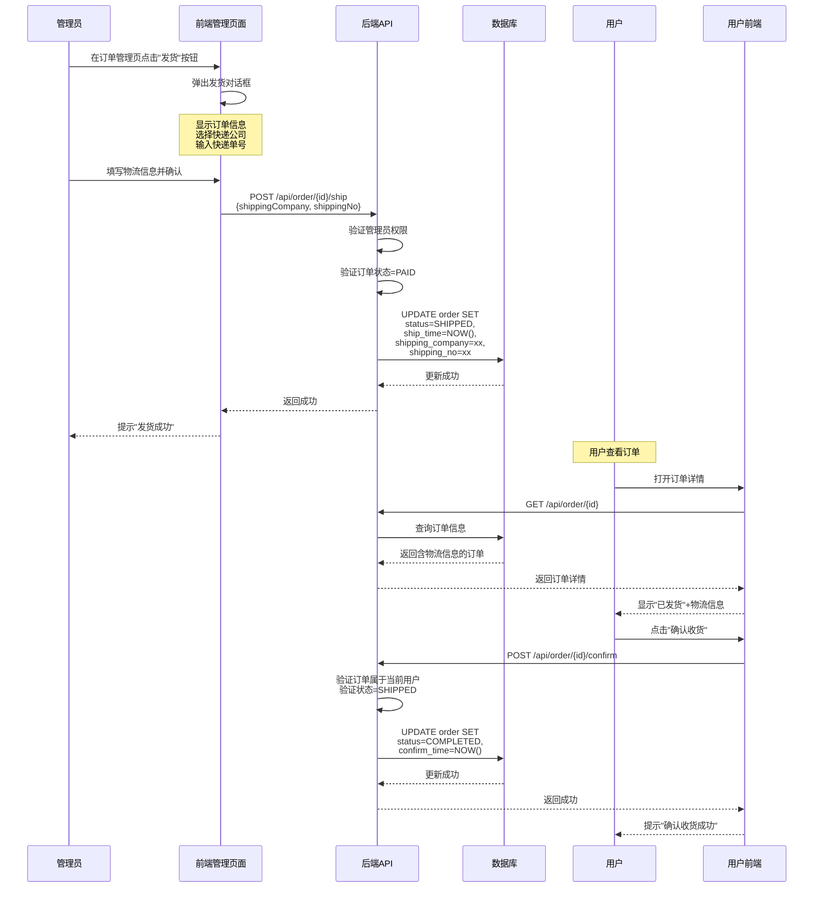

# 发货功能改进方案

## 一、当前问题分析

### 1.1 现有发货流程（极简版，不可用）

```
管理员点击"发货" → 后端将订单状态 PAID→SHIPPED，设置shipTime → 完成
```

**核心缺陷**：发货时没有输入任何物流信息（快递公司、快递单号），用户无法追踪包裹，这种"发货"等于只是改了个状态，没有实际业务价值。

### 1.2 正确的发货流程应该是

```
管理员点击"发货" 
  → 弹出对话框，填写物流信息（快递公司、快递单号）
  → 确认发货
  → 后端将订单状态 PAID→SHIPPED，记录shipTime + 快递公司 + 快递单号
  → 用户在订单详情中看到物流信息
  → 用户确认收货
  → 订单完成
```

### 1.3 完整发货业务流程图



---

## 二、数据库改进方案

### 2.1 新增字段清单

| 表名 | 新增字段 | 类型 | 说明 |
|------|---------|------|------|
| t_seckill_order | shipping_company | VARCHAR(50) | 物流公司（顺丰/中通/圆通/韵达/极兔/EMS等） |
| t_seckill_order | shipping_no | VARCHAR(64) | 快递单号 |
| t_seckill_order | ship_time | DATETIME | 发货时间 |
| t_seckill_order | confirm_time | DATETIME | 确认收货时间 |
| t_seckill_order | status枚举 | 增加SHIPPED | 已发货状态 |
| t_normal_order | shipping_company | VARCHAR(50) | 物流公司 |
| t_normal_order | shipping_no | VARCHAR(64) | 快递单号 |
| t_normal_order | ship_time | DATETIME | 发货时间 |
| t_normal_order | confirm_time | DATETIME | 确认收货时间 |
| t_normal_order | status枚举 | 增加SHIPPED | 已发货状态 |

### 2.2 DDL迁移脚本

文件：`seckill-mall/src/main/resources/db/migration_v6_shipping.sql`

```sql
-- ============================================================
-- migration_v6_shipping.sql
-- 发货功能：新增物流信息字段 + SHIPPED状态
-- ============================================================

-- 1. t_seckill_order: 修改status枚举，新增物流字段
ALTER TABLE t_seckill_order 
  MODIFY COLUMN status ENUM('UNPAID','PAID','SHIPPED','CANCELLED','TIMEOUT','COMPLETED') 
  NOT NULL DEFAULT 'UNPAID' COMMENT '订单状态',
  ADD COLUMN shipping_company VARCHAR(50) DEFAULT NULL COMMENT '物流公司' AFTER status,
  ADD COLUMN shipping_no VARCHAR(64) DEFAULT NULL COMMENT '快递单号' AFTER shipping_company,
  ADD COLUMN ship_time DATETIME DEFAULT NULL COMMENT '发货时间' AFTER shipping_no,
  ADD COLUMN confirm_time DATETIME DEFAULT NULL COMMENT '确认收货时间' AFTER ship_time;

-- 2. t_normal_order: 同上
ALTER TABLE t_normal_order 
  MODIFY COLUMN status ENUM('UNPAID','PAID','SHIPPED','CANCELLED','TIMEOUT','COMPLETED') 
  NOT NULL DEFAULT 'UNPAID' COMMENT '订单状态',
  ADD COLUMN shipping_company VARCHAR(50) DEFAULT NULL COMMENT '物流公司' AFTER status,
  ADD COLUMN shipping_no VARCHAR(64) DEFAULT NULL COMMENT '快递单号' AFTER shipping_company,
  ADD COLUMN ship_time DATETIME DEFAULT NULL COMMENT '发货时间' AFTER shipping_no,
  ADD COLUMN confirm_time DATETIME DEFAULT NULL COMMENT '确认收货时间' AFTER ship_time;

-- 3. 为快递单号创建索引（便于用户通过单号查询）
ALTER TABLE t_seckill_order ADD INDEX idx_shipping_no (shipping_no);
ALTER TABLE t_normal_order ADD INDEX idx_shipping_no (shipping_no);
```

### 2.3 H2测试schema同步

文件：`seckill-mall/src/test/resources/schema-h2.sql`

在t_seckill_order和t_normal_order建表语句中加入：
```sql
shipping_company VARCHAR(50),
shipping_no VARCHAR(64),
ship_time TIMESTAMP,
confirm_time TIMESTAMP
```

---

## 三、后端改进方案

### 3.1 实体类修改

#### SeckillOrder.java — 新增字段

```java
/** 物流公司 */
private String shippingCompany;

/** 快递单号 */
private String shippingNo;

/** 发货时间 */
private LocalDateTime shipTime;

/** 确认收货时间 */
private LocalDateTime confirmTime;
```

#### NormalOrder.java — 同样新增字段

```java
private String shippingCompany;
private String shippingNo;
private LocalDateTime shipTime;
private LocalDateTime confirmTime;
```

### 3.2 发货请求DTO

新建 `seckill-mall/src/main/java/com/seckill/mall/dto/ShipRequest.java`：

```java
package com.seckill.mall.dto;

import jakarta.validation.constraints.NotBlank;
import jakarta.validation.constraints.Size;
import lombok.Data;

/**
 * 发货请求参数
 */
@Data
public class ShipRequest {

    /** 物流公司（必填） */
    @NotBlank(message = "物流公司不能为空")
    @Size(max = 50, message = "物流公司名称不能超过50个字符")
    private String shippingCompany;

    /** 快递单号（必填） */
    @NotBlank(message = "快递单号不能为空")
    @Size(max = 64, message = "快递单号不能超过64个字符")
    private String shippingNo;
}
```

### 3.3 Controller接口修改

#### OrderController.java — 发货接口改为接收物流信息

```java
/**
 * 管理员发货 - 秒杀订单
 * 需要填写物流公司+快递单号
 */
@PreAuthorize("hasRole('ADMIN')")
@PostMapping("/{orderId}/ship")
public Result<Void> shipOrder(@PathVariable Long orderId,
                              @RequestBody @Valid ShipRequest request) {
    orderService.shipOrder(orderId, request.getShippingCompany(), request.getShippingNo());
    return Result.success();
}

/**
 * 管理员发货 - 普通订单
 */
@PreAuthorize("hasRole('ADMIN')")
@PostMapping("/{orderId}/normal-ship")
public Result<Void> shipNormalOrder(@PathVariable Long orderId,
                                     @RequestBody @Valid ShipRequest request) {
    orderService.shipNormalOrder(orderId, request.getShippingCompany(), request.getShippingNo());
    return Result.success();
}
```

### 3.4 Service接口与实现修改

#### OrderService.java — 方法签名改为包含物流参数

```java
void shipOrder(Long orderId, String shippingCompany, String shippingNo);
void shipNormalOrder(Long orderId, String shippingCompany, String shippingNo);
```

#### OrderServiceImpl.java — 实现逻辑

```java
@Override
@Transactional
public void shipOrder(Long orderId, String shippingCompany, String shippingNo) {
    SeckillOrder order = seckillOrderMapper.selectById(orderId);
    if (order == null) {
        throw new BusinessException(ErrorCode.ORDER_NOT_FOUND);
    }
    if (order.getStatus() != OrderStatus.PAID) {
        throw new BusinessException(ErrorCode.ORDER_STATUS_ERROR, "仅已支付订单可发货");
    }
    order.setStatus(OrderStatus.SHIPPED);
    order.setShippingCompany(shippingCompany);
    order.setShippingNo(shippingNo);
    order.setShipTime(LocalDateTime.now());
    seckillOrderMapper.updateById(order);
}

@Override
@Transactional
public void shipNormalOrder(Long orderId, String shippingCompany, String shippingNo) {
    NormalOrder order = normalOrderMapper.selectById(orderId);
    if (order == null) {
        throw new BusinessException(ErrorCode.ORDER_NOT_FOUND);
    }
    if (order.getStatus() != OrderStatus.PAID) {
        throw new BusinessException(ErrorCode.ORDER_STATUS_ERROR, "仅已支付订单可发货");
    }
    order.setStatus(OrderStatus.SHIPPED);
    order.setShippingCompany(shippingCompany);
    order.setShippingNo(shippingNo);
    order.setShipTime(LocalDateTime.now());
    normalOrderMapper.updateById(order);
}
```

### 3.5 VO类修改

#### AdminOrderVO.java — 新增物流字段

```java
/** 物流公司 */
private String shippingCompany;

/** 快递单号 */
private String shippingNo;

/** 发货时间 */
private LocalDateTime shipTime;

/** 确认收货时间 */
private LocalDateTime confirmTime;
```

#### OrderListItemVO.java — 新增发货时间

```java
/** 发货时间 */
private LocalDateTime shipTime;
```

#### SeckillOrderDetailVO / NormalOrderDetailVO — 新增物流字段

在订单详情返回中包含完整的物流信息，让用户可以查看快递公司和单号。

---

## 四、前端改进方案

### 4.1 前端类型定义修改

文件：`frontend/src/types/index.ts`

```typescript
// 1. OrderStatus增加SHIPPED
export type OrderStatus = 'UNPAID' | 'PAID' | 'SHIPPED' | 'CANCELLED' | 'TIMEOUT' | 'COMPLETED'

// 2. 物流公司枚举
export type ShippingCompany = '顺丰速运' | '中通快递' | '圆通速递' | '韵达快递' | '极兔速递' | 'EMS' | '申通快递' | '京东物流' | '百世快递' | '天天快递'

// 3. SeckillOrder接口补充字段
export interface SeckillOrder {
  // ... 原有字段 ...
  shippingCompany?: string
  shippingNo?: string
  shipTime?: string
  confirmTime?: string
}

// 4. NormalOrder接口补充字段
export interface NormalOrder {
  // ... 原有字段 ...
  shippingCompany?: string
  shippingNo?: string
  shipTime?: string
  confirmTime?: string
}

// 5. AdminOrderVO接口补充字段
export interface AdminOrderVO {
  // ... 原有字段 ...
  shippingCompany?: string
  shippingNo?: string
  shipTime?: string
  confirmTime?: string
}
```

### 4.2 前端API新增

文件：`frontend/src/api/order.ts`

```typescript
/** 管理员发货 - 秒杀订单 */
export function shipOrder(orderId: string | number, data: { shippingCompany: string; shippingNo: string }) {
  return request.post(`/api/v1/orders/${orderId}/ship`, data)
}

/** 管理员发货 - 普通订单 */
export function shipNormalOrder(orderId: string | number, data: { shippingCompany: string; shippingNo: string }) {
  return request.post(`/api/v1/orders/${orderId}/normal-ship`, data)
}
```

### 4.3 管理员订单管理页面改进

文件：`frontend/src/views/admin/OrderManage.vue`

#### 4.3.1 新增发货对话框

```html
<!-- 发货对话框 -->
<el-dialog v-model="shipDialogVisible" title="订单发货" width="500px" :close-on-click-modal="false">
  <div class="ship-order-info">
    <p><strong>订单编号：</strong>{{ currentOrder?.orderNo }}</p>
    <p><strong>订单金额：</strong>¥{{ currentOrder?.totalAmount?.toFixed(2) }}</p>
  </div>
  <el-form :model="shipForm" :rules="shipRules" ref="shipFormRef" label-width="100px">
    <el-form-item label="物流公司" prop="shippingCompany">
      <el-select v-model="shipForm.shippingCompany" placeholder="请选择物流公司" style="width: 100%">
        <el-option v-for="company in shippingCompanies" :key="company" :label="company" :value="company" />
      </el-select>
    </el-form-item>
    <el-form-item label="快递单号" prop="shippingNo">
      <el-input v-model="shipForm.shippingNo" placeholder="请输入快递单号" maxlength="64" show-word-limit />
    </el-form-item>
  </el-form>
  <template #footer>
    <el-button @click="shipDialogVisible = false">取消</el-button>
    <el-button type="primary" :loading="shipLoading" @click="handleShip">确认发货</el-button>
  </template>
</el-dialog>
```

#### 4.3.2 新增发货按钮

在订单列表操作列中，PAID状态的订单显示"发货"按钮：

```html
<el-table-column label="操作" width="200" fixed="right">
  <template #default="{ row }">
    <el-button size="small" @click="showDetail(row)">详情</el-button>
    <el-button v-if="row.status === 'PAID'" size="small" type="warning" @click="openShipDialog(row)">
      发货
    </el-button>
  </template>
</el-table-column>
```

#### 4.3.3 发货相关Script逻辑

```typescript
import { shipOrder, shipNormalOrder } from '@/api/order'

// 物流公司列表
const shippingCompanies = [
  '顺丰速运', '中通快递', '圆通速递', '韵达快递',
  '极兔速递', 'EMS', '申通快递', '京东物流', '百世快递', '天天快递'
]

// 发货对话框
const shipDialogVisible = ref(false)
const shipLoading = ref(false)
const currentOrder = ref<any>(null)
const shipFormRef = ref()
const shipForm = reactive({
  shippingCompany: '',
  shippingNo: ''
})
const shipRules = {
  shippingCompany: [{ required: true, message: '请选择物流公司', trigger: 'change' }],
  shippingNo: [{ required: true, message: '请输入快递单号', trigger: 'blur' }]
}

// 打开发货对话框
function openShipDialog(order: any) {
  currentOrder.value = order
  shipForm.shippingCompany = ''
  shipForm.shippingNo = ''
  shipDialogVisible.value = true
}

// 确认发货
async function handleShip() {
  await shipFormRef.value?.validate()
  shipLoading.value = true
  try {
    const isNormal = currentOrder.value.orderType === 'NORMAL'
    if (isNormal) {
      await shipNormalOrder(currentOrder.value.id, shipForm)
    } else {
      await shipOrder(currentOrder.value.id, shipForm)
    }
    ElMessage.success('发货成功')
    shipDialogVisible.value = false
    fetchOrderList() // 刷新列表
  } catch {
    // 错误已由拦截器处理
  } finally {
    shipLoading.value = false
  }
}
```

#### 4.3.4 状态筛选增加SHIPPED

```html
<el-select v-model="filterStatus" placeholder="订单状态">
  <el-option label="全部" value="" />
  <el-option label="待支付" value="UNPAID" />
  <el-option label="已支付" value="PAID" />
  <el-option label="已发货" value="SHIPPED" />  <!-- 新增 -->
  <el-option label="已完成" value="COMPLETED" />
  <el-option label="已取消" value="CANCELLED" />
  <el-option label="已超时" value="TIMEOUT" />
</el-select>
```

#### 4.3.5 订单列表展示物流信息

SHIPPED/COMPLETED状态的订单行显示快递信息：

```html
<el-table-column label="物流信息" width="180">
  <template #default="{ row }">
    <template v-if="row.shippingCompany && row.shippingNo">
      <div class="shipping-info">
        <span class="shipping-company">{{ row.shippingCompany }}</span>
        <span class="shipping-no" @click="copyShippingNo(row.shippingNo)">
          {{ row.shippingNo }}
          <el-icon><CopyDocument /></el-icon>
        </span>
      </div>
    </template>
    <span v-else class="text-muted">—</span>
  </template>
</el-table-column>
```

### 4.4 用户订单详情页改进

文件：`frontend/src/views/front/OrderDetail.vue`

在订单信息汇总区域新增物流信息展示：

```html
<!-- 物流信息（SHIPPED/COMPLETED状态显示） -->
<div v-if="order.shippingCompany || order.shippingNo" class="pay-summary shipping-summary">
  <div class="pay-summary-row">
    <span>物流公司</span>
    <span>{{ order.shippingCompany }}</span>
  </div>
  <div class="pay-summary-row">
    <span>快递单号</span>
    <span class="shipping-no-value" @click="copyShippingNo">
      {{ order.shippingNo }}
      <span class="copy-hint">复制</span>
    </span>
  </div>
  <div class="pay-summary-row">
    <span>发货时间</span>
    <span>{{ formatTime(order.shipTime) }}</span>
  </div>
</div>
```

### 4.5 用户订单列表页改进

文件：`frontend/src/views/front/UserOrders.vue`

SHIPPED状态的订单行增加"确认收货"快捷按钮：

```html
<template v-if="row.status === 'SHIPPED'">
  <button class="btn-sm primary" @click.stop="handleConfirmReceive(row)">确认收货</button>
</template>
```

---

## 五、完整修改文件清单

| 优先级 | 文件路径 | 修改内容 |
|--------|---------|---------|
| 🔴 P0 | `seckill-mall/src/main/resources/db/migration_v6_shipping.sql` | **新建** DDL迁移脚本 |
| 🔴 P0 | `seckill-mall/src/main/resources/schema.sql` | 同步修改建表语句 |
| 🔴 P0 | `seckill-mall/src/test/resources/schema-h2.sql` | H2测试schema同步 |
| 🔴 P0 | `frontend/src/types/index.ts` | OrderStatus加SHIPPED + 接口加物流字段 |
| 🟡 P1 | `seckill-mall/.../dto/ShipRequest.java` | **新建** 发货请求DTO |
| 🟡 P1 | `seckill-mall/.../entity/SeckillOrder.java` | 新增shippingCompany/shippingNo字段 |
| 🟡 P1 | `seckill-mall/.../entity/NormalOrder.java` | 新增shippingCompany/shippingNo字段 |
| 🟡 P1 | `seckill-mall/.../service/OrderService.java` | shipOrder方法签名改为含物流参数 |
| 🟡 P1 | `seckill-mall/.../service/impl/OrderServiceImpl.java` | shipOrder实现改为写入物流信息 |
| 🟡 P1 | `seckill-mall/.../controller/OrderController.java` | 发货接口接收@RequestBody ShipRequest |
| 🟡 P1 | `frontend/src/api/order.ts` | 新增shipOrder/shipNormalOrder API |
| 🟡 P1 | `frontend/src/views/admin/OrderManage.vue` | 发货按钮+发货对话框+状态筛选+物流信息列 |
| 🟢 P2 | `seckill-mall/.../vo/AdminOrderVO.java` | 新增物流字段 |
| 🟢 P2 | `seckill-mall/.../vo/OrderListItemVO.java` | 新增shipTime字段 |
| 🟢 P2 | `seckill-mall/.../mapper/SeckillOrderMapper.xml` | SELECT加入物流字段 |
| 🟢 P2 | `frontend/src/views/front/OrderDetail.vue` | 物流信息展示区域 |
| 🟢 P2 | `frontend/src/views/front/UserOrders.vue` | SHIPPED状态确认收货按钮 |

---

## 六、实施步骤

### 第一步：P0 — 数据库+类型基础（必须先做）
1. 创建DDL迁移脚本
2. 修改schema.sql和schema-h2.sql
3. 修改前端types/index.ts

### 第二步：P1 — 发货核心功能闭环
1. 新建ShipRequest DTO
2. 修改实体类新增物流字段
3. 修改Service/Controller发货逻辑
4. 新增前端发货API
5. 改造管理员OrderManage.vue（发货按钮+对话框）

### 第三步：P2 — 数据展示完善
1. 修改后端VO返回物流字段
2. 修改Mapper XML
3. 用户订单详情展示物流信息
4. 用户订单列表确认收货按钮

### 第四步：执行DDL并验证
1. 在MySQL中执行migration_v6_shipping.sql
2. 重启后端验证发货接口
3. 前端测试发货流程闭环

---

## 七、快递公司列表参考

| 编号 | 物流公司 | 编码（如有需要） |
|------|---------|----------------|
| 1 | 顺丰速运 | SF |
| 2 | 中通快递 | ZTO |
| 3 | 圆通速递 | YTO |
| 4 | 韵达快递 | YD |
| 5 | 极兔速递 | JT |
| 6 | EMS | EMS |
| 7 | 申通快递 | STO |
| 8 | 京东物流 | JD |
| 9 | 百世快递 | BEST |
| 10 | 天天快递 | TTKY |

---

## 八、注意事项

1. **DDL必须先执行**：数据库缺少SHIPPED枚举和物流字段是阻断级问题，不执行DDL后端代码运行即报错
2. **发货接口权限**：必须限制为ADMIN角色，Controller层@PreAuthorize + Service层二次校验
3. **快递单号唯一性**：建议在数据库层对shipping_no建索引，但不建议设唯一约束（不同快递公司可能有相同单号）
4. **发货后不可撤回**：发货操作是单向的，SHIPPED状态只能流向COMPLETED，不能回退到PAID
5. **确认收货超时**：建议后续增加定时任务，发货15天后自动确认收货（P3增强功能）